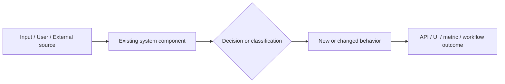

# Epic Template

Use this structure for `docs/epics/<feature-or-project>/<slug>.md`. It intentionally blends a project investigation document with an executable epic plan.

````markdown
# Epic: [Project / Initiative Name]

**Estado**: Borrador | En revision | Aprobado
**Apetito**: [Small bet | Medium bet | Large bet | One cycle | Multi-cycle | Custom]
**Limite de inversion**: [Time/effort/team constraint]
**Autor**: [Agent / Team]
**Fecha**: [YYYY-MM-DD]

## 1. Contexto y Problema que Resuelve

[2-4 paragraphs. Explain the current gap, who feels it, what business/product question cannot be answered today, and why it matters now. Do not start with implementation.]

## 2. Objetivo, Resultado Esperado y Metricas

**Objetivo principal**: [Outcome]

**Resultado esperado dentro del apetito**: [Concrete change that can be delivered within the appetite]

**Metricas de exito**:

| Metrica | Baseline | Objetivo | Como se mide |
| ------- | -------- | -------- | ------------ |
| ... | ... | ... | ... |

## 3. Alcance

**Incluido en esta epica:**

- [Committed deliverable for the stated appetite]

**No incluido:**

- [Explicit non-goal]

**Futuro:**

- [Useful extension intentionally deferred]

## 4. Flujo de Usuario

1. [Plain-language step in the target user journey]
2. [Plain-language step]
3. [Plain-language step]

[Add important UX states: empty, partial data, loading, error, permission denied, degraded confidence.]

## 5. Reglas de Negocio

**Regla 1: [Name]**  
[Behavior, rationale, edge cases, interpretation risk.]

**Regla 2: [Name]**  
[Behavior, rationale, edge cases, interpretation risk.]

## 6. Casos de Uso

### [Business case 1]

[Realistic business scenario a PM, executive, CS, or engineering lead would recognize.]

### [Business case 2]

[Another concrete scenario.]

## 7. Evidencia de Investigacion

### Codigo y Documentacion Interna

| Area | Hallazgo | Evidencia |
| ---- | -------- | --------- |
| Backend/Frontend/Docs | [Finding] | `[path]` |

### Investigacion Web

| Tema | Hallazgo | Fuente |
| ---- | -------- | ------ |
| [Topic] | [Finding] | [URL] |

### Supuestos

| Supuesto | Impacto si es falso | Como validarlo |
| -------- | ------------------- | -------------- |
| ... | ... | ... |

## 8. Impacto Tecnico

### Como funciona end-to-end

[Prose explaining the current system and target flow from user action/source event to stored data/API/UI outcome.]

### Diagrama de flujo



### Backend / Dominio

- [Models, services, jobs, serializers, permissions, tenancy, migrations]

### Frontend / UX

- [Routes, pages, components, states, forms, i18n, accessibility]

### API / Contratos

- [Endpoints, payloads, compatibility, contract tests]

### Datos, Seguridad y Operacion

- [Data migration, privacy, audit, observability, performance, rollback]

### Limites operativos

[Explain limits as a causal chain with an example: provider limits, data quality, tenancy, permissions, calculation confidence, performance ceilings.]

### Robustez ante fallas

[Explain what happens when data is missing, integrations fail, calculations are partial, permissions deny access, or contracts drift.]

## 9. Plan de Entrega por Fases

### Fases comprometidas dentro del apetito

| Fase | Apetito relativo | Resultado | Dependencias | Riesgo principal | Definition of Done |
| ---- | ---------------- | --------- | ------------ | ---------------- | ------------------ |
| 1 | Small/Medium/Large | ... | ... | ... | ... |

### Bets o fases futuras fuera del apetito actual

| Fase futura | Por que se difiere | Senal para retomarla |
| ------------ | ------------------ | -------------------- |
| ... | ... | ... |

## 10. Cola de PRDs y Flujo de Ejecucion

Each row must be executable as its own cycle:

`create-prd` -> `implement-prd` -> `document-development`

| Orden | PRD | Objetivo | Alcance estricto | Depende de | Implementacion esperada | Documento posterior |
| ----- | --- | -------- | ---------------- | ---------- | ----------------------- | ------------------- |
| 1 | PRD: [Name] | [Goal] | [Only this] | [None / PRD] | Use `$implement-prd` after PRD approval | Use `$document-development` after implementation |

## 11. Riesgos y Mitigaciones

| Riesgo | Probabilidad | Impacto | Mitigacion |
| ------ | ------------ | ------- | ---------- |
| ... | ... | ... | ... |

## 12. Preguntas Abiertas

| Pregunta | Bloquea | Decision requerida |
| -------- | ------- | ------------------ |
| ... | Si/No | ... |

## 13. Guia de Uso de la Epica

1. Start with PRD #1 only.
2. After the PRD is approved, run `$implement-prd` on that PRD file.
3. After implementation and validation, run `$document-development` for that delivered phase.
4. Return to this epic, update phase status if the user asks, and continue with the next PRD.

## 14. Handoff a Create PRD

**Primer PRD recomendado**: [Name]

**Prompt sugerido**:

```
Use $create-prd to create the PRD for "[Name]" using `docs/epics/<feature-or-project>/<slug>.md` as parent context. Focus only on [strict scope]. Keep [explicit exclusions] out of scope.

After that PRD is approved, use $implement-prd on the PRD file. After implementation and validation, use $document-development to document the delivered phase.
```

## Anexo: Fuentes de investigacion

| Tema | Fuente |
| ---- | ------ |
| [Topic] | [URL] |

## Anexo: Archivos tecnicos de referencia

| Proposito | Archivo |
| --------- | ------- |
| [Purpose] | `[path]` |
````

## Review Checklist

- The committed scope fits the stated appetite.
- Every child PRD has a clear goal and strict scope.
- Codebase evidence includes paths, not vague claims.
- Web evidence includes URLs and dates when relevant.
- Business narrative, user flow, business rules, use cases, architecture, and failure modes are covered.
- Backend, frontend, API, data, security, testing, rollout, and documentation were considered.
- Open questions are separated from confirmed decisions.
- The first PRD can be created without redoing the entire discovery process.
- Each committed phase states how it proceeds through `create-prd`, `implement-prd`, and `document-development`.
