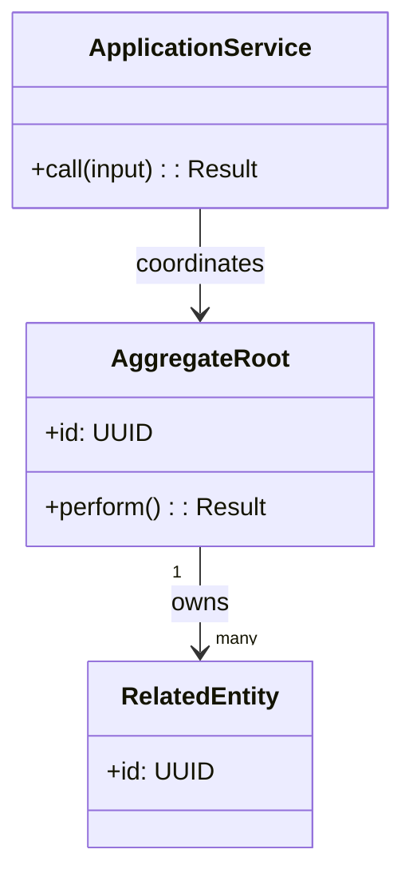
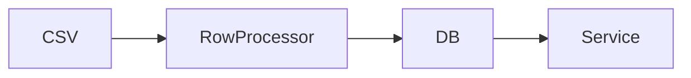

# PRD: [Feature Name]

**Ticket**: [User story or ticket reference]
**Autor**: [Team or person]
**Fecha**: [Date]
**Estado**: Borrador | En revision | Aprobado

---

## 1. Contexto y Objetivo

[2-3 sentences: what problem this solves, what the user wants to achieve]

> **Alcance estricto**: [Clear statement of what IS and is NOT in scope for this PRD]

### Contexto de Epica Padre _(si aplica)_

**parent_epic**: `[path/to/epic.md]`

| Invariante heredada | AC hijo | Estado | Change request aprobado |
| ------------------- | -------- | ------ | ----------------------- |
| INV-[AREA]-01 | AC-[N] | Mapeada | No aplica |

Una contradiccion exige un change request aprobado por el usuario con ID de invariante, motivo y aprobador antes de continuar.

### Contrato entre Fases _(si aplica)_

**Ledger leido**: `docs/epics/<feature-or-project>/<slug>-ledger.md`
**PRD anterior en la cola**: `[path/to/previous-prd.md]` (`No aplica` si es el primer PRD de la epica)

**Precondiciones (que asume que ya existe de fases previas)**:

| ID | Precondicion | Origen (PRD/ledger) | Verificado en discovery |
| -- | ------------- | -------------------- | ------------------------ |
| PRE-[N] | [Lo que este PRD asume que ya esta implementado o decidido] | [PRD/ledger row] | Si/No |

Si una precondicion no se verifica contra el codigo real durante el calibration, este PRD no puede continuar sin resolver la discrepancia con el usuario.

**Postcondiciones (que garantiza para fases siguientes)**:

| ID | Postcondicion | Como se prueba |
| -- | -------------- | --------------- |
| POST-[N] | [Lo que este PRD deja garantizado para que el proximo PRD lo pueda asumir] | [Test/evidencia] |

`document-development` copia estas postcondiciones al ledger de la epica al cerrar este PRD.

### Estado Actual

| Capa                | Componente  | Archivo           |
| ------------------- | ----------- | ----------------- |
| [Model/Service/...] | [ClassName] | [path/to/file.rb] |

### Columnas/Estado Actuales en [TableName]

[List existing columns/fields relevant to the feature]

---

## 2. Requerimientos Funcionales

### 2.1 [Requirement Group 1]

[Table of new columns, fields, or parameters]:

| Campo origen | Campo BD | Tipo | Nullable | Descripcion |
| ------------ | -------- | ---- | -------- | ----------- |
| ...          | ...      | ...  | ...      | ...         |

### 2.2 Regla de Negocio: [Name]

> **Decision confirmada**: [Exact business rule, in one clear paragraph]

**Condicion de aplicacion**: [When does the rule trigger?]
**Entidad de agrupacion**: [What identifies a group? e.g. (id_elemento, month)]
**Campos afectados**: [Exhaustive list]
**Campos NO afectados**: [Exhaustive list with reason]
**Almacenamiento**: [What gets persisted - raw, computed, or both]

### 2.3 Criterios de Aceptacion

| ID | Given | When | Then | Evidence expected |
| --- | --- | --- | --- | --- |
| AC-1 | [Precondition] | [Action/event] | [Observable result] | [Test/contract/smoke evidence] |

### 2.4 Casos de Uso

| ID | Actor | Precondiciones | Flujo principal | Resultado observable (falsable) | AC vinculado |
| --- | --- | --- | --- | --- | --- |
| UC-1 | [Actor] | [Precondition] | [Main flow steps] | [Falsifiable observable result] | AC-1 |

### 2.5 Estrategia de Tests

| Nivel | Objetivo | Caso de uso vinculado | Cobertura esperada | Comando o mecanismo de validacion |
| --- | --- | --- | --- | --- |
| Unidad/Integracion/Contrato/Smoke/E2E | [What this proves] | UC-1 | [Expected coverage] | `[exact command]` |

### 2.6 Matriz de Edge Cases

| Categoria | Descripcion | Caso de uso vinculado | Validacion | Estado |
| --- | --- | --- | --- | --- |
| Datos vacios | [Scenario] | UC-1 | [Test/contract/smoke/evidencia manual] | Pending |
| Limites | [Scenario] | UC-1 | [Test/contract/smoke/evidencia manual] | Pending |
| Errores | [Scenario] | UC-1 | [Test/contract/smoke/evidencia manual] | Pending |
| Permisos/tenancy | [Scenario] | UC-1 | [Test/contract/smoke/evidencia manual] | Pending |
| Concurrencia/orden | [Scenario] | UC-1 | [Test/contract/smoke/evidencia manual] | Pending |
| Rollout/rollback | [Scenario] | UC-1 | [Test/contract/smoke/evidencia manual] | Pending |

Una categoria sin caso aplicable se marca `No aplica` con una justificacion de una linea basada en el alcance real; nunca se omite en silencio.

---

## 3. Modelo de Datos

### 3.1 Migracion Requerida

```ruby
# Pseudo-code of migration
add_column :table_name, :column_name, :type, default: nil
```

### 3.2 Diagrama de Clases

Documentar las clases, entidades, value objects, servicios o interfaces introducidos o modificados y sus relaciones confirmadas. Usar nombres reales del diseno; indicar cardinalidades cuando apliquen.



### 3.3 Diagrama de Flujo



---

## 4. Plan de Implementacion por Fases

### Fase 1 - [Name]

**Objetivo**: [One-sentence goal]

**Slices ejecutables**:

| ID | Outcome | Depends on | Scope / likely files | Acceptance criteria | Use cases | Tests | Edge cases | Validation | Evidence |
| --- | --- | --- | --- | --- | --- | --- | --- | --- | --- |
| P1-S1 | [One small result] | none | [One responsibility] | AC-1 | UC-1 | [Focused test] | [Edge case row, if any] | `[exact command]` | [Passing output/diff/check] |
| P1-S2 | [Next small result] | P1-S1 | [One responsibility] | AC-2 | UC-1 | [Focused test] | [Edge case row, if any] | `[exact command]` | [Passing output/diff/check] |

**Slice stop conditions**:

- [Condition that requires clarification or replanning]

**Definition of Done**:

- Every slice is `VERIFIED`, not merely implemented
- Acceptance criteria assigned to this phase have evidence
- Focused tests and validations pass
- Relevant quality checks (contract, tenancy/auth, i18n, performance, rollback) are satisfied or explicitly not applicable
- No deferred cleanup or unexplained failure is hidden inside the next phase

---

### Fase 2 - [Name]

Repeat the complete phase structure above. Do not replace executable slices with a broad deliverables list.

---

### Fase Futura - [Name] _(fuera de alcance de este PRD)_

> Sera abordada en PRD separado.

- [Brief description of what will come later]

---

## 5. Decisiones Tomadas

| #   | Pregunta                                | Respuesta     | Impacto en diseno              |
| --- | --------------------------------------- | ------------- | ------------------------------ |
| 1   | ¿Solo para tipo X o todos los soportes? | Todos         | Division aplica genericamente  |
| 2   | ¿Almacenar cruda o dividida?            | Solo dividida | No se persisten valores crudos |
| 3   | ¿Feature flag?                          | No            | Implementacion directa         |

---

## 6. Preguntas Abiertas

| #   | Pregunta           | Bloquea | Area   |
| --- | ------------------ | ------- | ------ |
| 1   | [Pending question] | Si/No   | fase X |

_(Vacio = PRD listo para implementar)_

---

## 7. Riesgos y Mitigaciones

| Riesgo                                        | Probabilidad | Impacto | Mitigacion                                                    |
| --------------------------------------------- | ------------ | ------- | ------------------------------------------------------------- |
| [e.g. Division por cero si unique_people = 0] | Media        | Alto    | Guard in service: skip calculation if denominator is 0 or nil |

---

## 8. Definition of Done Global

- [ ] Todas las fases completadas
- [ ] `bundle exec rails test` en verde
- [ ] `bundle exec rubocop` sin offenses
- [ ] Retrocompatibilidad: archivos sin columnas nuevas siguen importando
- [ ] Columnas BD en ingles
- [ ] Sin queries N+1
- [ ] Errores capturados con `Errors::CaptureExceptionService`
- [ ] Todo AC tiene al menos un caso de uso vinculado y todo caso de uso tiene al menos un AC vinculado
- [ ] Todo caso de uso tiene al menos un test en la Estrategia de Tests
- [ ] La Matriz de Edge Cases cubre las seis categorias obligatorias (o declara `No aplica` con justificacion)

---

## 9. Matriz de Trazabilidad

| Acceptance criterion | Caso de uso | Phase / slice | Test evidence | Edge case(s) | Validation evidence | Status |
| --- | --- | --- | --- | --- | --- | --- |
| AC-1 | UC-1 | P1-S1 | [test path/name] | [edge case row] | [command/check] | Pending |

---

## 10. Evidencia de Implementacion

Esta seccion es el registro durable de cierre. `implement-prd` la completa antes de eliminar los artefactos temporales de `_meta/`; no registrar prompts, trackers, handoffs ni estado interno de agentes.

**Estado**: No iniciada | En progreso | Cerrada | Bloqueada

| Campo | Evidencia durable |
| --- | --- |
| Cambios entregados | [Resumen concreto y rutas relevantes] |
| Criterios de aceptacion | [AC-N: COMPLETE/BLOCKED y evidencia] |
| Validaciones ejecutadas | [`command` - PASS/FAIL y resultado relevante] |
| Calidad y QA | [Quality gate y `ready_to_close` con evidencia] |
| Referencia de cambio | [Commit, PR o diff identificable] |
| Riesgos o waivers | [Ninguno o riesgo, aprobador y motivo] |
| Fecha de cierre | [YYYY-MM-DD] |
