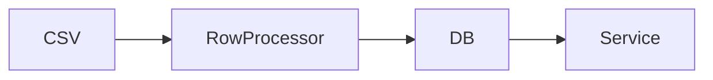

# PRD: [Feature Name]

**Ticket**: [User story or ticket reference]
**Autor**: [Team or person]
**Fecha**: [Date]
**Estado**: Borrador | En revision | Aprobado

---

## 1. Contexto y Objetivo

[2-3 sentences: what problem this solves, what the user wants to achieve]

> **Alcance estricto**: [Clear statement of what IS and is NOT in scope for this PRD]

### Estado Actual

| Capa                | Componente  | Archivo           |
| ------------------- | ----------- | ----------------- |
| [Model/Service/...] | [ClassName] | [path/to/file.rb] |

### Columnas/Estado Actuales en [TableName]

[List existing columns/fields relevant to the feature]

---

## 2. Requerimientos Funcionales

### 2.1 [Requirement Group 1]

[Table of new columns, fields, or parameters]:

| Campo origen | Campo BD | Tipo | Nullable | Descripcion |
| ------------ | -------- | ---- | -------- | ----------- |
| ...          | ...      | ...  | ...      | ...         |

### 2.2 Regla de Negocio: [Name]

> **Decision confirmada**: [Exact business rule, in one clear paragraph]

**Condicion de aplicacion**: [When does the rule trigger?]
**Entidad de agrupacion**: [What identifies a group? e.g. (id_elemento, month)]
**Campos afectados**: [Exhaustive list]
**Campos NO afectados**: [Exhaustive list with reason]
**Almacenamiento**: [What gets persisted - raw, computed, or both]

### 2.3 Criterios de Aceptacion

| ID | Given | When | Then | Evidence expected |
| --- | --- | --- | --- | --- |
| AC-1 | [Precondition] | [Action/event] | [Observable result] | [Test/contract/smoke evidence] |

---

## 3. Modelo de Datos

### 3.1 Migracion Requerida

```ruby
# Pseudo-code of migration
add_column :table_name, :column_name, :type, default: nil
```

### 3.2 Diagrama de Flujo



---

## 4. Plan de Implementacion por Fases

### Fase 1 - [Name]

**Objetivo**: [One-sentence goal]

**Slices ejecutables**:

| ID | Outcome | Depends on | Scope / likely files | Acceptance criteria | Tests | Validation | Evidence |
| --- | --- | --- | --- | --- | --- | --- | --- |
| P1-S1 | [One small result] | none | [One responsibility] | AC-1 | [Focused test] | `[exact command]` | [Passing output/diff/check] |
| P1-S2 | [Next small result] | P1-S1 | [One responsibility] | AC-2 | [Focused test] | `[exact command]` | [Passing output/diff/check] |

**Slice stop conditions**:

- [Condition that requires clarification or replanning]

**Definition of Done**:

- Every slice is `VERIFIED`, not merely implemented
- Acceptance criteria assigned to this phase have evidence
- Focused tests and validations pass
- Relevant quality checks (contract, tenancy/auth, i18n, performance, rollback) are satisfied or explicitly not applicable
- No deferred cleanup or unexplained failure is hidden inside the next phase

---

### Fase 2 - [Name]

Repeat the complete phase structure above. Do not replace executable slices with a broad deliverables list.

---

### Fase Futura - [Name] _(fuera de alcance de este PRD)_

> Sera abordada en PRD separado.

- [Brief description of what will come later]

---

## 5. Decisiones Tomadas

| #   | Pregunta                                | Respuesta     | Impacto en diseno              |
| --- | --------------------------------------- | ------------- | ------------------------------ |
| 1   | ¿Solo para tipo X o todos los soportes? | Todos         | Division aplica genericamente  |
| 2   | ¿Almacenar cruda o dividida?            | Solo dividida | No se persisten valores crudos |
| 3   | ¿Feature flag?                          | No            | Implementacion directa         |

---

## 6. Preguntas Abiertas

| #   | Pregunta           | Bloquea | Area   |
| --- | ------------------ | ------- | ------ |
| 1   | [Pending question] | Si/No   | fase X |

_(Vacio = PRD listo para implementar)_

---

## 7. Riesgos y Mitigaciones

| Riesgo                                        | Probabilidad | Impacto | Mitigacion                                                    |
| --------------------------------------------- | ------------ | ------- | ------------------------------------------------------------- |
| [e.g. Division por cero si unique_people = 0] | Media        | Alto    | Guard in service: skip calculation if denominator is 0 or nil |

---

## 8. Definition of Done Global

- [ ] Todas las fases completadas
- [ ] `bundle exec rails test` en verde
- [ ] `bundle exec rubocop` sin offenses
- [ ] Retrocompatibilidad: archivos sin columnas nuevas siguen importando
- [ ] Columnas BD en ingles
- [ ] Sin queries N+1
- [ ] Errores capturados con `Errors::CaptureExceptionService`

---

## 9. Matriz de Trazabilidad

| Acceptance criterion | Phase / slice | Test evidence | Validation evidence | Status |
| --- | --- | --- | --- | --- |
| AC-1 | P1-S1 | [test path/name] | [command/check] | Pending |
