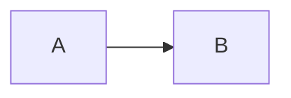
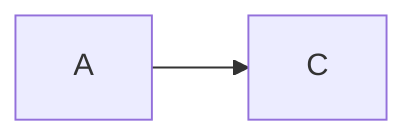
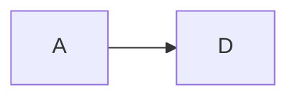

# Solution Sketch: [Name]

**Slug**: `[slug]`
**Fecha**: [YYYY-MM-DD]
**Estado**: Borrador | Locked
**Siguiente flujo**: create-prd | create-epic | project-formation

This is a whiteboard, not a PRD. Do not add acceptance criteria, edge-case matrices, or implementation slices.

---

## 1. Problem in 3 lines

1. [Who feels the pain]
2. [What is hard or expensive today]
3. [What a good design would make cheaper or safer]

---

## 2. Options

Compare 2 or 3 options. One option is not a workshop.

### Option A — [Name]

[One-sentence shape]

Tradeoff: [what this wins / what it costs]

### Option B — [Name]

[One-sentence shape]

Tradeoff: [what this wins / what it costs]

### Option C — [Name] _(optional)_

[One-sentence shape]

Tradeoff: [what this wins / what it costs]

---

## 3. Winner + discarded + why

**Winner**: [Option X]
**Discarded**: [Option Y]
**Why**: [concrete cost of picking the discarded option]
**Critical-stance challenge**: [the direct challenge that the winner survived]

---

## 4. Names that exist

| Name | Kind | Owner | Relates to |
| --- | --- | --- | --- |
| [ClassOrService] | class / service / artifact | [owner] | [relationship] |

Do not invent placeholders. If a name is still unknown, leave it in section 6.

---

## 5. What is not created now

- [Out of this bet]
- [Later phase]
- [Explicit non-goal]

---

## 6. Questions that still block the PRD

- [Question that would change the spec]
- [Or `none` if create-prd can start]
