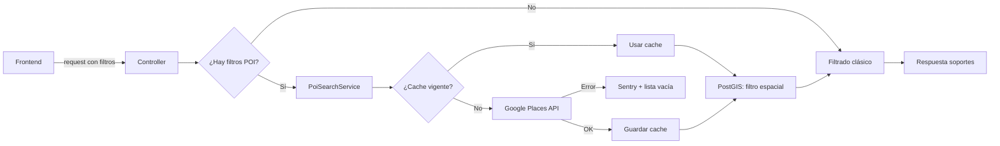

# Documentar Desarrollo

Esta skill es el cierre natural después de `implement-prd` cuando el cambio ya está implementado y validado.

## Cuándo Usar

- Feature nueva terminada que necesita documentación
- Sistema existente sin documentación clara
- Documentar para stakeholders no técnicos (comerciales, PMs, CS)
- Documentación de entrega junto a un PR

## Procedimiento

### Paso 1 — Explorar el código

Antes de escribir una línea, leer:

1. El PRD o ticket del desarrollo (en `docs/prd/<feature-or-project>/<YYYY-MM-DD>-<slug>/` o en el contexto del usuario)
2. Los servicios principales involucrados
3. Los modelos y migraciones relevantes
4. El controlador y las vistas/partials del flujo
5. Los tests para entender comportamientos esperados y edge cases
6. Las policies y reglas de autorización (roles, permisos por acción, restricciones por estado/ownership y feature flags)

Prestar atención especial a:

- Constantes con valores límite (`DEFAULT_LIMIT`, `MAX_*`, `TTL`)
- Bloques `rescue` y fallbacks → revelan comportamientos de robustez
- Callbacks y condiciones en el flujo principal → revelan reglas de negocio implícitas
- Cachés: clave, TTL, invalidación
- Reglas de autorización: quién puede ver/crear/editar/notificar/eliminar, bajo qué roles y condiciones

### Paso 2 — Identificar las audiencias

El documento sirve a dos audiencias simultáneamente:

| Audiencia                         | Qué necesitan                                                              |
| --------------------------------- | -------------------------------------------------------------------------- |
| No técnica (commercials, PMs, CS) | Qué problema resuelve, cómo se usa, qué casos cubre, qué pasa cuando falla |
| Técnica (developers, QA, DevOps)  | Cómo funciona por dentro, límites, integraciones, archivos clave           |

Escribir pensando en que ambas deben poder leer el mismo documento: la narrativa fluye de lo general a lo específico.

### Paso 3 — Construir el documento

Usar la estructura canónica de 10 secciones + anexo documentada abajo.

**Regla principal**: no repetir información. Si un concepto se explicó en la sección 3, las secciones siguientes solo lo referencian o lo amplían con perspectiva diferente.

### Paso 4 — Incluir el diagrama Mermaid

Todo documento de desarrollo **debe incluir un diagrama de flujo Mermaid** en la sección de arquitectura técnica. El diagrama debe mostrar el path principal del sistema de inicio a fin, incluyendo ramas de error y fallback cuando existen.

Usar `flowchart LR` para flujos horizontales (más legibles para procesos lineales):



### Paso 5 — Explicar límites como una cadena

Cuando existan límites numéricos en el sistema, **no listarlos como bullets independientes**. Explicar la relación causal entre ellos con un párrafo narrativo + ejemplo concreto:

> "Google devuelve máximo 10 resultados por llamada. Ese límite se preserva al guardar en caché: cada subcategoría almacena hasta 10 POIs. El techo total del proceso es 200 POIs por viewport; con 20 subcategorías activas y 10 por subcategoría, el máximo teórico coincide exactamente con ese cap."

### Paso 6 — Revisar antes de guardar

Checklist antes de guardar el documento:

- [ ] No hay sección que repita información de otra sección
- [ ] El diagrama Mermaid está incluido y es correcto
- [ ] Los límites se explican con relación causal y ejemplo
- [ ] El glosario incluye todos los términos técnicos usados en el texto
- [ ] La sección FAQ no repite información ya explicada en el cuerpo
- [ ] El anexo contiene links a los archivos clave, no código inline
- [ ] El lenguaje de las secciones 1–5 es accesible para no técnicos
- [ ] Las secciones 6–8 tienen suficiente detalle técnico para developers
- [ ] El documento explica claramente políticas de autorización: roles, permisos por acción y restricciones por estado/feature flags

---

## Estructura Canónica del Documento

Guardar en: `docs/internal-documentation/<feature-or-project>/<nombre-del-desarrollo>.md`

```markdown
# <Nombre del Desarrollo>

**Tipo de documento**: Guía funcional y técnica
**Fecha**: <fecha>
**Estado**: Implementado / En desarrollo / Deprecado

---

## 1. Contexto y Problema que Resuelve

Explicar en 2–3 párrafos:

- Qué no era posible hacer antes de este desarrollo
- Qué preguntas de negocio concretas no tenían respuesta
- Por qué es relevante resolverlo

NO mencionar la solución técnica aquí. Solo el problema.

## 2. Alcance

Dos listas cortas:

**Incluido en esta implementación:**

- item 1
- item 2

**No incluido:**

- item fuera de alcance 1
- item fuera de alcance 2

## 3. Flujo de Usuario

Pasos numerados del flujo principal en lenguaje llano.
Luego, subpárrafo con comportamientos importantes (edge cases de UX: qué pasa al cancelar, al desactivar, con errores).

## 4. Reglas de Negocio

Lista de reglas con título en negrita y explicación. Cada regla tiene nombre, descripción del comportamiento y el "por qué" si no es obvio.
Incluir explícitamente reglas de autorización: roles habilitados, roles excluidos, condiciones por estado del recurso, ownership y feature flags.

## 5. Casos de Uso

3–5 casos de uso reales del negocio. Formato: ### título del caso + descripción en prosa. Deben ser casos que un comercial o PM reconozca como propios.

## 6. Arquitectura Técnica

### Cómo funciona end-to-end

Prosa que explica el flujo completo del sistema.

### Diagrama de flujo

\`\`\`mermaid
flowchart LR
...
\`\`\`

### Integraciones y decisiones de diseño

Subsecciones por área: integración externa, estrategia de búsqueda/cálculo, caché, etc.
Debe incluir una subsección específica de **autorización y acceso** (Policies/Pundit), indicando acciones permitidas por rol y restricciones relevantes.

### Límites operativos

Explicación causal de los límites como una cadena, con ejemplo concreto.

### Robustez ante fallas

Qué pasa cuando falla cada integración externa. Debe mencionar: qué se captura, cómo afecta al usuario, qué registra.

## 7. Guía de Uso

Recomendaciones numeradas para usuarios no técnicos. Foco en cómo sacar el máximo provecho, no en cómo funciona por dentro.

## 8. Impacto y Evolución

Dos párrafos:

- Qué mejora desde el día 1 (valor inmediato)
- Qué habilita a futuro (valor derivado, sin comprometerse a fechas)

## 9. Preguntas Frecuentes

5–8 preguntas en formato **negrita pregunta** + respuesta en línea siguiente.
Solo preguntas que NO estén ya respondidas en el cuerpo del documento.

## 10. Glosario

Tabla o lista de términos técnicos usados en el documento. Cada entrada: término en negrita + definición en una línea.

---

## Anexo: Archivos técnicos de referencia

| Propósito   | Archivo                                  |
| ----------- | ---------------------------------------- |
| Descripción | [ruta/al/archivo.rb](ruta/al/archivo.rb) |
```

---

## Anti-patrones a Evitar

**Repetición entre secciones**: El resumen ejecutivo no debe ser un resumen del resto del documento. Cada sección agrega ángulo nuevo.

**Límites como bullets desconectados**: `- Máximo 10 por subcategoría` sin explicar por qué ni cómo se relaciona con los otros límites es inútil para el lector.

**Casos de uso técnicos**: "El usuario aplica el filtro POI y el sistema llama a Google Places" no es un caso de uso de negocio.

**Glosario vacío**: Si el documento usa términos como "viewport", "TTL", "PostGIS" o "caché geográfica" sin definirlos, la mitad del documento no es legible para no técnicos.

**FAQ redundante**: Si la pregunta ya se responde en el cuerpo, no va en el FAQ. El FAQ es para preguntas que surgen naturalmente pero que no tienen lugar natural en la narrativa.

**Código inline en el documento**: El documento no es una code review. Mencionar nombres de archivos y clases está bien; pegar bloques de código no.
