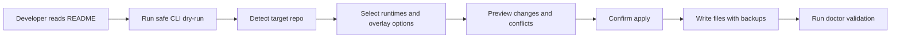

# All Metrics Workflow Kit

A future installable AI workflow kit for bringing the All Metrics-style agent workflow into other repositories safely.

> Current status: **Safe CLI MVP**. The project has a local dry-run-first CLI with explicit apply mode. It still does not publish packages, create GitHub repositories, or include a TUI.

## Why this exists

All Metrics has a mature AI workflow system with neutral `.agents/**` contracts, workflow skills, implementation orchestration, capability lifecycle docs, memory policy, and runtime adapter guidance. This project turns that proven workflow into a standalone distribution that another team can understand, review, and eventually install.

The core product promise is simple:

1. Read clear documentation before running anything.
2. Preview all changes before writing files.
3. Keep portable workflow core separate from local project overlay.
4. Keep Codex, GitHub Copilot, Claude Code, and future runtime adapters thin.
5. Never hide destructive operations behind a friendly TUI.

## What this scaffold includes

```text
all-metrics-workflow-kit/
  README.md
  LICENSE
  CONTRIBUTING.md
  package.json
  docs/
    adapter-authoring.md
    project-boundaries.md
    release-plan.md
    versioning.md
  templates/
    template-manifest.json
    portable-core/
    repo-overlay/
    runtime-adapters/
  scripts/
    validate-scaffold.mjs
```

## What this MVP intentionally does not include

- No TUI implementation.
- No `gh repo create`, push, release, or publish automation.
- No copying All Metrics-specific backend/frontend rules as generic defaults.
- No external capability auto-enable behavior.

## Planned user flow

Future PRDs will implement this flow incrementally:



## Safety model

The future installer must follow these rules:

- Dry-run is the default.
- Apply requires explicit confirmation.
- Existing files are never overwritten silently.
- Backups or merge proposals are required for conflicts.
- Portable core and repo overlay stay separate.
- Runtime adapters point back to neutral `.agents/**` contracts instead of duplicating workflow logic.

## CLI quickstart

Preview changes without writing files:

```bash
node bin/workflow-kit.mjs init --target /path/to/repo --runtime codex,copilot --overlay starter
```

Apply only after reviewing the dry-run plan:

```bash
node bin/workflow-kit.mjs init --target /path/to/repo --runtime codex,copilot --overlay starter --apply --yes
```

Validate an installed target:

```bash
node bin/workflow-kit.mjs doctor --target /path/to/repo --runtime codex,copilot --overlay starter
```

Export selected templates:

```bash
node bin/workflow-kit.mjs export --output /tmp/workflow-kit-export --runtime codex,copilot --overlay starter
```

Use the guided terminal UI:

```bash
node bin/workflow-kit.mjs tui
```

The TUI always shows a preview before asking to apply, and the default answer writes nothing.

## Validate this scaffold

From the parent repository, run:

```bash
node all-metrics-workflow-kit/scripts/validate-scaffold.mjs
```

From inside this scaffold, run:

```bash
npm run check
npm run check:templates
npm run check:release
npm run check:docs
```

The checks verify required scaffold files and folders exist, the package remains private, no publish/release automation is exposed, template-pack required files exist, portable/adapters avoid product-specific terms, and runtime adapters remain thin.

## Documentation

- [Quickstart](docs/quickstart.md)
- [Private GitHub install](docs/private-github-install.md)
- [Adapter authoring](docs/adapter-authoring.md)
- [Troubleshooting](docs/troubleshooting.md)
- [Migration](docs/migration.md)
- [Versioning](docs/versioning.md)
- [Release Checklist](RELEASE.md)

## Examples

- [Fresh Codex repository](examples/fresh-codex/README.md)
- [Existing GitHub Copilot repository](examples/existing-copilot/README.md)
- [Neutral core only](examples/neutral-core/README.md)

## Roadmap

1. Repository scaffold and README — complete.
2. Safe CLI Installer MVP with dry-run/apply/doctor — complete.
3. TUI installer experience over the safe planner — complete.
4. Portable templates and runtime adapter packs — complete.
5. GitHub publishing and release workflow — complete.
6. README, examples, and adoption documentation — current phase.

## Maintainer note

`all-metrics-workflow-kit` is the working project name. Rename before publication if a better public package identity is chosen.
