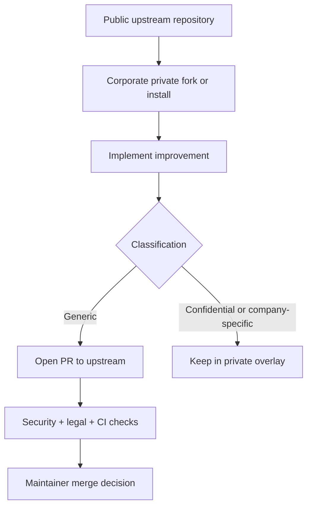

# OPEN SOURCE READINESS

Last updated: 2026-07-20
Status owner: repository maintainers

## Executive Summary

- Current state: significant provenance uncertainty concentrated in the full FHH overlay templates.
- Recommendation: `NO-GO` for immediate public release.
- Primary blockers: unresolved third-party provenance/licensing, potential corporate ownership constraints, missing legal notices and contribution controls.
- Main license recommendation now: keep current state private until blockers are resolved; do not switch to Apache-2.0 globally yet.
- Residual risk if published now: high probability of license/IP conflict and enterprise adoption risk.

## Critical Findings

| ID | Component | Risk | Evidence | Impact | Action | Suggested owner |
|---|---|---|---|---|---|---|
| C-001 | `impeccable` subtree in full overlay | CRITICAL | Upstream identifier `pbakaus/impeccable` in cleanup heuristics + large renamed subtree history | Potential unauthorized derivative redistribution | Freeze from public distribution; verify upstream license/version or rewrite | Maintainer + legal |
| C-002 | Product-studio skills adapted from external prompt repo | HIGH | Explicit “Adapted from ... deanpeters/product-manager-prompts” lines | Attribution/licensing non-compliance risk | Confirm upstream license and obligations or rewrite from clean-room brief | Maintainer |
| C-003 | `caveman` mirrored components | HIGH | Source URL references to external repo in manifest/docs | Unknown rights for bundled/mirrored material | Verify license and include notices; otherwise remove from public core | Maintainer + legal |
| C-004 | Vendored `modern-screenshot.umd.js` | MEDIUM | vendored UMD file + npm metadata indicates MIT | Missing required third-party notice/license trace | Keep with explicit notice and upstream reference | Maintainer |
| C-005 | FHH-specific overlay and internal patterns | HIGH | FHH-specific terminology, tenancy/internal references | Corporate ownership/confidentiality risk | Keep as private overlay pending corporate authorization | Company approver |

## Remediation Plan (P0-P3)

### P0 — blocks publication

1. Resolve license/provenance for `impeccable` subtree or remove from public distribution.
2. Resolve license/provenance for `caveman` mirrored content or remove from public distribution.
3. Resolve external adapted prompt rights (`deanpeters/product-manager-prompts`) or rewrite clean-room.
4. Obtain explicit corporate authorization for publishable FHH-derived material.

### P1 — required before public visibility

1. Complete third-party notices and per-component upstream license attachments where needed.
2. Confirm full overlay and private/public boundary documentation remains consistent in templates and docs.
3. Finalize legal wording for outbound licensing posture (MIT stay vs Apache transition timing).

### P2 — required before accepting broad external contributions

1. Enforce DCO process in contribution workflow.
2. Keep CODEOWNERS + PR provenance template as required checks.
3. Maintain corporate contribution policy and security review gate.

### P3 — post-launch hardening

1. Add SBOM generation and dependency license scans.
2. Add periodic secret scanning and dependency review controls.
3. Add file header/provenance lint for newly introduced third-party material.

## License Status

- Apache-2.0: proposed target only; prerequisites not yet met.
- Current repository license file: MIT.
- Compatible permissive third-party signals: `modern-screenshot` (MIT via npm metadata) but still needs local third-party notice trail.
- Potentially incompatible or unknown components: `impeccable`, `caveman`, and adapted prompt content without confirmed source license in this audit evidence.
- Components with no confirmed source license evidence: treat as `NO_LICENSE`/`UNKNOWN_PROVENANCE` until proven otherwise.

## Intellectual Property Status

- Confirmed own content (lower risk): CLI/TUI/planner/apply/doctor scripts in `src/`, `bin/`, tests and validation scripts (subject to spot checks).
- External authorized content: only partial confirmation for vendored package metadata (`modern-screenshot`), pending local notices.
- Derived content: product-studio adaptations and likely external-derived overlay clusters.
- Employment/corporate ownership: unresolved for FHH-specific overlays.
- AI-generated content: mixed; C/D/E categories likely present in overlay templates and require reinforced review.
- Unknown provenance: high concentration in `templates/repo-overlay-fhh-ia-ecosystem-full/.agents/**`.

## Repository Readiness Checklist

### Legal and notices
- License present: yes (`LICENSE`, MIT).
- `NOTICE`: now added (draft for future Apache transition posture).
- `THIRD_PARTY_NOTICES.md`: now added.
- Provenance audit ledger: now added (`docs/legal/PROVENANCE-AUDIT.md`).

### Governance and contribution
- `CONTRIBUTING.md`: updated with DCO + provenance declaration requirements.
- `GOVERNANCE.md`: added.
- `CODEOWNERS`: added.
- Pull request template and issue templates: added.
- Corporate contribution policy: added (`docs/legal/CORPORATE-CONTRIBUTIONS.md`).

### Security and policy
- `SECURITY.md`: added.
- `TRADEMARKS.md`: added.
- `CODE_OF_CONDUCT.md`: added.

### CI and preventive checks
- Existing CI retained.
- Added legal/provenance validation script and CI step.

## Publication Decision Gate

Do not change repository visibility to public until all conditions below are true:

1. Every external-derived component has confirmed source URL, version/commit and license evidence.
2. Missing-license or unknown-provenance components are removed, rewritten, or covered by written permission.
3. Third-party notices are complete and validated in CI.
4. Corporate ownership and authorization for publishable portions are documented.
5. Confidential/policy-specific content is segregated to private overlays.
6. DCO sign-off and review controls are enforced on contributions.
7. Final legal counsel review approves chosen outbound license strategy.

## Recommended Publication Path

1. Publish only a minimal portable core first (CLI/TUI/planner + neutral templates only).
2. Keep FHH full overlay private until legal provenance is closed.
3. Reintroduce external-derived capabilities one by one with verified notices.
4. Only after that, evaluate transition to Apache-2.0 at repository level.

## Corporate Collaboration Model

## Legal Review Required

These topics require specialized legal counsel before release:

- Derivative-work analysis for `impeccable` and `caveman` template trees.
- Licensing obligations for adapted prompt content from external repos.
- Corporate ownership assignment and employee-work/IP scope.
- Outbound re-licensing path from current MIT state to Apache-2.0 (if pursued).
