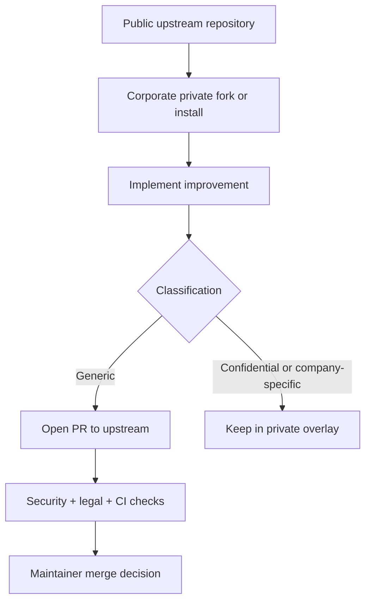

# OPEN SOURCE READINESS

Last updated: 2026-07-23
Status owner: repository maintainers

## Executive Summary

- Current state: known third-party components have pinned provenance, copied license texts, applicable notices, and SHA-256 inventory records; the complete `product-studio` tree remains `EXTERNAL_UNVERIFIED`.
- Recommendation: `NO-GO` for public visibility or distribution of the full overlay.
- Primary blockers: complete source and license evidence for all 19 Product Studio files, final publication authority, and legal approval of the outbound license strategy.
- Main license recommendation now: keep current state private until blockers are resolved; do not switch to Apache-2.0 globally yet.
- Residual risk if published now: high probability of license/IP conflict and enterprise adoption risk.

## Critical Findings

| ID | Component | Risk | Evidence | Impact | Action | Suggested owner |
|---|---|---|---|---|---|---|
| C-001 | `impeccable` subtree in full overlay | LOW | `e587004` comparison found 39 exact files, 19 adaptations, and 4 local-only files; Apache text and applicable NOTICE are carried forward | Ongoing redistribution obligation, not unknown provenance | Keep the manifest, license, and NOTICE synchronized with future imports | Maintainer + legal |
| C-002 | Full `product-studio` tree | HIGH | Only the `jobs-to-be-done` and `user-story` prompt sources have pinned MIT evidence; the other files have no complete source/license record | Public redistribution cannot be justified for the whole tree | Obtain coverage for all 19 files or remove the entire tree from canonical and installable overlays | Maintainer + legal |
| C-003 | `caveman` mirrored components | LOW | Pinned MIT snapshot comparison found 11 exact files, 11 adaptations, and 9 local-only adapters | Ongoing MIT notice obligation | Keep the manifest and MIT text synchronized with future imports | Maintainer |
| C-004 | Vendored `modern-screenshot.umd.js` | LOW | Exact `v4.7.0` pin, MIT text, and SHA-256 are recorded and checked in CI | Ongoing MIT notice obligation | Update pin, checksum, and license record together if the artifact changes | Maintainer |
| C-005 | FHH-specific overlay and internal patterns | MEDIUM | Maintainer states that FHH is the publishing party and that this material is authorized; `overlay-authorship.json` fixes the non-third-party path/content inventory | The record is a maintainer attestation, not independent proof of authorship | Renew the record when the inventory changes and obtain normal legal publication review | Maintainer + legal |
| C-006 | `frontend-design` skill | LOW | Independent Apache-2.0 source record pinned to `anthropics/skills`; local adaptation has a modification notice and SHA-256 inventory | Ongoing Apache notice and source-pin obligation | Keep its record independent from `impeccable` | Maintainer |

## Remediation Plan (P0-P3)

### P0 — blocks publication

1. Obtain source and license evidence covering all Product Studio files, or remove the complete Product Studio tree from both canonical and installable overlays.
2. Obtain legal counsel approval for public redistribution of the covered overlay and the chosen top-level license posture.

### P1 — required before public visibility

1. Confirm full overlay and private/public boundary documentation remains consistent in templates and docs.
2. Finalize legal wording for outbound licensing posture (MIT stay vs Apache transition timing).

### P2 — required before accepting broad external contributions

1. Enforce DCO process in contribution workflow.
2. Keep CODEOWNERS + PR provenance template as required checks.
3. Maintain corporate contribution policy and security review gate.

### P3 — post-launch hardening

1. Add SBOM generation and dependency license scans.
2. Add periodic secret scanning and dependency review controls.
3. Add file header/provenance lint for newly introduced third-party material.

## License Status

- Apache-2.0: proposed target only; do not change the top-level license without legal approval.
- Current repository license file: MIT.
- Compatible permissive third-party records are pinned and checked: `modern-screenshot` (MIT), `caveman` (MIT), `typecraft-guide-skill` (MIT), `product-manager-prompts` (pre-relicense MIT for two declared prompt sources), `frontend-design` (Apache-2.0), and `impeccable` (Apache-2.0 with applicable NOTICE).
- The distribution records live in `docs/legal/third-party/`; the legal check verifies their presence, notice declarations, vendored checksums, and SHA-256 path/content inventories.
- Remaining uncertainty includes the full Product Studio tree, the sufficiency of the maintainer authorization record for the internal overlay, and the final outbound-license decision.

## Intellectual Property Status

- Confirmed own content (lower risk): CLI/TUI/planner/apply/doctor scripts in `src/`, `bin/`, tests and validation scripts (subject to spot checks).
- External authorized content: `modern-screenshot`, `caveman`, `impeccable`, `frontend-design`, and the two source-evidenced Product Studio prompts.
- Derived content: `impeccable`, `frontend-design`, `caveman`, and the two source-evidenced Product Studio prompts.
- External-unverified content: the Product Studio tree as a whole; it must not be treated as internal or MIT-covered without complete evidence.
- Employment/corporate ownership: maintainer states the FHH-specific overlay is owned/authorized by the publishing party.
- AI-generated content: mixed; C/D/E categories likely present in overlay templates and require reinforced review.
- Unknown provenance: high concentration in `templates/repo-overlay-fhh-ia-ecosystem-full/.agents/**`.

## Repository Readiness Checklist

### Legal and notices
- License present: yes (`LICENSE`, MIT).
- `NOTICE`: now added (draft for future Apache transition posture).
- `THIRD_PARTY_NOTICES.md`: now added.
- Provenance audit ledger: now added (`docs/legal/PROVENANCE-AUDIT.md`).

### Governance and contribution
- `CONTRIBUTING.md`: updated with DCO + provenance declaration requirements.
- `GOVERNANCE.md`: added.
- `CODEOWNERS`: added.
- Pull request template and issue templates: added.
- Corporate contribution policy: added (`docs/legal/CORPORATE-CONTRIBUTIONS.md`).

### Security and policy
- `SECURITY.md`: added.
- `TRADEMARKS.md`: added.
- `CODE_OF_CONDUCT.md`: added.

### CI and preventive checks
- Existing CI retained.
- Added legal/provenance validation script and CI step.

## Publication Decision Gate

Do not change repository visibility to public until all conditions below are true:

1. Every external-derived component, including every Product Studio file, has confirmed source URL, source snapshot timing, and license evidence.
2. Pinned source commits or archived snapshots are recorded wherever redistribution depends on prior-license timing or Apache NOTICE carry-forward.
3. Third-party notices are complete and validated in CI.
4. Maintainer publication authority and the reviewed overlay inventory are documented in the audit trail.
5. DCO sign-off and review controls are enforced on contributions.
6. Final legal counsel review approves chosen outbound license strategy.

## Recommended Publication Path

1. Keep the repository private until the Product Studio blocker is resolved and explicit maintainer and legal approval are recorded.
2. Before changing visibility, rerun `npm run check:legal`, `npm run check:docs`, `npm run check:release`, and the full test suite on the intended commit.
3. Publish the full overlay only after every included component has a validated provenance record; otherwise publish a Product-Studio-free package only after a separate scope review.
4. Evaluate any transition to Apache-2.0 only after a separate legal decision; the repository remains MIT today.

## Corporate Collaboration Model

## Legal Review Required

These topics require specialized legal counsel before release:

- Derivative-work analysis for `impeccable` and `caveman` template trees.
- Licensing obligations for adapted prompt content from external repos.
- Final outbound licensing strategy and scope of derivative redistribution.
- Outbound re-licensing path from current MIT state to Apache-2.0 (if pursued).
