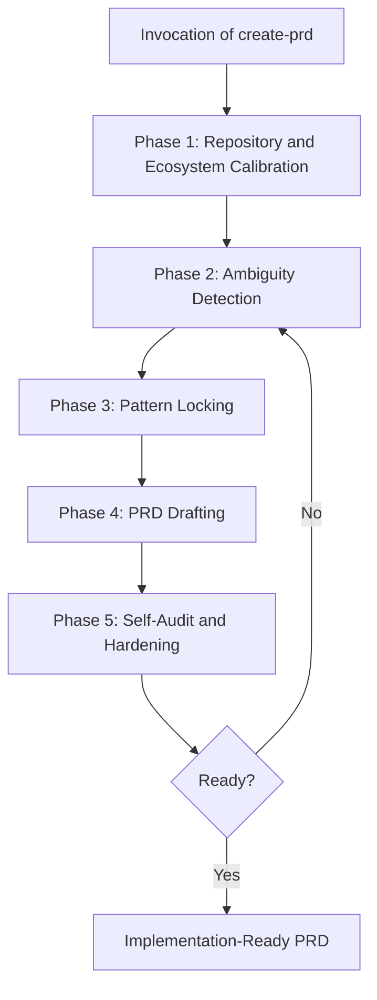

# Create-PRD as Orchestrator Architecture

## Status

Proposed

## Purpose

Define a robust, generic architecture for evolving `create-prd` from a single drafting skill into a multi-phase orchestrator that can produce implementation-ready PRDs for any application, feature, initiative, task, or system change.

This decision is intended for both humans and AI agents. It should be treated as the source proposal for implementation work in the workflow ecosystem.

## Executive Summary

The recommended direction is not to patch `create-prd` with a larger prompt. Instead, `create-prd` should become an internal workflow orchestrator with explicit phases, phase outputs, validation gates, and ecosystem integrations.

The outer router still decides when `create-prd` is the correct route. Once `create-prd` is invoked, the hardening, drafting, and self-audit responsibilities live inside the skill itself.

This preserves a clean system boundary:

- the router selects the workflow;
- `create-prd` executes the full PRD workflow;
- registries, capabilities, memory, and repo standards act as inputs to the workflow rather than ad hoc optional helpers.

## Problem Statement

Current PRD generation quality degrades when the drafting workflow does not sufficiently harden:

- local implementation patterns;
- comparable repo anchors;
- architecture placement;
- data and contract decisions;
- user-visible semantics;
- rollout and activation details;
- validation evidence;
- implementation slice granularity.

When these are not locked during PRD creation, downstream implementation workflows are forced to invent behavior. That is a workflow design problem, not only a prompting problem.

## Decision

`create-prd` should be redesigned as a generic orchestrator with explicit internal phases and hard gates.

It must remain generic across:

- frameworks;
- stacks;
- domains;
- product surfaces;
- feature sizes;
- backend/frontend/infra/data/AI work types.

It must adapt itself to the repository where it runs by inspecting the local workflow ecosystem, registry metadata, installed capabilities, memory, standards, and comparable implementation patterns.

## Non-Goals

- Do not move this hardening logic into the router.
- Do not create a one-off importer-specific or domain-specific PRD workflow.
- Do not rely on a giant monolithic prompt as the main enforcement mechanism.
- Do not force every repo to expose the same files; the orchestrator must adapt to what exists locally.
- Do not turn `create-prd` into an implementation skill.

## Design Principles

1. One workflow, many phases.
2. Generic core, local adaptation.
3. Hard gates over soft suggestions.
4. Real codebase evidence before PRD drafting.
5. Explicit pattern locking when a local comparable exists.
6. Downstream implementation must not invent missing behavior.
7. Registries, capabilities, and memory are workflow inputs, not decorative context.
8. The orchestrator should stay understandable to humans reviewing the system.

## Target Architecture

`create-prd` becomes an orchestrator with five mandatory internal phases.

## Internal Phase Contract

### Phase 1: Repository and Ecosystem Calibration

Objective:
Discover the minimum real context needed to avoid drafting a generic or incorrect PRD.

Required inputs when available:

- workflow instructions;
- skill registry;
- capability or integration registry;
- memory systems;
- repository standards;
- architecture docs;
- comparable PRDs or implementation anchors;
- relevant code surfaces.

Required outputs:

- detected work type;
- touched surfaces;
- relevant standards and local patterns;
- closest comparable implementation anchor;
- major risks;
- list of unresolved design-sensitive questions.

Hard gate:
The skill must not draft the PRD before this calibration output exists.

### Phase 2: Ambiguity Detection

Objective:
Find only the ambiguities that would materially change implementation, validation, or rollout.

Required ambiguity classes:

- scope boundary;
- business rules;
- ownership and placement;
- persistence and data lifecycle;
- contract/interface behavior;
- background or async semantics;
- success/partial/failure states;
- idempotency and retry rules when applicable;
- observability and user feedback;
- rollout/activation/backfill/repair when applicable;
- permissions, tenancy, and security when applicable;
- validation evidence;
- future-scope exclusions.

Required outputs:

- grouped blocking questions;
- resolved decisions table as answers arrive;
- explicit statement when no blocking ambiguity remains.

Hard gate:
Drafting is blocked while material ambiguity remains.

### Phase 3: Pattern Locking

Objective:
Ensure the PRD names and adopts the correct local implementation pattern instead of hand-waving with phrases like “follow the standard”.

Examples of patterns this phase may detect:

- async workflow orchestration;
- background post-processing;
- feature router or flag rollout;
- service-object composition;
- state/result summary pattern;
- row-level error persistence pattern;
- data migration and cutover pattern;
- UI table and feedback pattern;
- event or job chaining pattern.

Required outputs:

- adopted pattern name;
- anchor file(s) in repo;
- reused parts;
- intentionally different parts;
- rationale for the choice.

Hard gate:
If a meaningful local pattern exists, the PRD must anchor to it explicitly.

### Phase 4: PRD Drafting

Objective:
Draft the PRD using the repository-native template and the outputs of the previous phases.

The PRD must include, when applicable:

- concrete context and urgency;
- strict in/out scope;
- current-state grounding in real repo artifacts;
- architecture ownership and dependency direction;
- data model and persistence rules;
- contract and user-visible semantics;
- async/background behavior rules;
- rollout and activation path;
- executable implementation slices;
- evidence-linked acceptance criteria.

Hard gate:
The document must be executable by downstream workflow steps, not only readable.

### Phase 5: Self-Audit and Hardening

Objective:
Attack the PRD as if a future implementation workflow were trying to find missing behavior.

Mandatory review questions:

- Would implementation need to invent architecture?
- Would implementation need to invent persistence or lifecycle rules?
- Would implementation need to invent user-visible behavior?
- Would implementation need to invent idempotency, retries, or failure semantics?
- Would implementation need to invent rollout, repair, or rollback details?
- Are phases still too large and missing executable slices?
- Is any acceptance criterion missing evidence?
- Is any local pattern referenced vaguely rather than concretely?

Required outputs:

- hardening summary;
- unresolved residual risks;
- explicit “ready for implement-prd” or “not ready”.

Hard gate:
The PRD must not be considered complete while material invention would still be required downstream.

## Ecosystem Integration Contract

The orchestrator must integrate with the local AI workflow ecosystem.

### Router

Responsibility:
Select `create-prd` as the route.

Non-responsibility:
The router should not carry the internal hardening logic. Once the route is chosen, `create-prd` owns the PRD workflow.

### Registry

The skill registry should remain the discovery source for workflow skills and reusable patterns.

`create-prd` should consult the registry to discover:

- locally installed pattern skills;
- project-specific reusable workflows;
- domain-specific capabilities that affect PRD quality.

### Capabilities and Integrations

The orchestrator should use installed capabilities as tools for evidence gathering, not as a substitute for the workflow itself.

Examples:

- memory systems;
- code graph/search;
- documentation fetchers;
- test or contract analyzers;
- repo-aware search helpers.

### Memory

If memory exists, `create-prd` should search it before drafting and save meaningful new decisions after convergence.

At minimum, memory should be used for:

- prior decisions on the same initiative;
- known regressions;
- local conventions;
- previous trade-offs that should not be rediscovered.

## Artifact Model

To avoid hiding workflow state inside freeform prose, the orchestrator should generate internal structured artifacts between phases, even if the final output remains Markdown.

Minimum internal artifact fields:

- work_type;
- touched_surfaces;
- comparable_anchor;
- adopted_pattern;
- scope_in;
- scope_out;
- unresolved_questions;
- resolved_decisions;
- user_visible_contract;
- persistence_contract;
- async_or_background_contract;
- rollout_activation_contract;
- acceptance_evidence_map;
- execution_slices.

These artifacts may live as:

- in-memory structured outputs within the skill;
- auxiliary reference documents inside the skill folder;
- or an internal checklist file under the workflow meta area.

The exact storage can vary, but the contract should be explicit.

## Recommended File-Level Implementation Shape

The implementation in this repository should prefer a small orchestrator entrypoint with delegated reference documents rather than a single oversized `SKILL.md`.

Recommended shape:

- `.agents/skills/01-product/create-prd/SKILL.md`
  Orchestrator entrypoint, phase protocol, gates, and responsibilities.
- `.agents/skills/01-product/create-prd/reference/calibration.md`
  Rules for repository and ecosystem calibration.
- `.agents/skills/01-product/create-prd/reference/ambiguity-detection.md`
  Rules for blocking-question detection.
- `.agents/skills/01-product/create-prd/reference/pattern-locking.md`
  Rules for comparable-anchor and local-pattern adoption.
- `.agents/skills/01-product/create-prd/reference/self-audit.md`
  Adversarial quality gate before closure.
- `.agents/skills/01-product/create-prd/PRD_TEMPLATE.md`
  Final Markdown rendering template.

This keeps the system composable, inspectable, and easier to evolve.

## Why This Is Better Than a Large Embedded Prompt

Embedding one giant hardening prompt directly inside `create-prd` has three structural problems:

1. It mixes orchestration, policy, evidence-gathering, and rendering in one opaque blob.
2. It is harder to evolve phase-by-phase without regressions.
3. It makes quality dependent on prompt recall instead of explicit workflow gates.

An orchestrator design turns those implicit expectations into an actual system.

## Migration Strategy

### Step 1: Refactor `create-prd` into explicit phases

Keep the skill name stable, but rewrite the protocol as a phase-based orchestrator.

### Step 2: Externalize reference policies

Move detailed hardening logic into focused reference files under the skill folder.

### Step 3: Add mandatory pattern-locking output

Require every non-trivial PRD to name the adopted local pattern or state that none exists.

### Step 4: Add explicit self-audit closure gate

The skill must not terminate with “ready” unless the self-audit passes.

### Step 5: Add workflow smoke checks

Create a runbook or checklist verifying:

- phase order is respected;
- drafting never happens before calibration;
- blocking ambiguities halt the workflow;
- pattern-locking occurs when applicable;
- self-audit can force rewrite before closure.

## Acceptance Criteria for This Architecture Change

The redesign should be considered successful when:

1. `create-prd` can operate generically across multiple feature types without special-casing one domain.
2. PRDs consistently cite local comparable patterns when they exist.
3. PRDs stop leaving implementation-critical behavior undefined.
4. The skill remains understandable and maintainable by humans.
5. The workflow uses registries, capabilities, and memory systematically rather than optionally.
6. The resulting PRDs are easier for `implement-prd` to execute without invention.

## Risks

| Risk | Impact | Mitigation |
| --- | --- | --- |
| Overloading `create-prd` with too much inline detail | Hard-to-maintain skill | Use orchestrator entrypoint plus reference docs |
| Making the flow too rigid for small tasks | Slower PRD creation | Keep proportional behavior, but preserve gates |
| Pattern locking becomes performative rather than useful | Fake rigor | Require anchor files and explicit reused/different parts |
| Memory/capability integration varies by repo | Inconsistent execution | Make integrations adaptive and optional-by-availability, but mandatory-by-protocol when available |
| Self-audit becomes repetitive boilerplate | Low trust in the gate | Keep the audit adversarial and tied to implementation invention risk |

## Open Implementation Questions

These questions do not block the architecture decision, but they do affect implementation details:

1. Should phase outputs become explicit files under `docs/prd/_meta/` or remain internal to the skill runtime?
2. Should the self-audit phase reuse a separate skill later, or remain fully internal to `create-prd`?
3. How much of the calibration summary should be visible to the user by default?

## Recommended Next Step

Implement this as a skill refactor, not as a prompt append.

The first concrete delivery should be:

1. refactor `create-prd` into explicit phases;
2. add the referenced phase docs;
3. add one smoke-check runbook for the new behavior;
4. test the flow on at least one backend feature, one frontend feature, and one async/background workflow.