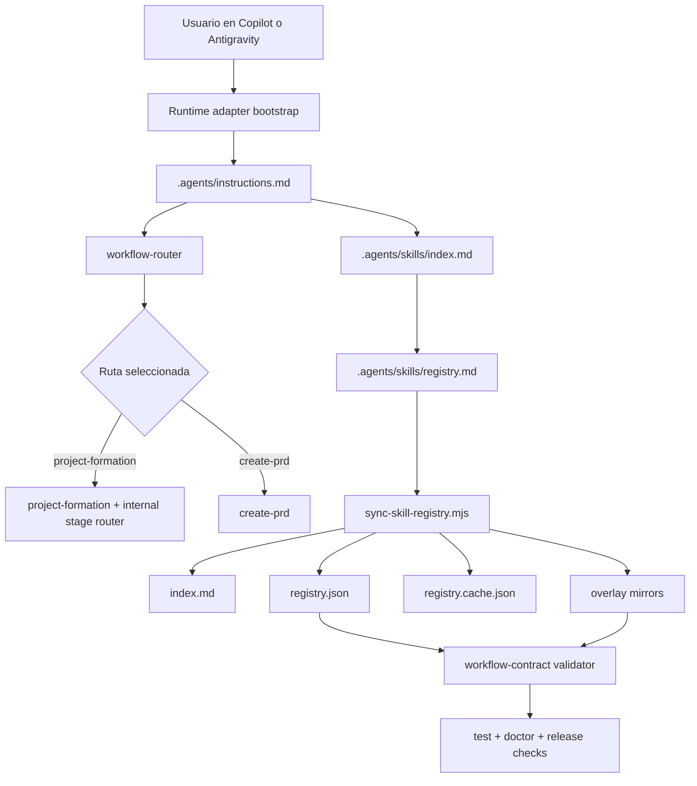

# PRD: Project Formation Router Parity for Antigravity and Copilot

**Ticket**: Release hardening for project formation, router enforcement, and skill registration lifecycle
**Autor**: GitHub Copilot
**Fecha**: 2026-07-29
**Estado**: Borrador

---

## 1. Contexto y Objetivo

El repositorio ya tiene un workflow robusto de project formation y un contrato neutral router-first, pero la experiencia por runtime no está expresada con el mismo nivel de enforcement. Hoy Copilot declara guardrails adicionales de traza visible, re-routing por turno y authorization gate; Antigravity sigue siendo un adapter más delgado y no deja igual de explícita esa conducta. En paralelo, el ciclo de registro de skills depende de un contrato repartido entre Markdown canónico, artefactos derivados y validaciones, por lo que cualquier drift puede degradar el routing o dejar skills invisibles para tooling y doctor.

Este PRD define un release en el que project formation debe operar con una experiencia de primer nivel en Antigravity, el router debe ser respetado de manera estricta en Copilot, y el proceso de registry/registro debe detectar y bloquear cualquier excepción de enrutamiento causada por drift, omisiones o sincronización incompleta.

> **Alcance estricto**: incluir paridad y enforcement de routing para Antigravity y Copilot, robustez del ciclo `.agents/skills/registry.md` -> sync -> `index.md`/`registry.json`/`registry.cache.json` -> overlay/template -> doctor/tests, y evidencia de release. No incluye rediseñar otros runtimes, crear nuevos workflows de producto, ni una reescritura general del sistema de skills.

### Estado Actual

| Capa | Componente | Archivo | Estado actual |
| --- | --- | --- | --- |
| Contrato neutral | Intake y router-first | `.agents/instructions.md` | Define per-turn intake, authorization gate y binding del workflow seleccionado. |
| Router principal | Selección de workflow | `.agents/skills/00-router/workflow-router/SKILL.md` | Tiene hard triggers, route-options y reglas explícitas para `project-formation` y Copilot-like traces. |
| Workflow producto | Project formation | `.agents/skills/01-product/project-formation/SKILL.md` | Tiene stage router, anti-skip, continuity protocol y footer obligatorio por turno. |
| Adapter runtime | Copilot | `.github/copilot-instructions.md` | Declara visible routing trace, turn-by-turn re-routing, PR comments hard trigger y execution authorization guarantee. |
| Adapter runtime | Antigravity | `ANTIGRAVITY.md` | Mantiene bootstrap neutral, pero no explicita el mismo nivel de enforcement conversacional que Copilot. |
| Registro canónico | Inventario humano | `.agents/skills/registry.md` | Fuente canónica de skills, triggers y loading posture. |
| Sync | Artefactos derivados | `scripts/sync-skill-registry.mjs` | Genera `index.md`, `registry.json`, `registry.cache.json` y copias overlay de forma determinística. |
| Validación | Contract/doctor | `src/workflow-contract/skills.mjs` | Valida `registry.json` y detecta `SKILL.md` no registrados. |
| Validación | Routing tests | `test/turn-routing-contract.test.mjs`, `test/workflow-contract.test.mjs` | Valida mínimos cross-runtime y parte del enforcement de Copilot/project-formation. |

### Estado Actual de Artefactos de Routing

| Artefacto | Rol | Observación |
| --- | --- | --- |
| `.agents/skills/index.md` | Descubrimiento startup-minimal | Derivado desde registry; no debe divergir. |
| `.agents/skills/registry.md` | Intención canónica legible por humanos | Se preserva en instalaciones existentes y guía routing/authoring. |
| `.agents/skills/registry.json` | Fuente validada por tooling | Es el archivo que consume el validador para detectar skills faltantes o inválidos. |
| `templates/repo-overlay-fhh-ia-ecosystem-full/**` | Overlay instalable | Debe reflejar sin drift los artefactos canónicos y derivados. |

---

## 2. Requerimientos Funcionales

### 2.1 Paridad de Project Formation en Antigravity

Antigravity debe ofrecer una entrada compatible con el contrato neutral y con la expectativa operativa de `project-formation`.

> **Decisión confirmada**: el adapter de Antigravity seguirá siendo delgado, pero debe declarar de forma suficiente las garantías necesarias para que el runtime no oculte ni debilite el router-first contract cuando el usuario trabaje con `project-formation` o con cualquier flujo no trivial.

**Condición de aplicación**: prompts no triviales en Antigravity y prompts que invoquen explícitamente `project-formation` o dependan del route selection para llegar a él.
**Entidad de agrupación**: runtime adapter + workflow router + project formation workflow + runtime templates.
**Campos afectados**: reglas de bootstrap, reglas de traza visible cuando aplique, re-routing por turno, binding del workflow seleccionado, continuidad de stage state, evidencia de paridad por tests/docs.
**Campos NO afectados**: algoritmo interno de shaping, roadmap, GTM o dossier de `project-formation`; model routing general fuera de este scope.
**Almacenamiento**: no hay persistencia de datos de negocio nueva; se modifican contratos y artefactos de documentación/validación.

Requisitos:

1. Antigravity debe preservar el flujo router-first para cualquier solicitud no trivial.
2. Antigravity debe dejar explícito que una decisión de workflow seleccionada es vinculante para la siguiente acción no trivial.
3. Cuando el runtime soporte la misma semántica conversacional, Antigravity debe reflejar re-routing por turno, protección contra route stickiness y guardrails de no ejecutar trabajo de implementación antes de autorización explícita.
4. El uso explícito o recomendado de `project-formation` en Antigravity debe conducir a la misma secuencia de stages, anti-skip gating y footer de navegación definidos por la skill canónica.

### 2.2 Enforcement Estricto del Router en Copilot

Copilot debe seguir siendo el runtime con mayor explicitud de enforcement, sin bypasses entre adapter, scoped instructions y router.

> **Decisión confirmada**: cualquier prompt no trivial en Copilot debe producir una decisión de routing visible antes de cargar un workflow, y una vez elegida una ruta el runtime no puede ejecutar una distinta sin emitir una nueva traza.

**Condición de aplicación**: prompts no triviales, follow-up turns, prompts ambiguos entre `project-formation`, `create-prd`, `generate-pm-ticket`, `create-epic`, y hard triggers de comentarios de PR.
**Entidad de agrupación**: `.github/copilot-instructions.md`, `.github/instructions/ai-workflow.instructions.md`, `workflow-router`, templates de Copilot y tests contractuales.
**Campos afectados**: visible routing trace, turn-by-turn re-routing, workflow binding, authorization gate, hard trigger precedence, evidence tests.
**Campos NO afectados**: lógica del picker de modelos o integraciones externas sin relación con routing.
**Almacenamiento**: contratos de texto y tests.

Requisitos:

1. Copilot no debe reutilizar la ruta de un turno anterior para el siguiente prompt no trivial.
2. Copilot no debe pasar de route selection a exploración/edición de implementación cuando la autorización requerida no exista.
3. Copilot debe seguir priorizando `project-formation` como opción recomendada cuando el usuario pide shaping end-to-end, pero respetar `create-prd` cuando el usuario lo pide explícitamente.
4. La precedencia determinística y los hard triggers del router deben mantenerse alineados entre contrato neutral, wrappers Copilot y tests.

### 2.3 Robustez del Registry y del Proceso de Registro

El ciclo de skill registration debe impedir que una skill válida quede fuera del routing o que un runtime/overlay quede sincronizado parcialmente.

> **Decisión confirmada**: `.agents/skills/registry.md` sigue siendo la fuente canónica legible por humanos; `scripts/sync-skill-registry.mjs` sigue siendo la única fuente autorizada para derivar `index.md`, `registry.json` y `registry.cache.json`; doctor/tests deben detectar drift o ausencia de registro antes de release.

**Condición de aplicación**: cambios en skills, triggers, loading posture, runtime wrappers, overlay mirrors e instalaciones sobre repos existentes.
**Entidad de agrupación**: registry Markdown, artifacts derivados, overlay templates, planner/apply merge behavior, workflow-contract validators, runbooks y docs operativas.
**Campos afectados**: auto-discovery de `SKILL.md`, determinismo de sync, validación de overlays, detección de drift, runbook de actualización y release checks.
**Campos NO afectados**: publicación en npm registry, inventario de capabilities fuera de skills, cambios de estructura del package manager.
**Almacenamiento**: Markdown canónico, JSON derivado, cache derivado, templates y tests.

Requisitos:

1. Toda skill instalada o creada localmente bajo `.agents/skills/**/SKILL.md` debe terminar visible en `registry.json` o fallar de forma explícita en doctor/validation.
2. Cualquier cambio en router, registry o runtime adapter que afecte routing debe incluir validación de overlay drift y artefactos derivados sincronizados.
3. El proceso de instalación/merge sobre repos existentes no debe clobber el catálogo local, pero tampoco dejar skills invisibles para el doctor.
4. La documentación operativa debe indicar una sola secuencia oficial para registrar cambios: editar canon, sincronizar artefactos, validar templates/contract, validar tests, validar legal si cambia overlay.

### 2.4 Criterios de Aceptación

| ID | Given | When | Then | Evidence expected |
| --- | --- | --- | --- | --- |
| AC-1 | Un repo con adapters de Copilot y Antigravity instalados | El usuario envía un prompt no trivial en cualquiera de ambos runtimes | El runtime sigue el bootstrap neutral y llega al workflow correcto sin bypass del router | Tests contractuales y/o fixtures actualizados por runtime |
| AC-2 | Un usuario pide shaping integral de iniciativa | El router clasifica el prompt | `project-formation` aparece como ruta recomendada y no se colapsa por error a otra workflow más pequeña | Assertions en router tests y ejemplos de prompt |
| AC-3 | Un usuario pide explícitamente crear un PRD | El prompt entra por Copilot o Antigravity | El sistema respeta `create-prd` como invocación explícita y no lo reemplaza por `project-formation` | Tests de precedence y trazas esperadas |
| AC-4 | Un usuario sigue una conversación multi-turn en Copilot | Llega un follow-up no trivial | Se re-ejecuta intake/routing y no se reutiliza automáticamente la ruta previa | `test/turn-routing-contract.test.mjs` o equivalente |
| AC-5 | Un cambio toca router, registry o wrappers runtime | Se corre el proceso oficial de sync/validation | `index.md`, `registry.json`, `registry.cache.json` y overlay quedan sincronizados o el check falla | `bun run check:workflow` en verde |
| AC-6 | Existe un `SKILL.md` local no registrado | Se ejecuta doctor/validator | El sistema reporta el skill como no registrado y bloquea confianza falsa de routing | `skills/unregistered-file` en tests/diagnostics |
| AC-7 | Se actualiza paridad de Antigravity | Se ejecutan checks del contrato | El adapter no redefine workflow logic, pero explicita las garantías necesarias para routing seguro | Diff contractual + tests de runtime entrypoints |
| AC-8 | Se prepara el release | Se corren validaciones focalizadas y suite relevante | No quedan drift de overlay ni artefactos de registry fuera de sync | `bun run test`, `bun run check:workflow`, `bun run check:legal` |

---

## 3. Modelo de Artefactos y Flujo

### 3.1 Migración Requerida

No hay migración de base de datos. El cambio es sobre contratos, adapters, skills, templates y artefactos derivados.

### 3.2 Artefactos Principales

| Artefacto | Tipo | Propósito | Propietario |
| --- | --- | --- | --- |
| `.agents/instructions.md` | Contrato neutral | Define intake, authorization gate y binding base | Contrato neutral |
| `.agents/skills/00-router/workflow-router/SKILL.md` | Skill workflow | Decide ruta no trivial y reglas de precedencia | Router |
| `.agents/skills/01-product/project-formation/SKILL.md` | Skill workflow | Define stages, continuity y anti-skip | Product workflows |
| `ANTIGRAVITY.md` | Adapter runtime | Bootstrap Antigravity sin redefinir lógica | Runtime adapter |
| `.github/copilot-instructions.md` y `.github/instructions/ai-workflow.instructions.md` | Adapter runtime | Enforcement explícito para Copilot | Runtime adapter |
| `.agents/skills/registry.md` | Registro canónico | Inventario humano de skills y posturas de carga | Skills registry |
| `scripts/sync-skill-registry.mjs` | Generador | Deriva index/json/cache y overlay mirrors | Tooling |
| `src/workflow-contract/skills.mjs` | Validator | Detecta registry inválido, duplicados y skills huérfanas | Doctor/contract |

### 3.3 Diagrama de Flujo

### 3.4 Reglas Arquitectónicas

1. Los adapters runtime deben seguir siendo delgados: pueden reforzar garantías de uso, pero no redefinir la lógica del workflow.
2. El router neutral es la autoridad de clasificación; los wrappers runtime solo pueden hacer más visible su enforcement, nunca desviarlo.
3. `registry.md` es canónico para authoring humano; `registry.json` es canónico para validación automatizada solo después de sincronizar desde el Markdown fuente.
4. Todo cambio que impacte routing debe reflejarse en el overlay instalable para mantener paridad entre paquete fuente y salida instalada.
5. Project formation sigue siendo un workflow explícito; no puede autoejecutarse cuando el usuario no autorizó esa ruta.

---

## 4. Plan de Implementación por Fases

### Fase 1 — Paridad Runtime para Antigravity

**Objetivo**: asegurar que Antigravity exprese y preserve el mismo contrato operativo mínimo necesario para routing seguro y uso confiable de `project-formation`.

**Slices ejecutables**:

| ID | Outcome | Depends on | Scope / likely files | Acceptance criteria | Tests | Validation | Evidence |
| --- | --- | --- | --- | --- | --- | --- | --- |
| P1-S1 | Matriz explícita de paridad Antigravity vs Copilot para routing y project-formation | none | `ANTIGRAVITY.md`, `templates/runtime-adapters/antigravity/ANTIGRAVITY.md`, docs/runbook si hace falta | AC-1, AC-7 | Contract tests de entrypoints | `node --test test/turn-routing-contract.test.mjs test/workflow-contract.test.mjs` | Assertions nuevas o actualizadas pasando |
| P1-S2 | Adapter de Antigravity reforzado sin duplicar workflow logic | P1-S1 | `ANTIGRAVITY.md`, `.antigravity/README.md`, template mirror | AC-1, AC-7 | Tests de bootstrap y parity | `bun run check:workflow` | Diff contractual y overlay sin drift |
| P1-S3 | Cobertura de prompt scenarios para `project-formation` en Antigravity | P1-S2 | Tests de routing/runtime | AC-1, AC-2 | Scenario tests o assertions equivalentes | `node --test test/turn-routing-contract.test.mjs` | Casos de ruta esperada documentados |

**Slice stop conditions**:

- Si Antigravity no soporta alguna semántica conversacional usada por Copilot, la diferencia debe quedar documentada y cubierta por una regla de equivalencia segura, no por omisión silenciosa.

**Definition of Done**:

- Cada slice está `VERIFIED` con contrato runtime, overlay mirror y evidencia de tests.

### Fase 2 — Enforcement del Router en Copilot

**Objetivo**: cerrar cualquier bypass entre wrappers Copilot, scoped instructions y router neutral para que la ruta seleccionada sea respetada siempre.

**Slices ejecutables**:

| ID | Outcome | Depends on | Scope / likely files | Acceptance criteria | Tests | Validation | Evidence |
| --- | --- | --- | --- | --- | --- | --- | --- |
| P2-S1 | Reglas de Copilot alineadas con el router para visible trace, binding y re-routing por turno | none | `.github/copilot-instructions.md`, `.github/instructions/ai-workflow.instructions.md`, template mirrors | AC-3, AC-4 | Contract tests Copilot | `node --test test/turn-routing-contract.test.mjs` | Tests en verde con assertions de follow-up routing |
| P2-S2 | Casos determinísticos ampliados para `project-formation`, `create-prd` y authorization gate | P2-S1 | `test/turn-routing-contract.test.mjs`, `test/workflow-contract.test.mjs` | AC-2, AC-3, AC-4 | Node test focalizado | `node --test test/turn-routing-contract.test.mjs test/workflow-contract.test.mjs` | Nuevos escenarios cubiertos |
| P2-S3 | Router neutral revisado para asegurar precedencia y route-binding sin excepciones | P2-S2 | `.agents/skills/00-router/workflow-router/SKILL.md`, overlay mirror | AC-2, AC-3, AC-4 | Routing contract tests | `bun run check:workflow && node --test test/turn-routing-contract.test.mjs test/workflow-contract.test.mjs` | Router y overlay sincronizados |

**Slice stop conditions**:

- Si un nuevo caso de precedence exige cambiar el contrato neutral, los wrappers no deben adelantarse; primero se ajusta la fuente neutral y luego los mirrors.

**Definition of Done**:

- Ningún escenario cubierto permite saltar desde intake a ejecución no autorizada ni reciclar la ruta del turno previo sin nueva traza.

### Fase 3 — Endurecimiento del Registry y del Proceso de Registro

**Objetivo**: hacer determinístico, comprobable y operativo el ciclo completo de skill registration.

**Slices ejecutables**:

| ID | Outcome | Depends on | Scope / likely files | Acceptance criteria | Tests | Validation | Evidence |
| --- | --- | --- | --- | --- | --- | --- | --- |
| P3-S1 | Runbook oficial de registro/sync/validación claramente definido | none | `docs/workflow/runbooks/update-skill-registry.md` o docs equivalentes, `README.md` si aplica | AC-5, AC-8 | Docs checks si cambian docs | `bun run check:docs` | Secuencia oficial documentada |
| P3-S2 | Sync script y validadores revisados para cubrir drift, mirrors y skills locales huérfanas | P3-S1 | `scripts/sync-skill-registry.mjs`, `src/workflow-contract/skills.mjs`, `src/planner.mjs` si aplica | AC-5, AC-6 | Registry sync tests, planner/workflow-contract tests | `node --test test/skill-registry-sync.test.mjs test/planner.test.mjs test/workflow-contract.test.mjs` | Fallos esperados/positivos cubiertos |
| P3-S3 | Overlay y artefactos derivados se regeneran de forma idempotente | P3-S2 | `.agents/skills/index.md`, `.agents/skills/registry.json`, `.agents/skills/registry.cache.json`, overlay mirrors | AC-5, AC-8 | Sync determinism tests | `bun run check:workflow` | Check de sync en verde |

**Slice stop conditions**:

- Si se detecta una diferencia entre catálogo humano y catálogo derivado que no pueda resolverse automáticamente, el release no avanza hasta definir fuente de verdad única para ese caso.

**Definition of Done**:

- Un maintainer puede registrar o modificar una skill siguiendo un solo flujo documentado y el doctor detecta cualquier omisión relevante.

### Fase 4 — Release Readiness y Evidencia

**Objetivo**: empaquetar el cambio como una versión liberable con evidencia de contrato, docs y overlay.

**Slices ejecutables**:

| ID | Outcome | Depends on | Scope / likely files | Acceptance criteria | Tests | Validation | Evidence |
| --- | --- | --- | --- | --- | --- | --- | --- |
| P4-S1 | Documento de release/versioning actualizado para esta mejora | P1-S3, P2-S3, P3-S3 | `docs/release-plan.md`, `docs/versioning.md`, changelog/release note donde corresponda | AC-8 | Release-readiness checks | `bun run check:release` | Nota de release o plan actualizado |
| P4-S2 | Suite final de validación ejecutada y documentada | P4-S1 | repo root, tests y scripts existentes | AC-8 | Full relevant suite | `bun run test && bun run check:workflow && bun run check:legal && bun run check:docs` | Salida en verde registrada en handoff/release note |

**Slice stop conditions**:

- Si `check:workflow`, `check:legal` o la suite contractual fallan, no se publica la versión.

**Definition of Done**:

- Existe evidencia ejecutable de que routing, mirrors y registro permanecen consistentes en la versión candidata.

---

## 5. Riesgos y Decisiones Abiertas

| Riesgo | Impacto | Mitigación |
| --- | --- | --- |
| Diferencias reales de capacidad entre Copilot y Antigravity | Se fuerza una paridad textual que el runtime no puede honrar | Documentar equivalencia segura y testear contrato observable, no semántica inventada |
| Drift entre canon y overlay | El repo fuente pasa tests locales pero instala un contrato distinto | Mantener mirrors obligatorios y fallar en `check:workflow`/overlay drift |
| Registry humano y JSON derivado divergen | Tooling valida una realidad distinta a la que leen los agentes | Hacer del sync un paso obligatorio en el runbook y en la validación de release |
| Project formation se vuelve demasiado rígido | Peor UX por exceso de guardrails | Medir paridad sobre comportamiento observable y mantener adapters delgados |

Decisiones abiertas no bloqueantes:

1. Si la release necesita un smoke test guiado por prompts de ejemplo además de assertions estáticas.
2. Si conviene agregar un fixture reusable de routing cross-runtime para reducir duplicación de tests.

---

## 6. Activación y Adopción

No hay backfill de datos. La activación consiste en instalar o actualizar el overlay, regenerar artefactos de skill registry y validar el contrato.

Secuencia de activación esperada:

1. Editar fuentes canónicas de router/registry/adapters.
2. Ejecutar `bun run check:workflow` o `node scripts/sync-skill-registry.mjs --write` seguido del check correspondiente.
3. Ejecutar `bun run test`, `bun run check:docs` y `bun run check:legal` cuando cambien overlays/documentación.
4. Validar instalación en runtime target con `workflow-kit doctor --target <repo> --runtime copilot,antigravity` cuando aplique.

Rollback:

- Revertir el cambio completo de contrato + artefactos derivados + overlay mirrors en el mismo changeset; no dejar sincronización parcial.