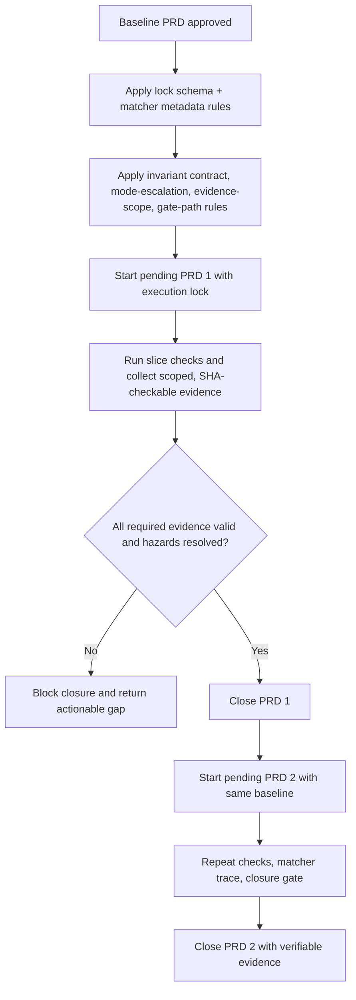

# PRD: Baseline Hardening Before Pending PRD Implementation

**Ticket**: Workflow reliability guardrails for pending PRD execution
**Autor**: GitHub Copilot
**Fecha**: 2026-08-05
**Estado**: En ejecucion - Fases 1 y 2 completadas; Fases 3 y 4 pendientes

---

## 1. Contexto y Objetivo

There are two pending PRDs in draft status under `docs/prd/workflow-skills/` and the team wants to implement them now while also fixing workflow weaknesses that previously produced poor outcomes in a real rollout: a child PRD silently contradicted a parent epic's non-negotiable requirement, a feature-flag-style rollout pattern shipped without a real lifecycle (no data migration, no both-state tests, no rollback plan), a high-risk change (flag + migration + background job + visible UI) was classified as low-delegation `controlled-implementation` instead of `standard`, validation commands were recorded as passing without actually exercising the declared scope, and closure relied on a quality-gate reference that pointed to a nonexistent file. Implementing the two pending PRDs without closing these architectural gaps repeats the same failure mode; pausing for full hardening delays delivery.

> **Alcance estricto**: introduce a minimal, enforceable baseline in `implement-prd`, `create-epic`, `create-prd`, and the pattern-authoring contract so the two pending PRDs run under verifiable execution rules, with contradictions blocked and evidence tied to real commands and real scope. This PRD does not include a full `bin/ai-workflow doctor`/`verify` CLI build-out, CI-native automation, or retroactive migration of historical epics/PRDs to the new invariant format.

### Estado Actual

| Capa | Componente | Archivo | Estado actual |
| --- | --- | --- | --- |
| Pendiente 1 | Executable review workflow | `docs/prd/workflow-skills/2026-08-03-executable-review-workflow-pattern/executable-review-workflow-pattern.md` | Borrador |
| Pendiente 2 | Use-cases/tests/edge-case gates | `docs/prd/workflow-skills/2026-08-04-prd-use-cases-tests-edge-cases-gate/prd-use-cases-tests-edge-cases-gate.md` | Borrador |
| Implementacion | PRD orchestrator | `.agents/skills/02-implement/implement-prd/SKILL.md` | Tiene gating parcial, no baseline lock minimo para esta secuencia |
| Seleccion de patterns | Matcher | `.agents/skills/02-implement/implementation-skill-matcher/SKILL.md` | Existe, pero requiere alineacion con politicas de elegibilidad |
| Catalogo skills | Registry | `.agents/skills/registry.md` | Mezcla postura de carga con seleccion automatica en algunos patterns |
| Epica | create-epic | `.agents/skills/01-product/create-epic/SKILL.md` | No define invariantes versionadas con ID que un PRD hijo deba respetar |
| PRD | create-prd | `.agents/skills/01-product/create-prd/SKILL.md`, `PRD_TEMPLATE.md` | No exige mapear invariantes heredadas del epic ni bloquear contradicciones |
| Validacion | Stop conditions | `.agents/skills/02-implement/implement-prd/reference/validation-and-stop-conditions.md` | Referencia rutas de quality gate sin exigir verificar que existan |
| Patterns de riesgo | Authoring contract | `.agents/skills/06-patterns/README.md` | No exige lifecycle estructurado para patterns que gobiernan rollout riesgoso (ej. feature flags) |

### Problema a Resolver

| Aspecto | Situacion actual | Impacto |
| --- | --- | --- |
| Seleccion condicional de patterns | Inconsistente entre matcher y metadata | Riesgo de omitir patterns requeridos por slice |
| Evidencia de cierre | Puede quedar autoafirmada por handoff | Cierres fragiles sin verificacion externa minima |
| Secuencia de entrega | No hay baseline obligatorio previo a PRDs pendientes | Se repite deuda de proceso durante implementacion |
| Herencia epic -> PRD | Sin invariantes con ID ni bloqueo de contradiccion | Un PRD hijo puede redefinir silenciosamente un requisito no negociable del epic |
| Seleccion de modo | Basada en criterio subjetivo de "un solo escritor" | Cambios de alto riesgo (flag+migracion+job+UI) se implementan sin matcher bloqueante ni QA fresca |
| Evidencia de comando | Se acepta cualquier comando en verde | Un comando que no ejerce el alcance declarado puede registrarse como evidencia valida |
| Rutas de quality gate | Se referencian sin verificar existencia | El cierre puede avanzar aunque el gate configurado no exista |
| Lifecycle de patterns riesgosos | No estructurado en el contrato de autoria | Un pattern de rollout (ej. feature flag) puede faltar owner, estado por defecto, pruebas de ambos estados o plan de retiro |

---

## 2. Requerimientos Funcionales

### 2.1 Baseline de ejecucion obligatorio

> **Decision confirmada**: antes de implementar PRD pendiente 1 y 2, se activa un baseline minimo coercitivo.

**Condicion de aplicacion**: cualquier ejecucion `implement-prd` para los dos PRDs pendientes.
**Entidad de agrupacion**: PRD target + slices + evidencias + cierre.
**Campos afectados**: `implement-prd` contract, matcher metadata usage, closure evidence contract.
**Campos NO afectados**: contenido funcional de negocio de los dos PRDs pendientes.
**Almacenamiento**: artefactos markdown de skills/contracts y evidencia de validacion.

Requisitos:

1. `implement-prd` must require an execution lock artifact per PRD before starting slice implementation.
2. The lock must include `slice_id`, `hazards`, `selected_patterns`, `required_checks`, `evidence_state`, and `waiver_state`.
3. Closure must fail when required checks are missing or stale for touched slice scope.

### 2.2 Alineacion matcher-registry para seleccion automatica

> **Decision confirmada**: patterns remain conditional, but eligibility for matcher must be explicit and machine-readable.

**Condicion de aplicacion**: slices with hazards (contract changes, edge-case coverage gates, QA closure gates).
**Entidad de agrupacion**: pattern metadata, matcher decision input, selected pattern list.
**Campos afectados**: registry entries and matcher rules references.
**Campos NO afectados**: explicit user-invocation behavior.
**Almacenamiento**: skill metadata/markdown contracts.

Requisitos:

1. Registry metadata must separate `user-invocable` from `matcher-eligible` semantics.
2. Matcher must emit deterministic selection evidence in handoff output.
3. Missing eligibility metadata for required patterns must block progression to implementation slices.

### 2.3 Gate minimo de evidencia verificable

> **Decision confirmada**: no `VERIFIED` status without reproducible check evidence.

**Condicion de aplicacion**: every slice state transition to `VERIFIED`.
**Entidad de agrupacion**: slice transition + command evidence.
**Campos afectados**: handoff schema closure fields and validation requirements.
**Campos NO afectados**: optional narrative notes.
**Almacenamiento**: task tracker + handoff payload.

Requisitos:

1. Every `VERIFIED` slice must cite exact command and pass signal.
2. Evidence must be invalidated when files in slice scope change after validation.
3. Waivers are allowed only as explicit `waived_by_user` with reason.

### 2.5 Contrato de invariantes padre-hijo (create-epic -> create-prd)

> **Decision confirmada**: un PRD hijo nunca puede redefinir silenciosamente un requisito no negociable del epic padre.

**Condicion de aplicacion**: cualquier PRD que declare un `parent_epic`.
**Entidad de agrupacion**: invariante del epic (con ID estable) + AC del PRD hijo que la cubre.
**Campos afectados**: `create-epic/SKILL.md`, `create-prd/SKILL.md`, `PRD_TEMPLATE.md`.
**Campos NO afectados**: PRDs sin epic padre; estos siguen sin exigir esta seccion.
**Almacenamiento**: seccion versionada dentro del epic y del PRD hijo.

Requisitos:

1. `create-epic` must declare a versioned `Invariantes No Negociables` table with stable IDs (for example `INV-EMAIL-01`, `INV-FLAG-01`), owner, and rationale.
2. `create-prd` must require a `parent_epic` reference plus an explicit mapping table: each inherited invariant ID maps to at least one AC of the child PRD.
3. If a child PRD would contradict an inherited invariant, `create-prd` must stop and require an explicit user-approved "change request" record (invariant ID, reason, approver) before drafting can continue; silent redefinition is not allowed.

### 2.6 Escalamiento determinista de modo por riesgo (implement-prd)

> **Decision confirmada**: la eleccion de modo no puede depender de un criterio subjetivo de "un solo escritor" cuando hay multiples hazards de alto riesgo combinados.

**Condicion de aplicacion**: cualquier slice o PRD cuyo alcance combine dos o mas hazards de alto riesgo (por ejemplo: mecanismo de rollout persistente tipo feature flag, migracion de datos, background job, contrato/API publico, UI visible para usuario).
**Entidad de agrupacion**: slice + hazards detectados + modo asignado.
**Campos afectados**: `implement-prd/SKILL.md` (Operating Modes, Delegation Heuristics).
**Campos NO afectados**: slices con un unico hazard o sin hazards de alto riesgo.
**Almacenamiento**: seccion de modo en el contrato `implement-prd` y en el execution lock.

Requisitos:

1. `implement-prd` must define a fixed hazard list (rollout mechanism/feature flag, data migration, background job, public contract/API change, tenancy/authorization change, visible UI) and count them per slice/PRD.
2. If two or more hazards from that list are present, the mode must be forced to `standard` regardless of file count or "one writer" framing; the orchestrator cannot downgrade this with a narrative justification alone.
3. Forcing `standard` under this rule implies: blocking matcher completion before coding, independent validation, and fresh-context QA before closure.

### 2.7 Evidencia ligada a comando, alcance real y SHA

> **Decision confirmada**: un comando en verde solo cuenta como evidencia si ejerce realmente el alcance requerido para el slice.

**Condicion de aplicacion**: cualquier evidencia usada para promover un slice a `VERIFIED`.
**Entidad de agrupacion**: comando ejecutado + alcance declarado (`required_checks`) + SHA del contenido validado.
**Campos afectados**: `implement-prd/reference/handoff-schemas.md`, `implement-prd/reference/validation-and-stop-conditions.md`.
**Campos NO afectados**: evidencia narrativa complementaria (notas, aprendizajes).
**Almacenamiento**: contrato TOON de handoff y execution lock.

Requisitos:

1. Every accepted evidence entry must record the exact command executed and confirm, in plain text, that the command's scope matches the slice's `required_checks` (for example: a project-wide selector that silently no-ops on the intended files must not be accepted as evidence).
2. Evidence must include or be checkable against a content reference (file paths + SHA or equivalent) so a later change to those files marks the evidence `stale` per the existing baseline rule in 2.3/2.1.
3. If the declared command cannot be confirmed to exercise the intended scope, the orchestrator must treat that slice as `evidence_state: missing`, not `fresh`.

### 2.8 Verificacion de rutas de quality gate antes de confiar en ellas

> **Decision confirmada**: `implement-prd` no puede depender de una ruta de quality gate o instructions sin confirmar que existe.

**Condicion de aplicacion**: cualquier referencia a un archivo de quality gate, instructions de dominio, o estandares citado por `implement-prd` o sus referencias.
**Entidad de agrupacion**: ruta referenciada + resultado de verificacion de existencia.
**Campos afectados**: `implement-prd/SKILL.md` (Mandatory Startup), `implement-prd/reference/validation-and-stop-conditions.md`.
**Campos NO afectados**: contenido de negocio de los quality gates mismos.
**Almacenamiento**: contrato de arranque de `implement-prd`.

Requisitos:

1. Before relying on a configured quality-gate or standards-instruction path, `implement-prd` must confirm the path exists in the target repository.
2. If a referenced path is missing, this is a hard stop condition (added to `validation-and-stop-conditions.md`), not a silent pass-through to closure.
3. The missing-path stop must name the exact expected path so the user can create it or correct the reference.

### 2.9 Contrato de lifecycle para patterns de rollout riesgoso

> **Decision confirmada**: un pattern skill que gobierna un mecanismo de rollout riesgoso (por ejemplo feature flags/toggles) debe declarar su lifecycle completo, no solo el mecanismo tecnico.

**Condicion de aplicacion**: cualquier pattern skill repo-owned bajo `.agents/skills/06-patterns/**` cuyo dominio gobierne activacion/desactivacion controlada de comportamiento en produccion.
**Entidad de agrupacion**: pattern skill + bloque de lifecycle.
**Campos afectados**: `.agents/skills/06-patterns/README.md` (Authoring Rules).
**Campos NO afectados**: patterns que no gobiernan rollout controlado (por ejemplo, serializers o validators puros).
**Almacenamiento**: contrato de autoria de pattern skills.

Requisitos:

1. The authoring contract must require a structured lifecycle block for rollout-governing patterns: owner, default state (off by default), activation mechanism, required tests for both states, rollback path, and retirement/cleanup plan.
2. A pattern skill missing this lifecycle block for a rollout-governing domain must be treated as incomplete by `add-project-pattern` review guidance.
3. This requirement applies to future repo-owned patterns of this kind; it does not retrofit patterns that do not exist in this repository today.

### 2.10 Criterios de Aceptacion

| ID | Given | When | Then | Evidence expected |
| --- | --- | --- | --- | --- |
| AC-1 | Two pending PRDs are still draft | Baseline hardening is applied first | A baseline lock contract exists before PRD 1 execution starts | Skill/contract diff with lock fields |
| AC-2 | A slice requires conditional patterns | Matcher runs for that slice | Selected patterns are explicit and traceable in handoff output | Handoff schema or skill output contract update |
| AC-3 | A slice claims `VERIFIED` | Closure gate evaluates evidence | Closure blocks if command evidence is missing or stale | Validation/closure rule in implement-prd contract |
| AC-4 | A required pattern lacks matcher metadata | Orchestrator prepares slice | Progression is blocked with explicit reason | Stop-condition text in relevant skill/contracts |
| AC-5 | Team starts implementing pending PRD 1 | Baseline is active | PRD 1 implementation follows lock + evidence rules | Task tracker evidence for PRD 1 start |
| AC-6 | Team finishes PRD 2 under baseline | Closure is requested | Both pending PRDs close with verifiable evidence mapping | Final tracker + validation outputs |
| AC-7 | A PRD declares a `parent_epic` | create-prd maps invariants | Every inherited invariant ID has at least one AC, and any contradiction requires an explicit approved change request | Invariant mapping table in create-prd/PRD_TEMPLATE |
| AC-8 | A slice combines two or more high-risk hazards | implement-prd classifies mode | Mode is forced to `standard` with blocking matcher and fresh QA, regardless of writer count | Mode rule text in implement-prd |
| AC-9 | A slice reports a passing validation command | Evidence is evaluated for closure | Evidence is accepted only if the command scope matches required_checks; otherwise marked missing | Evidence rule in handoff-schemas/validation-and-stop-conditions |
| AC-10 | implement-prd references a quality-gate/instructions path | Startup or validation runs | Missing path is a named hard stop, not silent pass-through | Stop-condition entry in validation-and-stop-conditions |
| AC-11 | A new pattern skill governs a rollout mechanism | Pattern authoring review happens | The pattern must declare owner, default-off state, both-state tests, rollback, and retirement plan | Authoring rule in 06-patterns/README.md |
| AC-12 | implement-prd initializes its execution lock/tracker | Baseline is active | The lock/tracker artifact remains git-tracked, not excluded via `.gitignore` | Explicit rule text plus verified tracked file state |

---

## 3. Modelo de Artefactos y Flujo

### 3.1 Migracion Requerida

No database migration. Workflow contract and validation behavior migration only.

### 3.2 Artefactos Principales

| Artefacto | Tipo | Proposito | Propietario |
| --- | --- | --- | --- |
| `.agents/skills/02-implement/implement-prd/SKILL.md` | Skill canonic | Add mandatory baseline execution lock, mode-escalation rule, quality-gate path verification, and closure gates | Implement workflow |
| `.agents/skills/02-implement/implement-prd/reference/handoff-schemas.md` | Contract | Extend evidence, matcher selection trace, and command/scope-correctness fields | Implement references |
| `.agents/skills/02-implement/implement-prd/reference/validation-and-stop-conditions.md` | Contract | Add command-scope correctness and missing-quality-gate-path stop conditions | Implement references |
| `.agents/skills/02-implement/implementation-skill-matcher/SKILL.md` | Skill canonic | Define deterministic matcher output requirements | Implement workflow |
| `.agents/skills/registry.md` | Registry | Clarify matcher-eligible metadata rules | Workflow catalog |
| `.agents/skills/01-product/create-epic/SKILL.md` | Skill canonic | Add versioned non-negotiable invariants table with stable IDs | Product workflow |
| `.agents/skills/01-product/create-prd/SKILL.md`, `PRD_TEMPLATE.md` | Skill canonic + template | Require parent invariant mapping and block silent contradiction | Product workflow |
| `.agents/skills/06-patterns/README.md` | Authoring contract | Require structured lifecycle block for rollout-governing pattern skills | Pattern authoring |
| `docs/prd/_meta/task_tracker.md` | Tracker | Record baseline activation before pending PRD execution; must remain git-tracked | Execution control |

### 3.3 Diagrama de Flujo

### 3.4 Reglas Arquitectonicas

1. No global mandatory pattern policy is introduced.
2. Conditional patterns become mandatory only when slice hazards trigger them.
3. Baseline lock is per-PRD, versioned with PRD artifacts, and git-tracked.
4. Closure authority is evidence-based, not narrative-based.
5. A child PRD can never silently redefine a parent epic's non-negotiable invariant.
6. Mode selection for multi-hazard slices is deterministic, not left to writer-count judgment.
7. Evidence is only as good as its declared command's real scope; unscoped "green" is not evidence.

---

## 4. Plan de Implementacion por Fases

### Fase 1 - Baseline hardening minimo

**Objetivo**: create enforceable execution baseline before pending PRD implementation.

| ID | Outcome | Depends on | Scope / likely files | Acceptance criteria | Tests | Validation | Evidence |
| --- | --- | --- | --- | --- | --- | --- | --- |
| P1-S1 | Execution lock schema required in implement-prd | none | `.agents/skills/02-implement/implement-prd/SKILL.md`, `reference/handoff-schemas.md` | AC-1, AC-3 | Contract test update | `bun run check:workflow` | Contract fields and gating rules added |
| P1-S2 | Matcher eligibility policy aligned with registry | P1-S1 | `.agents/skills/registry.md`, `implementation-skill-matcher/SKILL.md` | AC-2, AC-4 | Contract test update | `bun run check:workflow` | Deterministic matcher metadata and blocking rules |
| P1-S3 | Baseline activation recorded for execution | P1-S2 | `docs/prd/_meta/task_tracker.md` | AC-1 | Docs review | `bun run check:docs` | Tracker entry shows baseline active before PRD 1 |

**Slice stop conditions**:

- If matcher eligibility cannot be represented without breaking registry conventions, stop and issue a focused follow-up decision.
- If evidence invalidation cannot be expressed in current closure contract, stop and split into a dedicated contract patch slice.

**Definition of Done**:

- Baseline lock exists and is mandatory before pending PRD execution.
- Matcher eligibility and closure evidence rules are consistent.

### Fase 2 - Contratos de invariantes, modo determinista, evidencia real y lifecycle de patterns riesgosos

**Objetivo**: close the architectural gaps that let a child PRD contradict a parent epic, a high-risk change be under-classified, unscoped commands be accepted as evidence, a missing quality-gate path pass silently, and a rollout-governing pattern skill ship without a real lifecycle.

**Estado**: Completada el 2026-08-05. Evidencia autoritativa: `execution-lock.toon` del PRD.

| ID | Outcome | Depends on | Scope / likely files | Acceptance criteria | Tests | Validation | Evidence |
| --- | --- | --- | --- | --- | --- | --- | --- |
| P2-S1 | Parent-child invariant contract added to create-epic/create-prd/template | P1-S3 | `.agents/skills/01-product/create-epic/SKILL.md`, `.agents/skills/01-product/create-prd/SKILL.md`, `.agents/skills/01-product/create-prd/PRD_TEMPLATE.md` | AC-7 | Contract review | `bun run check:docs` | Invariant table + mapping rule + contradiction-block rule present |
| P2-S2 | Deterministic multi-hazard mode escalation added to implement-prd | P1-S3 | `.agents/skills/02-implement/implement-prd/SKILL.md` | AC-8 | Contract review | `bun run check:workflow` | Fixed hazard list + forced `standard` rule present |
| P2-S3 | Command-scope and SHA-checkable evidence rule added | P2-S2 | `.agents/skills/02-implement/implement-prd/reference/handoff-schemas.md`, `reference/validation-and-stop-conditions.md` | AC-9 | Contract review | `bun run check:workflow` | Evidence rule rejects unscoped "green" commands |
| P2-S4 | Quality-gate/instructions path verification stop condition added | P2-S3 | `.agents/skills/02-implement/implement-prd/SKILL.md`, `reference/validation-and-stop-conditions.md` | AC-10 | Contract review | `bun run check:workflow` | Missing-path stop condition present and named |
| P2-S5 | Rollout-pattern lifecycle block added to pattern authoring contract | none | `.agents/skills/06-patterns/README.md` | AC-11 | Docs review | `bun run check:docs` | Lifecycle fields (owner, default-off, both-state tests, rollback, retirement) present |
| P2-S6 | Execution lock/tracker confirmed git-tracked with explicit rule | P1-S3 | `.agents/skills/02-implement/implement-prd/SKILL.md`, `docs/prd/_meta/task_tracker.md` | AC-12 | `.gitignore` check | `git check-ignore -v docs/prd/_meta/task_tracker.md` (expect non-match) | Rule text plus confirmed tracked file |

**Slice stop conditions**:

- If an inherited invariant genuinely needs to change, the slice must produce the explicit change-request format, not silently rewrite the epic.
- If a hazard cannot be classified deterministically from the fixed hazard list, stop and refine the hazard list definition before proceeding.
- If no repo-owned pattern skill currently governs rollout mechanisms, P2-S5 still updates the authoring contract as a forward-looking requirement; it does not invent a pattern skill that does not exist.

**Definition of Done**:

- create-epic/create-prd enforce invariant inheritance with explicit contradiction handling.
- implement-prd forces `standard` mode deterministically for multi-hazard slices.
- Evidence acceptance requires real command/scope correspondence, not just exit code.
- Missing quality-gate/instruction paths block closure instead of passing silently.
- The pattern authoring contract requires a full lifecycle block for future rollout-governing patterns.
- The execution lock/tracker artifact is confirmed git-tracked.

### Fase 3 - Ejecutar PRD pendiente 1 bajo baseline

**Objetivo**: implement `2026-08-03-executable-review-workflow-pattern` with the full baseline (Fase 1 + Fase 2) enforcement active.

| ID | Outcome | Depends on | Scope / likely files | Acceptance criteria | Tests | Validation | Evidence |
| --- | --- | --- | --- | --- | --- | --- | --- |
| P3-S1 | PRD 1 slicing and execution under lock | P2-S6 | PRD 1 target files under `.agents/skills/02-implement/**` | AC-5 | Focused workflow tests | `bun run check:workflow && bun run check:docs` | Tracker + check output linked to slices |
| P3-S2 | PRD 1 closure with verified evidence | P3-S1 | `docs/prd/_meta/task_tracker.md` and touched contracts | AC-5 | Regression tests | `bun run test` | Verified closure evidence mapped to AC |

**Slice stop conditions**:

- If PRD 1 requires architecture changes beyond baseline scope, pause and split explicit follow-up slice.

**Definition of Done**:

- PRD 1 closed with lock-driven evidence and no bypass.

### Fase 4 - Ejecutar PRD pendiente 2 bajo baseline

**Objetivo**: implement `2026-08-04-prd-use-cases-tests-edge-cases-gate` with the same full baseline enforcement.

| ID | Outcome | Depends on | Scope / likely files | Acceptance criteria | Tests | Validation | Evidence |
| --- | --- | --- | --- | --- | --- | --- | --- |
| P4-S1 | PRD 2 slicing and execution under lock | P3-S2 | PRD 2 target files under `.agents/skills/01-product/**`, `.agents/skills/02-implement/**` | AC-6 | Focused workflow tests | `bun run check:workflow && bun run check:docs` | Slice-level evidence with matcher trace |
| P4-S2 | PRD 2 closure and final regression | P4-S1 | tracker + contract tests | AC-6 | Full regression | `bun run test` | Final closure evidence mapped to AC |

**Slice stop conditions**:

- If PRD 2 introduces incompatible closure semantics, halt and reconcile in a dedicated contract slice before closure.

**Definition of Done**:

- Both pending PRDs are implemented under the same baseline and close with reproducible evidence.

### Fase Futura - Hardening profundo fuera de baseline _(fuera de alcance)_

- Add dedicated `bin/ai-workflow doctor`/`verify` CLI surfaces if still needed.
- Add stronger CI-native stale-evidence detection and SHA pinning automation.
- Retrofit historical epics/PRDs with invariant IDs and lifecycle blocks.

---

## 5. Decisiones Tomadas

| # | Pregunta | Respuesta | Impacto en diseno |
| --- | --- | --- | --- |
| 1 | Hardening completo antes de entregar PRDs pendientes? | No | Use baseline-first hybrid rollout |
| 2 | Patterns obligatorios globales? | No | Only mandatory per hazard-triggered slice |
| 3 | Cierre por narrativa de handoff? | No | Require command-backed evidence |
| 4 | Implementar PRD 1 y PRD 2 sin baseline? | No | Baseline is phase-0 gate |
| 5 | Orden de ejecucion de PRDs pendientes? | PRD 1 y luego PRD 2 | PRD 1 primero reduce ambiguedad del flujo de review antes de endurecer casos de uso/tests/edge cases |
| 6 | Granularidad minima de evidencia? | Por slice | Cada slice debe llegar a VERIFIED con evidencia fresca o waiver explicito |
| 7 | Un PRD hijo puede redefinir un invariante del epic sin aviso? | No | Requiere change request explicito aprobado por el usuario |
| 8 | El modo se elige por criterio de "un solo escritor"? | No | Se fuerza `standard` deterministicamente ante 2+ hazards de alto riesgo |
| 9 | Un comando en verde sin verificar alcance cuenta como evidencia? | No | Debe confirmarse que el comando ejerce el `required_checks` real |
| 10 | Una ruta de quality gate ausente bloquea el cierre? | Si | Se agrega como stop condition explicita y nombrada |
| 11 | Los patterns de rollout riesgoso necesitan lifecycle estructurado? | Si | Owner, estado por defecto, pruebas de ambos estados, rollback y retiro |

---

## 6. Preguntas Abiertas

_(Vacio = PRD listo para implementar)_

---

## 7. Riesgos y Mitigaciones

| Riesgo | Probabilidad | Impacto | Mitigacion |
| --- | --- | --- | --- |
| Baseline demasiado ligero y no evita bypass real | Media | Alto | Add explicit blocking conditions in implement-prd and handoff schema |
| Baseline demasiado pesado y frena entrega | Media | Medio | Keep scope to lock+matcher-evidence only |
| Divergencia entre contracts y tests | Media | Alto | Tie each AC to `check:workflow` and node test evidence |
| El contrato de invariantes se vuelve ceremonial y no se completa en la practica | Media | Alto | Mantener la tabla compacta y exigir solo IDs, owner y AC vinculada, sin prosa extensa |
| El escalamiento de modo genera falsos positivos en slices simples | Baja | Medio | Limitar el conteo de hazards a la lista fija definida en 2.6 |
| La verificacion de rutas de quality gate rompe repos que aun no tienen esos archivos | Media | Medio | El stop condition nombra la ruta exacta esperada para que el usuario la cree o corrija |

---

## 8. Definition of Done Global

- [ ] Baseline hardening slices (Fase 1) are `VERIFIED`
- [ ] Contract hardening slices (Fase 2: invariants, mode escalation, evidence scope, gate-path verification, pattern lifecycle) are `VERIFIED`
- [ ] Pending PRD 1 implemented under full baseline with verifiable evidence
- [ ] Pending PRD 2 implemented under full baseline with verifiable evidence
- [ ] `bun run check:docs` in green
- [ ] `bun run check:workflow` in green
- [ ] `bun run test` in green

---

## 9. Matriz de Trazabilidad

| Acceptance criterion | Phase / slice | Test evidence | Validation evidence | Status |
| --- | --- | --- | --- | --- |
| AC-1 | P1-S1/P1-S3 | Contract checks | `bun run check:workflow`, `bun run check:docs` | Pending |
| AC-2 | P1-S2 | Contract checks | `bun run check:workflow` | Pending |
| AC-3 | P1-S1 | Closure rule checks | `bun run check:workflow` | Pending |
| AC-4 | P1-S2 | Matcher policy checks | `bun run check:workflow` | Pending |
| AC-5 | P3-S1/P3-S2 | Workflow + regression tests | `bun run check:workflow`, `bun run test` | Pending |
| AC-6 | P4-S1/P4-S2 | Workflow + regression tests | `bun run check:workflow`, `bun run test` | Pending |
| AC-7 | P2-S1 | Contract review | `bun run check:docs` | Pending |
| AC-8 | P2-S2 | Contract review | `bun run check:workflow` | Pending |
| AC-9 | P2-S3 | Contract review | `bun run check:workflow` | Pending |
| AC-10 | P2-S4 | Contract review | `bun run check:workflow` | Pending |
| AC-11 | P2-S5 | Docs review | `bun run check:docs` | Pending |
| AC-12 | P2-S6 | Git tracking check | `git check-ignore -v docs/prd/_meta/task_tracker.md` | Pending |
