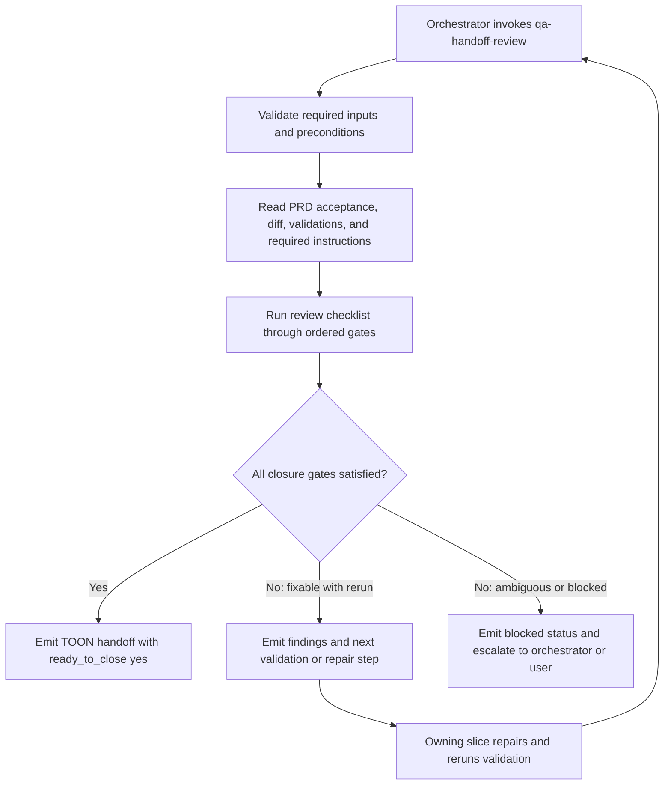

# PRD: Executable Review Workflow Pattern for QA Handoff Review

**Ticket**: Workflow-structure hardening for delegate review skills
**Autor**: GitHub Copilot
**Fecha**: 2026-08-03
**Estado**: Borrador

---

## 1. Contexto y Objetivo

El skill canónico de QA handoff review ya cubre misión, inputs, checklist y contrato de salida, pero todavía funciona más como una checklist fuerte que como un workflow ejecutable por agentes. Eso deja implícita la secuencia operativa, dificulta distinguir cuándo se puede saltar un paso, cuándo hay que volver a validación y qué condiciones bloquean el cierre.

Este PRD define un patrón de workflow ejecutable para skills de revisión/handoff que pueda aplicarse de manera consistente a todos los casos futuros, empezando por `qa-handoff-review` como caso inicial. La implementación debe mantener el archivo compacto, optimizado para entendimiento del agente y sin convertir la skill en una state machine verbosa.

> **Alcance estricto**: definir y aplicar en la fuente canónica un patrón de workflow ejecutable para `qa-handoff-review`, con secuencia base, excepciones claras, bucles finitos de reparación/validación y criterios explícitos de cierre. No incluye migrar todas las skills del ecosistema, tocar runtime adapters, cambiar `workflow-router`, ni propagar este cambio al template overlay en este PRD.

### Estado Actual

| Capa | Componente | Archivo | Estado actual |
| --- | --- | --- | --- |
| Skill canónica | QA final delegada | `.agents/skills/02-implement/qa-handoff-review/SKILL.md` | Tiene misión, inputs, checklist y output, pero no una secuencia operativa explícita con decisiones y re-entry rules. |
| Orquestación | Fase final de QA | `.agents/skills/02-implement/implement-prd/SKILL.md` | Exige QA final y rerun si hay findings, pero deja la mecánica concreta distribuida entre referencias. |
| Slicing | Criterio de cuándo usar QA | `.agents/skills/02-implement/implementation-slicing/SKILL.md` | Determina cuándo agregar `qa-handoff-review`, pero no define la estructura interna del review workflow. |
| Handoff | Contrato TOON | `.agents/skills/02-implement/implement-prd/reference/handoff-schemas.md` | Define campos de salida completos, pero no el orden operativo para producirlos. |

### Estado Actual del Problema

| Aspecto | Situación actual | Impacto |
| --- | --- | --- |
| Secuencia | El orden de lectura, revisión, findings y cierre es implícito | Diferentes agentes pueden ejecutar el review con criterios distintos |
| Excepciones | No están modeladas como saltos explícitos | Se vuelve difícil saber cuándo inline QA es válido o cuándo bloquear |
| Bucles | El rerun tras findings existe como intención, no como regla operacional concreta | Riesgo de cierre prematuro o iteraciones ambiguas |
| Cierre | `ready_to_close` depende de múltiples campos, pero la skill no explica el gate paso a paso | El agente puede tratar checklist y cierre como equivalentes |

---

## 2. Requerimientos Funcionales

### 2.1 Patrón de Workflow Ejecutable para Reviews

El skill debe expresar una secuencia base corta y clara, diseñada para que un agente pueda ejecutar el review sin inventar orden, sin omitir gates y sin expandir el archivo innecesariamente.

> **Decisión confirmada**: el patrón debe ser generalizable a otros review/handoff skills, pero este PRD solo implementa el caso canónico de `qa-handoff-review`.

**Condición de aplicación**: skills delegadas de review/handoff que determinan si una entrega puede cerrarse o debe volver a la fase dueña del problema.
**Entidad de agrupación**: skill de review + contrato de handoff + reglas del orquestador que dependen del cierre.
**Campos afectados**: propósito operativo, precondiciones, secuencia base, decisiones, excepciones, bucles finitos, criterios de bloqueo, criterios de cierre, output TOON.
**Campos NO afectados**: runtime adapters, skill registry, workflow-router, template overlays, y migración masiva del resto de las skills.
**Almacenamiento**: no hay persistencia de datos; se modifican artefactos Markdown canónicos del workflow.

Requisitos:

1. La skill debe declarar una secuencia base explícita y breve.
2. La skill debe distinguir entre pasos obligatorios y saltos permitidos solo bajo excepciones concretas.
3. La skill debe modelar al menos un bucle finito de reparación o rerun cuando haya findings o evidencia incompleta.
4. La skill debe indicar cuándo consultar al usuario por ambigüedad material, en lugar de seguir iterando automáticamente.
5. La skill no debe crecer con secciones ceremoniales que no mejoren el entendimiento del agente.

### 2.2 Excepciones y Bucles de Cierre

El workflow debe permitir saltos y reintentos solo cuando estén delimitados por reglas falsables y sin dejar espacio a loops indefinidos.

> **Decisión confirmada**: la secuencia base es obligatoria; los saltos solo se admiten en excepciones muy claras y los bucles existen para llegar a cierre o exponer errores pendientes, no para iterar sin fin.

**Condición de aplicación**: ejecución inline o delegada de QA final, reruns posteriores a findings, gaps de evidencia, o ambigüedades que afecten cierre.
**Entidad de agrupación**: findings, estado de validación, estado de regresión, estado de estándares, estado de test gaps, estado de edge cases, `ready_to_close`.
**Campos afectados**: gates de entrada, re-entry a validación, bloqueo por ambigüedad, reintento acotado, salida bloqueada.
**Campos NO afectados**: algoritmo del matcher, ownership de slices, ni reglas de selección de subagentes.
**Almacenamiento**: contratos Markdown y output TOON.

Requisitos:

1. Si falta evidencia de aceptación, regresión, estándares, tests o edge cases, el workflow debe bloquear cierre y devolver findings o gaps explícitos.
2. Si el problema es corregible con un rerun tras reparación/validación, la skill debe indicarlo como siguiente paso esperado.
3. Si la ambigüedad cambia la interpretación del cierre, la skill debe detenerse y escalar consulta al usuario o al orquestador.
4. El workflow debe dejar claro cuándo el resultado es `success`, `partial` o `blocked`.

### 2.3 Criterios de Estructura Mínima

La estructura del skill debe ser suficientemente explícita para agentes, pero compacta para mantenimiento humano.

> **Decisión confirmada**: solo se incorpora estructura que aumente la legibilidad operativa del agente; no se agrega taxonomía ornamental.

**Condición de aplicación**: redacción del skill canónico y artefactos canónicos de apoyo.
**Entidad de agrupación**: secciones del skill, bullets operativos, output schema y referencias mínimas.
**Campos afectados**: headings, pasos, decision bullets, rules de rerun, compact guidance.
**Campos NO afectados**: estilo visual de docs, catálogo de skills y convenciones runtime.
**Almacenamiento**: Markdown canónico.

Requisitos:

1. La skill debe dejar verificable qué parte es paso obligatorio, qué parte es decisión, qué parte es excepción y qué parte es checklist auxiliar.
2. La checklist debe permanecer como cobertura, no como sustituto de la secuencia.
3. El output TOON debe seguir siendo la fuente de cierre, sin duplicar otro contrato paralelo.

### 2.4 Criterios de Aceptación

| ID | Given | When | Then | Evidence expected |
| --- | --- | --- | --- | --- |
| AC-1 | Un agente carga `qa-handoff-review` | Lee el skill para ejecutar un review final | Encuentra una secuencia base explícita para preparar inputs, revisar, decidir cierre y emitir handoff | Diff del skill mostrando pasos operativos claros |
| AC-2 | El review detecta findings o evidencia incompleta | El agente llega al gate de cierre | El workflow bloquea `ready_to_close` y devuelve gaps o findings concretos con siguiente paso | Texto del skill + handoff schema consistente |
| AC-3 | El review puede cerrarse con evidencia suficiente | El agente completa todos los gates requeridos | El workflow permite `ready_to_close: yes` sin ambigüedad sobre criterios mínimos | Skill canónico alineado con el contrato TOON |
| AC-4 | Existe una excepción válida para saltar un paso | El agente evalúa el caso excepcional | La skill explica la condición de salto y evita interpretación libre | Regla explícita de excepción en el skill |
| AC-5 | El reviewer necesita rerun tras una reparación | Se emite un handoff no cerrable | La skill modela un bucle finito hacia validación o follow-up, sin loop infinito | Reglas de rerun y next-step explícitos |
| AC-6 | Un maintainer lee el skill | Compara el workflow con la checklist actual | Puede distinguir pasos obligatorios, decisiones, excepciones y checklist auxiliar sin leer otros archivos | Estructura final compacta y legible |

---

## 3. Modelo de Artefactos y Flujo

### 3.1 Migración Requerida

No hay migración de base de datos. El cambio es de contrato operativo y documentación ejecutable en artefactos canónicos de skills.

### 3.2 Artefactos Principales

| Artefacto | Tipo | Propósito | Propietario |
| --- | --- | --- | --- |
| `.agents/skills/02-implement/qa-handoff-review/SKILL.md` | Skill canónica | Definir el workflow ejecutable del review final | Implement PRD quality workflow |
| `.agents/skills/02-implement/implement-prd/reference/handoff-schemas.md` | Contrato de salida | Mantener el schema TOON como cierre único | Implement PRD references |
| `.agents/skills/02-implement/implementation-slicing/SKILL.md` | Skill vecina | Mantener consistencia sobre cuándo se usa QA y qué espera como salida | Implement PRD slicing |
| `.agents/skills/02-implement/implement-prd/SKILL.md` | Orquestador | Mantener alineada la semántica de rerun/cierre con el workflow de QA | Implement PRD orchestrator |

### 3.3 Diagrama de Flujo

### 3.4 Reglas Arquitectónicas

1. `qa-handoff-review` sigue siendo una skill delegada, no un workflow top-level.
2. El patrón nuevo debe servir como convención reutilizable, pero la implementación inicial se limita a la fuente canónica de esta skill.
3. La estructura interna de la skill debe optimizar ejecución por agente, no exhaustividad narrativa.
4. El contrato TOON existente sigue siendo la única salida canónica; cualquier regla nueva debe aterrizar en campos ya definidos o en su uso operativo.
5. Las excepciones deben estar explicitadas por condición observable; nunca por criterio subjetivo del agente.

---

## 4. Plan de Implementación por Fases

### Fase 1 - Definir el patrón ejecutable en la skill canónica

**Objetivo**: convertir `qa-handoff-review` de checklist fuerte a workflow ejecutable compacto en la fuente canónica.

**Slices ejecutables**:

| ID | Outcome | Depends on | Scope / likely files | Acceptance criteria | Tests | Validation | Evidence |
| --- | --- | --- | --- | --- | --- | --- | --- |
| P1-S1 | Estructura base del workflow definida con pasos, decisiones y cierre | none | `.agents/skills/02-implement/qa-handoff-review/SKILL.md` | AC-1, AC-6 | Revisión documental focalizada | `bun run check:docs` | Skill con secuencia operativa compacta y distinguible |
| P1-S2 | Excepciones claras y bucle finito de rerun documentados | P1-S1 | `.agents/skills/02-implement/qa-handoff-review/SKILL.md` | AC-2, AC-4, AC-5 | Revisión documental focalizada | `bun run check:docs` | Reglas explícitas de salto, bloqueo y rerun |

**Slice stop conditions**:

- Si una excepción propuesta no puede formularse como condición observable, debe retirarse del alcance y tratarse como futura convención.
- Si el archivo requiere crecer significativamente para sostener la estructura, debe simplificarse la convención antes de seguir.

**Definition of Done**:

- La skill canónica expresa secuencia, decisiones y cierre sin depender de lectura implícita del checklist.
- El archivo sigue siendo compacto y legible para agentes.
- No quedan bucles abiertos sin condición de salida.

---

### Fase 2 - Alinear contratos canónicos adyacentes con el patrón

**Objetivo**: asegurar que el contrato TOON y las referencias canónicas que dependen de QA reflejen la nueva semántica operativa sin expandir el alcance a overlays ni runtimes.

**Slices ejecutables**:

| ID | Outcome | Depends on | Scope / likely files | Acceptance criteria | Tests | Validation | Evidence |
| --- | --- | --- | --- | --- | --- | --- | --- |
| P2-S1 | Handoff schema y expectativa de cierre quedan alineados con el workflow ejecutable | P1-S2 | `.agents/skills/02-implement/implement-prd/reference/handoff-schemas.md`, `.agents/skills/02-implement/implement-prd/SKILL.md` | AC-2, AC-3, AC-5 | Contract review focalizado | `bun test test/workflow-contract.test.mjs` | Contrato y orquestador sin contradicciones sobre rerun o cierre |
| P2-S2 | Referencias canónicas de uso de QA reflejan la nueva convención mínima | P2-S1 | `.agents/skills/02-implement/implementation-slicing/SKILL.md` | AC-3, AC-6 | Contract review focalizado | `bun test test/template-packs.test.mjs test/workflow-contract.test.mjs` | Referencia de uso alineada con el patrón sin ampliar scope |

**Slice stop conditions**:

- Si alinear referencias canónicas obliga a tocar mirrors de template para mantener checks verdes, esa propagación se registra como follow-up fuera del alcance de este PRD.
- Si surge la necesidad de cambiar reglas de routing o de registro de skills, el trabajo se frena y se abre un PRD separado.

**Definition of Done**:

- El skill canónico y sus contratos canónicos vecinos describen el mismo comportamiento de cierre.
- La convención queda lista para replicarse más adelante sin haber intentado migrar todo el ecosistema en este PRD.

---

### Fase Futura - Adopción ecosistémica del patrón _(fuera de alcance de este PRD)_

> Será abordada en PRD o épica separada.

- Identificar qué otras skills delegadas de review/handoff deben adoptar el patrón.
- Definir si el template overlay y artefactos instalables deben sincronizarse automáticamente con esta convención.
- Evaluar si conviene una guía repo-wide para distinguir checklist, workflow ejecutable y contrato de salida.

---

## 5. Decisiones Tomadas

| # | Pregunta | Respuesta | Impacto en diseño |
| --- | --- | --- | --- |
| 1 | ¿La convención debe ser local o general? | General, siempre que aplique para todos | El PRD diseña un patrón reusable, aunque solo implementa el caso inicial |
| 2 | ¿Se toca solo canon o también mirrors? | Solo fuente canónica | El alcance excluye template overlays y adapters |
| 3 | ¿Optimización para quién? | Para agentes | La estructura prioriza legibilidad operativa sobre prosa extensa |
| 4 | ¿Secuencia rígida o flexible? | Secuencia base con excepciones claras | Se modelan saltos solo por condiciones observables |
| 5 | ¿Agregar estructura explícita? | Sí, solo si ayuda sin alargar el archivo | La convención debe ser compacta |
| 6 | ¿Cómo deben funcionar los bucles? | Para cumplir cierre o exponer errores; sin infinitos | Se requieren reruns finitos y stop conditions |
| 7 | ¿Esto es caso puntual o patrón? | Patrón | Se documenta reusable pattern, no solo refactor cosmético |
| 8 | ¿Tocar router/registry? | No | Se excluyen cambios de routing y catálogo |
| 9 | ¿Tocar adapters/runtime? | No | Se excluyen wrappers y template runtime |
| 10 | ¿Qué nivel de verificación? | Evidencia documental y consistencia estructural | No se exige automatización nueva más allá de checks existentes |
| 11 | ¿Distinguir tipos de bloque operativamente? | Sí | La skill debe marcar pasos, decisiones, excepciones y checklist auxiliar |
| 12 | ¿Una o dos fases? | Dos fases | Primero skill canónica, luego contratos canónicos vecinos |

---

## 6. Preguntas Abiertas

_(Vacío = PRD listo para implementar)_

---

## 7. Riesgos y Mitigaciones

| Riesgo | Probabilidad | Impacto | Mitigación |
| --- | --- | --- | --- |
| La skill crece demasiado y pierde claridad | Media | Alto | Mantener secuencia mínima y mover detalle redundante a reglas compactas |
| La convención queda demasiado vaga para replicarse | Media | Alto | Hacer explícitos pasos, decisiones, excepciones y bucles con criterios verificables |
| Aparecen dependencias con template overlays al validar | Media | Medio | Registrar follow-up explícito y no ampliar el PRD sin nueva autorización |
| La checklist sigue dominando sobre la secuencia | Alta | Medio | Convertir la checklist en cobertura subordinada al flujo y al gate de cierre |

---

## 8. Definition of Done Global

- [ ] La fuente canónica de `qa-handoff-review` expresa un workflow ejecutable compacto
- [ ] Los pasos obligatorios, decisiones, excepciones y checklist auxiliar se distinguen claramente
- [ ] Existe al menos un bucle finito de rerun hacia reparación/validación o bloqueo explícito
- [ ] `ready_to_close` solo puede resultar `yes` cuando el workflow lo justifica operacionalmente
- [ ] Los contratos canónicos vecinos no contradicen la nueva semántica de cierre
- [ ] `bun run check:docs` en verde
- [ ] `bun test test/template-packs.test.mjs test/workflow-contract.test.mjs` en verde o con follow-up explícito aceptado

---

## 9. Matriz de Trazabilidad

| Acceptance criterion | Phase / slice | Test evidence | Validation evidence | Status |
| --- | --- | --- | --- | --- |
| AC-1 | P1-S1 | Review of resulting skill structure | `bun run check:docs` | Pending |
| AC-2 | P1-S2, P2-S1 | Handoff and closure semantics reviewed | `bun run check:docs`, `bun test test/workflow-contract.test.mjs` | Pending |
| AC-3 | P2-S1, P2-S2 | Orchestrator and slicing references aligned | `bun test test/workflow-contract.test.mjs test/template-packs.test.mjs` | Pending |
| AC-4 | P1-S2 | Explicit exception rules in skill | `bun run check:docs` | Pending |
| AC-5 | P1-S2, P2-S1 | Rerun and blocked-next semantics aligned | `bun test test/workflow-contract.test.mjs` | Pending |
| AC-6 | P1-S1, P2-S2 | Human/agent readability review | `bun run check:docs`, `bun test test/template-packs.test.mjs test/workflow-contract.test.mjs` | Pending |