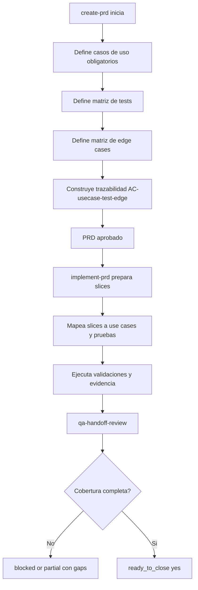

# PRD: Mandatory Use Cases, Test Plan, and Edge-Case Gates for create-prd and implement-prd

**Ticket**: Workflow quality hardening for PRD creation and execution
**Autor**: GitHub Copilot
**Fecha**: 2026-08-04
**Estado**: Borrador

---

## 1. Contexto y Objetivo

El repositorio ya define buenas prácticas para especificar y ejecutar PRDs, pero hoy no existe un contrato único y explícito que obligue a declarar casos de uso, estrategia de tests y edge cases como artefactos trazables desde la creación del PRD hasta su implementación. Esto deja espacio para PRDs correctos en estructura, pero incompletos en cobertura de escenarios reales o riesgos de regresión.

Este PRD define un endurecimiento del flujo para que `create-prd` exija esos tres bloques como salida mínima verificable y para que `implement-prd` no pueda cerrar una implementación si no existe evidencia de cobertura de esos mismos bloques.

> **Alcance estricto**: reforzar los skills y contratos de workflow para que casos de uso, plan de tests y edge cases sean obligatorios, trazables y verificables entre especificación e implementación. No incluye rediseñar todos los templates de producto del ecosistema, ni cambiar la semántica general del router fuera de este flujo.

### Estado Actual

| Capa | Componente | Archivo | Estado actual |
| --- | --- | --- | --- |
| Especificación | create-prd | `.agents/skills/01-product/create-prd/SKILL.md` | Exige calidad alta y evidencia, pero no define un bloque canónico y obligatorio de casos de uso + pruebas + edge cases con trazabilidad formal entre secciones. |
| Plantilla | PRD template | `.agents/skills/01-product/create-prd/PRD_TEMPLATE.md` | Tiene AC y fases, pero no fuerza taxonomía mínima de casos de uso y edge cases por categoría. |
| Implementación | implement-prd | `.agents/skills/02-implement/implement-prd/SKILL.md` | Cierre exige tests y edge cases en general, pero no bloquea por ausencia de mapeo explícito contra casos de uso definidos en el PRD. |
| Slicing | implementation-slicing | `.agents/skills/02-implement/implementation-slicing/SKILL.md` | Mapea AC a slices, pero no obliga un mapeo complementario de casos de uso y edge-case matrix. |
| QA final | qa-handoff-review | `.agents/skills/02-implement/qa-handoff-review/SKILL.md` | Revisa edge cases y tests, pero sin un contrato explícito de cobertura mínima por tipo de edge case vinculado a casos de uso. |

### Estado Actual del Problema

| Aspecto | Situación actual | Impacto |
| --- | --- | --- |
| Casos de uso | No hay estructura mínima homogénea en todos los PRDs | Implementaciones pueden cubrir happy path y omitir comportamientos clave |
| Test plan | Existe validación de tests, pero no siempre como diseño explícito desde PRD | Riesgo de agregar tests reactivos y no por intención de producto |
| Edge cases | Se mencionan en varios skills, pero sin matriz trazable y verificable | Cierres con cobertura parcial difícil de auditar |
| Trazabilidad | AC -> slices está definido; casos de uso -> tests -> evidencia no está endurecido | Aumenta rework y findings tardíos en QA |

---

## 2. Requerimientos Funcionales

### 2.1 Bloque Canónico de Casos de Uso en create-prd

`create-prd` debe exigir un bloque formal y completo de casos de uso antes de considerar el PRD listo para implementar.

> **Decisión confirmada**: un PRD no se considera listo solo con AC de alto nivel; requiere casos de uso explícitos y clasificados.

**Condición de aplicación**: cualquier PRD nuevo generado con `create-prd`.
**Entidad de agrupación**: casos de uso funcionales por actor/flujo.
**Campos afectados**: `create-prd/SKILL.md`, `PRD_TEMPLATE.md`, checklist de calidad del skill.
**Campos NO afectados**: workflow-router, create-epic y project-formation.
**Almacenamiento**: artefactos Markdown canónicos.

Requisitos:

1. El PRD debe incluir una sección obligatoria de casos de uso con formato verificable (ID, actor, precondiciones, flujo principal, resultado observable).
2. Cada caso de uso debe declarar al menos un resultado falsable y su vínculo con uno o más criterios de aceptación.
3. El skill debe bloquear cierre del PRD si faltan casos de uso para comportamientos centrales del alcance.

### 2.2 Estrategia de Tests Obligatoria Desde PRD

`create-prd` debe exigir estrategia de tests antes de implementación y `implement-prd` debe consumirla como gate de ejecución.

> **Decisión confirmada**: los tests son parte del diseño, no una actividad posterior opcional.

**Condición de aplicación**: PRDs implementables y su ejecución en `implement-prd`.
**Entidad de agrupación**: pruebas por nivel (unidad, integración, contrato, smoke, e2e si aplica).
**Campos afectados**: `create-prd/SKILL.md`, `PRD_TEMPLATE.md`, `implement-prd/SKILL.md`, `implementation-slicing/SKILL.md`.
**Campos NO afectados**: infraestructura de CI/CD y toolchain de test fuera de los skills.
**Almacenamiento**: contratos Markdown y evidencia de validación.

Requisitos:

1. El PRD debe incluir matriz mínima de tests: objetivo, nivel, cobertura esperada, comando o mecanismo de validación.
2. Cada slice de implementación debe heredar los tests del PRD y declarar evidencia para marcar `VERIFIED`.
3. `implement-prd` debe bloquear cierre si no hay correspondencia entre estrategia de tests del PRD y evidencia ejecutada.

### 2.3 Matriz de Edge Cases Obligatoria y Trazable

Se debe introducir una matriz mínima de edge cases desde la creación del PRD y exigir su verificación en cierre de implementación.

> **Decisión confirmada**: no basta mencionar edge cases; deben estar clasificados, vinculados a casos de uso y con verificación explícita.

**Condición de aplicación**: cualquier flujo que pase por `create-prd` -> `implement-prd`.
**Entidad de agrupación**: edge cases por categoría de riesgo.
**Campos afectados**: `create-prd/SKILL.md`, `PRD_TEMPLATE.md`, `implement-prd/SKILL.md`, `qa-handoff-review/SKILL.md`.
**Campos NO afectados**: runtime adapters y catálogo de capabilities.
**Almacenamiento**: Markdown canónico y handoff de QA.

Requisitos:

1. El PRD debe incluir una matriz de edge cases con al menos estas categorías: datos vacíos, límites, errores, permisos/tenancy, concurrencia/orden, rollout/rollback.
2. Cada edge case debe mapearse a al menos una validación (test automático, contrato, smoke o evidencia manual justificada).
3. `qa-handoff-review` debe reportar explícitamente gaps por categoría y bloquear `ready_to_close: yes` si faltan categorías críticas sin justificación aceptada.

### 2.4 Contrato de Trazabilidad End-to-End

Debe existir trazabilidad explícita entre casos de uso, AC, slices, tests y edge cases.

> **Decisión confirmada**: la trazabilidad mínima se vuelve requisito de cierre y no recomendación.

**Condición de aplicación**: todos los PRDs nuevos y su implementación.
**Entidad de agrupación**: matriz de trazabilidad del PRD + evidencia de implementación.
**Campos afectados**: plantilla PRD, create-prd skill, implement-prd cierre, qa handoff.
**Campos NO afectados**: documentación histórica ya aprobada (sin backfill obligatorio en este PRD).
**Almacenamiento**: tablas de trazabilidad en Markdown.

Requisitos:

1. Toda AC debe enlazar al menos un caso de uso, un slice y una evidencia.
2. Todo caso de uso debe enlazar al menos un test y un edge case relevante.
3. El cierre global debe fallar si existe huérfano de trazabilidad (AC, caso de uso, test o edge case sin mapeo).

### 2.5 Criterios de Aceptación

| ID | Given | When | Then | Evidence expected |
| --- | --- | --- | --- | --- |
| AC-1 | Un usuario crea un PRD con `create-prd` | El skill ejecuta la fase de redacción | El documento contiene sección obligatoria de casos de uso con formato verificable | Diff del skill y PRD template actualizado |
| AC-2 | Un PRD incluye casos de uso y AC | Se prepara la implementación con `implement-prd` | Los slices heredan trazabilidad de casos de uso y estrategia de tests | Plan/slices con mapeo explícito |
| AC-3 | Un PRD nuevo define edge cases | QA revisa cierre | `qa-handoff-review` valida cobertura por categoría y bloquea huecos críticos | Handoff schema + checklist de QA actualizada |
| AC-4 | Existe un caso de uso sin test asociado | Se ejecuta gate de cierre | El workflow bloquea `ready_to_close` y reporta gap concreto | Resultado de QA/closure gate con motivo |
| AC-5 | Existe un edge case crítico sin validación | Se completa implementación técnica | El cierre no avanza hasta evidencia o aceptación explícita del riesgo | Estado `blocked`/`partial` documentado |
| AC-6 | Un maintainer revisa un PRD nuevo | Evalúa matriz de trazabilidad | Puede seguir de forma determinística: caso de uso -> AC -> slice -> test -> evidencia | Tabla de trazabilidad sin huérfanos |

---

## 3. Modelo de Artefactos y Flujo

### 3.1 Migración Requerida

No hay migración de base de datos. El cambio es de contrato de workflow y artefactos de skills/templates.

### 3.2 Artefactos Principales

| Artefacto | Tipo | Propósito | Propietario |
| --- | --- | --- | --- |
| `.agents/skills/01-product/create-prd/SKILL.md` | Skill canónica | Exigir casos de uso, test plan y edge-case matrix en PRDs nuevos | Product workflows |
| `.agents/skills/01-product/create-prd/PRD_TEMPLATE.md` | Plantilla | Añadir secciones/tablas obligatorias y trazabilidad | Product workflows |
| `.agents/skills/02-implement/implement-prd/SKILL.md` | Orquestador implementación | Convertir cobertura y trazabilidad en hard gate de cierre | Implement workflows |
| `.agents/skills/02-implement/implementation-slicing/SKILL.md` | Planificación | Forzar mapeo de casos de uso y edge cases por slice | Implement workflows |
| `.agents/skills/02-implement/qa-handoff-review/SKILL.md` | QA final | Verificar cobertura de edge cases por categoría y bloquear gaps | QA workflows |
| `test/workflow-contract.test.mjs` y/o tests de routing/workflow | Validación | Probar guardrails de contrato | Tooling/contract |

### 3.3 Diagrama de Flujo

### 3.4 Reglas Arquitectónicas

1. Casos de uso, test plan y edge-case matrix son artefactos de primer nivel del PRD.
2. `implement-prd` no puede considerar completa una fase sin evidencia trazable de esos artefactos.
3. QA final valida cobertura por categoría de edge case, no solo por cantidad de tests.
4. No se exige backfill inmediato de PRDs históricos; aplica a PRDs nuevos y a PRDs existentes que entren en revisión mayor.

---

## 4. Plan de Implementación por Fases

### Fase 1 - Endurecer create-prd y plantilla PRD

**Objetivo**: que la salida de `create-prd` obligue definición explícita de casos de uso, estrategia de tests y edge cases.

**Slices ejecutables**:

| ID | Outcome | Depends on | Scope / likely files | Acceptance criteria | Tests | Validation | Evidence |
| --- | --- | --- | --- | --- | --- | --- | --- |
| P1-S1 | Sección obligatoria de casos de uso agregada a skill y template | none | `.agents/skills/01-product/create-prd/SKILL.md`, `.agents/skills/01-product/create-prd/PRD_TEMPLATE.md` | AC-1 | Docs/contract review | `bun run check:docs` | Diff con formato obligatorio y checklist actualizado |
| P1-S2 | Matriz mínima de test strategy y edge cases incorporada en template y quality checklist | P1-S1 | mismos archivos de P1-S1 | AC-1, AC-6 | Docs/contract review | `bun run check:docs` | Tablas nuevas + criterio de completitud explícito |
| P1-S3 | Reglas de bloqueo por ausencia de trazabilidad definidas en create-prd | P1-S2 | `.agents/skills/01-product/create-prd/SKILL.md` | AC-1, AC-6 | Workflow rule review | `bun run check:workflow` | Reglas de stop/quality checklist con huérfanos prohibidos |

**Slice stop conditions**:

- Si la estructura propuesta genera plantillas demasiado pesadas para scopes pequeños, se define versión compacta obligatoria con mínimos no negociables.
- Si hay conflicto entre claridad y brevedad, prevalece trazabilidad mínima verificable.

**Definition of Done**:

- Todo PRD nuevo exige los tres bloques (casos de uso, tests, edge cases).
- La plantilla guía esa salida sin ambigüedad.
- No quedan huecos de trazabilidad permitidos por defecto.

### Fase 2 - Convertir trazabilidad en gates de implement-prd

**Objetivo**: que la implementación consuma y exija la cobertura definida en el PRD.

**Slices ejecutables**:

| ID | Outcome | Depends on | Scope / likely files | Acceptance criteria | Tests | Validation | Evidence |
| --- | --- | --- | --- | --- | --- | --- | --- |
| P2-S1 | `implementation-slicing` exige mapeo use case -> slice -> test -> edge | P1-S3 | `.agents/skills/02-implement/implementation-slicing/SKILL.md` | AC-2, AC-6 | Workflow contract review | `bun run check:workflow` | Handoff de slices con campos de trazabilidad extendidos |
| P2-S2 | `implement-prd` define gate explícito de cierre por cobertura de trazabilidad | P2-S1 | `.agents/skills/02-implement/implement-prd/SKILL.md` | AC-2, AC-4, AC-5 | Workflow contract review | `bun run check:workflow` | Closure contract actualizado con criterios bloqueantes |
| P2-S3 | QA final exige matriz de edge-case coverage por categoría crítica | P2-S2 | `.agents/skills/02-implement/qa-handoff-review/SKILL.md` | AC-3, AC-5 | Workflow contract review | `bun run check:workflow` | Checklist y output de QA reflejan bloqueos por gaps |

**Slice stop conditions**:

- Si el gate de cierre rompe compatibilidad con PRDs históricos sin nueva matriz, debe definirse modo de compatibilidad explícito con riesgo declarado.
- Si los nuevos campos no son verificables por el orquestador, no se avanza a cierre.

**Definition of Done**:

- Implementación no cierra con cobertura parcial no justificada.
- QA final reporta gaps por tipo de edge case y no solo observaciones genéricas.

### Fase 3 - Validación contractual y evidencia de adopción

**Objetivo**: dejar evidencia automatizada y operativa de que el flujo está endurecido.

**Slices ejecutables**:

| ID | Outcome | Depends on | Scope / likely files | Acceptance criteria | Tests | Validation | Evidence |
| --- | --- | --- | --- | --- | --- | --- | --- |
| P3-S1 | Tests/validaciones contractuales cubren los nuevos guardrails | P2-S3 | `test/workflow-contract.test.mjs` y tests relacionados | AC-1 a AC-6 | Node tests focalizados | `bun test test/workflow-contract.test.mjs test/turn-routing-contract.test.mjs` | Nuevas assertions en verde |
| P3-S2 | Runbook corto de uso del nuevo estándar (opcional si ya existe sección equivalente) | P3-S1 | `docs/workflow/runbooks/*` o sección equivalente | AC-6 | Docs checks | `bun run check:docs` | Guía operativa para maintainers |

**Slice stop conditions**:

- Si no existe forma de testear automáticamente un gate, debe documentarse evidencia manual mínima y criterio de bloqueo.

**Definition of Done**:

- El flujo endurecido puede auditarse por tests y documentación operativa.

### Fase Futura - Migración de PRDs históricos _(fuera de alcance de este PRD)_

> Será abordada en PRD separado.

- Definir política de retrofit para PRDs antiguos sin matriz de casos de uso/tests/edge cases.
- Priorizar migración por criticidad de dominio y riesgo de release.

---

## 5. Decisiones Tomadas

| # | Pregunta | Respuesta | Impacto en diseño |
| --- | --- | --- | --- |
| 1 | ¿Casos de uso son opcionales? | No | Se vuelven bloque obligatorios del PRD |
| 2 | ¿Tests se definen recién en implementación? | No | Se definen desde PRD y se consumen en implementación |
| 3 | ¿Edge cases pueden quedar narrativos? | No | Deben tener matriz y categoría verificable |
| 4 | ¿La trazabilidad es recomendación o hard gate? | Hard gate | Cierre bloquea huérfanos |
| 5 | ¿Incluye retrofit masivo de PRDs viejos? | No en este alcance | Se planifica como fase futura |

---

## 6. Preguntas Abiertas

_(Vacío = PRD listo para implementar)_

---

## 7. Riesgos y Mitigaciones

| Riesgo | Probabilidad | Impacto | Mitigación |
| --- | --- | --- | --- |
| Aumento de fricción al redactar PRDs pequeños | Media | Medio | Definir formato mínimo compacto pero obligatorio |
| Sobrecarga de QA por matrices extensas sin priorización | Media | Alto | Exigir categorías críticas y justificación explícita de no aplicabilidad |
| Dificultad para aplicar a PRDs históricos | Alta | Medio | Dejar compatibilidad controlada y PRD separado para retrofit |
| Cierre bloqueado por evidencia difícil de obtener | Media | Alto | Permitir evidencia manual acotada con riesgo explícito y aprobación del usuario |

---

## 8. Definition of Done Global

- [ ] `create-prd` exige casos de uso, test strategy y edge-case matrix obligatorios
- [ ] `PRD_TEMPLATE` incluye secciones y tablas para trazabilidad completa
- [ ] `implement-prd` bloquea cierre por huérfanos de trazabilidad
- [ ] `implementation-slicing` mapea use cases/tests/edge cases por slice
- [ ] `qa-handoff-review` valida cobertura de edge cases por categoría
- [ ] `bun run check:workflow` en verde
- [ ] `bun run check:docs` en verde
- [ ] `bun test test/workflow-contract.test.mjs test/turn-routing-contract.test.mjs` en verde

---

## 9. Matriz de Trazabilidad

| Acceptance criterion | Phase / slice | Test evidence | Validation evidence | Status |
| --- | --- | --- | --- | --- |
| AC-1 | P1-S1, P1-S2 | Diff de skill/template | `bun run check:docs` | Pending |
| AC-2 | P2-S1, P2-S2 | Handoff de slicing y closure rules | `bun run check:workflow` | Pending |
| AC-3 | P2-S3 | QA checklist/handoff actualizado | `bun run check:workflow` | Pending |
| AC-4 | P2-S2 | Gate bloqueante en closure contract | `bun run check:workflow` | Pending |
| AC-5 | P2-S2, P2-S3 | Evidencia de bloqueo por edge gap | `bun run check:workflow` | Pending |
| AC-6 | P1-S2, P2-S1, P3-S2 | Tabla de trazabilidad determinística | `bun run check:docs` | Pending |
