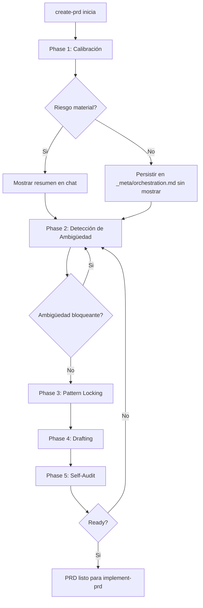

# PRD: Refactor de `create-prd` a Orquestador Explícito de 5 Fases

**Ticket**: Workflow hardening — `create-prd` como orquestador (ver `docs/plans/2026-08-05-create-prd-orchestrator-architecture.md`)
**Autor**: GitHub Copilot
**Fecha**: 2026-08-05
**Estado**: En revisión

---

## 1. Contexto y Objetivo

`create-prd` ya exige exploración previa, preguntas de ambigüedad, y un bloque obligatorio de Casos de Uso/Estrategia de Tests/Matriz de Edge Cases (endurecido en `docs/prd/workflow-skills/2026-08-04-prd-use-cases-tests-edge-cases-gate/`). Sin embargo, esas reglas viven como una lista plana de fases (`Phase 1 → Phase 2 → Phase 3`) sin un paso explícito de **pattern-locking** (anclar la implementación a un patrón local comparable) ni un cierre formal de **self-audit** antes de considerar el PRD listo. Esto deja lugar a PRDs que citan patrones locales de forma vaga y a un cierre que depende de que el agente recuerde revisar la checklist final, en lugar de un gate estructurado.

Este PRD implementa la propuesta de `docs/plans/2026-08-05-create-prd-orchestrator-architecture.md`: reorganizar `create-prd` en 5 fases explícitas y no-saltables (Calibración, Detección de Ambigüedad, Pattern Locking, Drafting, Self-Audit), externalizar el detalle de cada fase a documentos de referencia, persistir los artefactos de cada fase por PRD, y definir una regla de visibilidad para no saturar la conversación con resúmenes de bajo riesgo.

> **Alcance estricto**: este PRD modifica únicamente `.agents/skills/01-product/create-prd/` (SKILL.md, PRD_TEMPLATE.md, nuevos `reference/*.md`) y agrega un runbook de smoke-check manual bajo `docs/workflow/runbooks/`. **No** modifica `implement-prd`, `implementation-slicing`, `qa-handoff-review`, `prd-readiness-review`, el router, ni el registry de skills. La propagación de este modelo a esos skills queda documentada como propuesta futura fuera de alcance (Sección 4, Fase Futura).

### Estado Actual

| Capa | Componente | Archivo | Estado actual |
| --- | --- | --- | --- |
| Especificación | create-prd | `.agents/skills/01-product/create-prd/SKILL.md` | Define 3 fases planas (Exploration, Gap Analysis, Draft) + Hard Gate de Casos de Uso/Tests/Edge Cases + Execution Granularity Contract + Quality Checklist + Final Self-Review informal. No tiene fase de pattern-locking explícita ni persistencia de artefactos de fase. |
| Plantilla | PRD template | `.agents/skills/01-product/create-prd/PRD_TEMPLATE.md` | Ya incluye secciones 2.4 Casos de Uso, 2.5 Estrategia de Tests, 2.6 Matriz de Edge Cases. No requiere cambios de fondo en este PRD. |
| Arquitectura propuesta | Plan de diseño | `docs/plans/2026-08-05-create-prd-orchestrator-architecture.md` | Define el modelo objetivo de 5 fases, contrato de artefactos, y deja 3 preguntas abiertas (almacenamiento de artefactos, dueño de self-audit, visibilidad de calibración) — resueltas en Sección 5 de este PRD. |
| Ancla comparable | PRD previo del mismo dominio | `docs/prd/workflow-skills/2026-08-04-prd-use-cases-tests-edge-cases-gate/prd-use-cases-tests-edge-cases-gate.md` | Usado como anchor de estructura, densidad de tablas, y convención de validación (`bun run check:docs`, `bun run check:workflow`). |
| Validación existente | Tests de contrato | `test/workflow-contract.test.mjs` | Ya contiene `assert.match` sobre el contenido literal de `create-prd/SKILL.md` y `PRD_TEMPLATE.md`; cualquier renombrado de fases debe preservar las cadenas exactas que ese archivo verifica. |

---

## 2. Requerimientos Funcionales

### 2.1 Fase 1 — Calibración de Repositorio y Ecosistema (renombra y expande la actual "Phase 1: Codebase Exploration")

> **Decisión confirmada**: se preserva todo el contenido actual de exploración (docs mandatorios, modelos/servicios/queries, "Reference artifact calibration") y se agrega descubrimiento explícito de registry (`.agents/skills/registry.md`), capabilities/integrations, y memoria (Engram u otra), cuando estén disponibles.

**Condición de aplicación**: inicio de cualquier PRD nuevo con `create-prd`.
**Campos afectados**: `create-prd/SKILL.md` (sección de fase 1).
**Campos NO afectados**: `PRD_TEMPLATE.md`, otros skills.
**Salida obligatoria**: work_type, touched_surfaces, comparable_anchor, riesgos mayores, preguntas sin resolver — igual que en el plan de arquitectura.

### 2.2 Fase 2 — Detección de Ambigüedad (renombra la actual "Phase 2: Gap Analysis")

> **Decisión confirmada**: se preserva el formato actual de preguntas agrupadas por categoría; se agregan las clases de ambigüedad formales del plan (scope boundary, business rules, ownership/placement, persistencia, contrato/interfaz, async/background, éxito/parcial/falla, idempotencia/retries, observabilidad, rollout/activación, permisos/tenancy, evidencia de validación, exclusiones de scope futuro) como checklist de cobertura, no como reemplazo del formato de preguntas existente.

**Salida obligatoria**: preguntas bloqueantes agrupadas, tabla de decisiones resueltas, y una declaración explícita de "sin ambigüedad bloqueante" antes de avanzar.

### 2.3 Fase 3 — Pattern Locking (NUEVA)

> **Decisión confirmada**: esta fase es nueva y se inserta como hard gate entre Detección de Ambigüedad y Drafting. Si existe un patrón local comparable, el PRD debe nombrarlo explícitamente con archivo ancla; si no existe, la fase debe declararlo explícitamente ("no se encontró patrón local comparable") en lugar de omitir la sección.

**Condición de aplicación**: todo PRD nuevo, antes de redactar contenido.
**Salida obligatoria**: nombre del patrón adoptado (o "ninguno"), archivo(s) ancla en el repo, partes reutilizadas, partes intencionalmente distintas, justificación.

### 2.4 Fase 4 — Drafting (relocaliza la actual "Phase 3: Draft the PRD")

> **Decisión confirmada**: todo el contenido mandatorio actual se preserva sin cambios de fondo: Casos de Uso, Estrategia de Tests, Matriz de Edge Cases, Execution Granularity Contract, reglas de DDD/enumeraciones/testing, y el uso obligatorio de `PRD_TEMPLATE.md`. Se agrega la regla de persistencia de artefactos por PRD (ver 2.6).

### 2.5 Fase 5 — Self-Audit and Hardening (formaliza la actual sección "Final Self-Review" + "Quality Checklist")

> **Decisión confirmada**: se deja lista en su versión definitiva en este mismo PRD (no se pospone). El contenido actual de "Final Self-Review" y "Quality Checklist Before Delivering" se preserva y se reubica como el cuerpo de esta fase, agregando una salida obligatoria explícita: resumen de hardening, riesgos residuales, y declaración final `ready for implement-prd` o `not ready` con motivo.

### 2.6 Persistencia de Artefactos por PRD (`_meta/`)

> **Decisión confirmada**: cada PRD conserva su propia carpeta (`docs/prd/<feature-or-project>/<YYYY-MM-DD>-<feature-name>/`) y agrega una subcarpeta `_meta/` con un único archivo `orchestration.md` que contiene las 4 secciones: `## Calibration`, `## Ambiguity Log`, `## Pattern Lock`, `## Self-Audit`. Este archivo se persiste siempre al completar cada fase, **independientemente** de si el resumen se mostró en el chat (ver 2.7). No reemplaza ni modifica `execution-lock.toon` (propiedad de `implement-prd`, fuera de alcance).

**Condición de aplicación**: todo PRD nuevo creado después de este cambio. No aplica retroactivamente a PRDs históricos (ver Fase Futura / Riesgos).
**Campos afectados**: `create-prd/SKILL.md` (sección "File location").
**Almacenamiento**: Markdown, un archivo por PRD.

### 2.7 Regla de Visibilidad de Resúmenes

> **Decisión confirmada**: aplica a los 4 resúmenes de fase (Calibración, Ambigüedad, Pattern Lock, Self-Audit). Por defecto, el resumen **no** se muestra en el chat; solo se muestra cuando (a) el usuario lo pide explícitamente, o (b) la fase detecta riesgo material (contradicción con invariante heredada, ambigüedad de arquitectura/datos/contrato sin resolver, ausencia de patrón local comparable, o baja confianza en la calibración). La persistencia en `_meta/orchestration.md` ocurre siempre, se muestre o no el resumen.

**Campos afectados**: `create-prd/SKILL.md`, los 4 `reference/*.md` nuevos (cada uno debe listar sus propias señales concretas de "riesgo material" para esa fase, evitando juicio subjetivo).

### 2.8 Externalización a `reference/*.md`

> **Decisión confirmada**: el detalle operativo de las fases 1, 2, 3 y 5 se mueve a documentos de referencia dedicados, y `SKILL.md` los referencia sin duplicar contenido:

- `.agents/skills/01-product/create-prd/reference/calibration.md`
- `.agents/skills/01-product/create-prd/reference/ambiguity-detection.md`
- `.agents/skills/01-product/create-prd/reference/pattern-locking.md`
- `.agents/skills/01-product/create-prd/reference/self-audit.md`

La Fase 4 (Drafting) no requiere un `reference/*.md` propio: su contenido detallado ya vive en `SKILL.md` y `PRD_TEMPLATE.md`.

### 2.9 Criterios de Aceptación

| ID | Given | When | Then | Evidence expected |
| --- | --- | --- | --- | --- |
| AC-1 | Un agente abre `create-prd/SKILL.md` | Ejecuta la fase inicial de un PRD nuevo | El skill define "Phase 1: Repository and Ecosystem Calibration" como hard gate, preservando el contenido actual de exploración y agregando descubrimiento de registry/capabilities/memory | Diff de `SKILL.md` |
| AC-2 | Un agente completa la Fase 1 | Pasa a preguntas de ambigüedad | El skill define "Phase 2: Ambiguity Detection" con las clases formales de ambigüedad y declaración explícita de "sin ambigüedad bloqueante" | Diff de `SKILL.md` |
| AC-3 | Un agente resolvió toda ambigüedad bloqueante | Antes de redactar el PRD | El skill exige "Phase 3: Pattern Locking" como hard gate nuevo, con patrón adoptado + archivo ancla + justificación, o declaración explícita de "ninguno" | Diff de `SKILL.md` |
| AC-4 | Un agente completó Pattern Locking | Redacta el PRD | El skill preserva sin cambios de fondo el contenido mandatorio de Casos de Uso/Tests/Edge Cases/Execution Granularity Contract bajo "Phase 4: Drafting", y agrega la regla de persistencia en `_meta/orchestration.md` | Diff de `SKILL.md` |
| AC-5 | Un PRD está redactado | Antes de entregarlo | El skill exige "Phase 5: Self-Audit and Hardening" con declaración final `ready for implement-prd` / `not ready` | Diff de `SKILL.md` |
| AC-6 | Un agente ejecuta cualquiera de las fases 1, 2, 3 o 5 | Necesita el detalle operativo completo | El skill carga el `reference/*.md` correspondiente en vez de duplicar contenido inline | Existencia y referencia cruzada de los 4 archivos `reference/*.md` |
| AC-7 | Una fase termina sin riesgo material y sin pedido explícito del usuario | Se completa la fase | El resumen no se muestra en el chat, pero `_meta/orchestration.md` se actualiza igual | Ejemplo documentado en el checklist de smoke-check |
| AC-8 | Un maintainer lee `create-prd/SKILL.md` | Busca cómo evoluciona este modelo | Existe una sección "Future Scope" explícita proponiendo propagación a `implement-prd`, `implementation-slicing` y `qa-handoff-review`, marcada fuera de alcance de este PRD | Sección "Future Scope" en `SKILL.md` |
| AC-9 | Un maintainer quiere validar el flujo end-to-end | Ejecuta el runbook | Existe `docs/workflow/runbooks/create-prd-orchestrator-smoke-check.md` con al menos un ejemplo backend-like, uno frontend-like y uno async/background-like, sin requerir un test automatizado en este PRD | Archivo del runbook |
| AC-10 | Un maintainer abre un PRD creado antes de este cambio | Lo revisa o continúa su implementación | El PRD histórico sigue siendo válido; no se exige retrofit de `_meta/orchestration.md` ni de la nueva estructura de fases | Declaración explícita en `SKILL.md` / este PRD |

### 2.10 Casos de Uso

| ID | Actor | Precondiciones | Flujo principal | Resultado observable (falsable) | AC vinculado |
| --- | --- | --- | --- | --- | --- |
| UC-1 | Agente IA ejecutando `create-prd` | Usuario pidió un PRD nuevo | Agente ejecuta Fase 1 (Calibración) sin riesgo detectado | No aparece resumen en el chat; `_meta/orchestration.md` contiene sección `## Calibration` con work_type/touched_surfaces/comparable_anchor | AC-1, AC-7 |
| UC-2 | Agente IA ejecutando `create-prd` | Fase 2 detecta ambigüedad que contradice una invariante heredada | Agente ejecuta Fase 2 y encuentra riesgo material | El resumen de ambigüedad se muestra en el chat aunque el usuario no lo pidió | AC-2, AC-7 |
| UC-3 | Agente IA ejecutando `create-prd` | Fase 2 cerrada sin ambigüedad bloqueante | Agente ejecuta Fase 3 (Pattern Locking) y encuentra un PRD ancla comparable | El PRD final declara nombre del patrón, archivo ancla, partes reutilizadas/distintas y justificación | AC-3 |
| UC-4 | Agente IA ejecutando `create-prd` | Pattern Locking completado | Agente redacta el PRD (Fase 4) | El PRD final incluye Casos de Uso, Estrategia de Tests y Matriz de Edge Cases sin degradar el gate existente; `_meta/orchestration.md` se actualiza con la sección `## Pattern Lock` | AC-4 |
| UC-5 | Agente IA ejecutando `create-prd` | PRD redactado | Agente ejecuta Fase 5 (Self-Audit) | El PRD/artefacto declara explícitamente `ready for implement-prd` o `not ready` con motivo concreto | AC-5 |
| UC-6 | Maintainer humano | Está en medio de una sesión de `create-prd` | Pide explícitamente ver el resumen de calibración | El agente muestra el resumen compacto aunque no haya riesgo detectado | AC-7 |
| UC-7 | Maintainer humano | Lee `create-prd/SKILL.md` | Busca si existe plan de propagación a otros skills | Encuentra la sección "Future Scope" con la propuesta concreta y su condición de activación | AC-8 |
| UC-8 | Maintainer humano | Quiere confirmar que el flujo de 5 fases funciona | Sigue el runbook de smoke-check manual | Completa los 3 escenarios de ejemplo (backend-like, frontend-like, async/background-like) marcando cada ítem del checklist | AC-9 |
| UC-9 | Maintainer humano | Abre un PRD creado antes de este cambio (por ejemplo el de 2026-08-04) | Lo revisa o retoma su implementación | El PRD sigue siendo válido sin necesitar `_meta/orchestration.md` ni el modelo de 5 fases | AC-10 |
| UC-10 | Agente IA ejecutando `create-prd` | Está en Fase 1, 2, 3 o 5 | Necesita el detalle operativo completo de esa fase | Carga el `reference/*.md` correspondiente en vez de reescribir el contenido inline en `SKILL.md` | AC-6 |

### 2.11 Estrategia de Tests

| Nivel | Objetivo | Caso de uso vinculado | Cobertura esperada | Comando o mecanismo de validación |
| --- | --- | --- | --- | --- |
| Contrato/Regresión | Confirmar que las cadenas literales ya verificadas por `test/workflow-contract.test.mjs` (Hard Gate de Casos de Uso/Tests/Edge Cases) siguen presentes tras el renombrado de fases | UC-4 | 0 regresiones en assertions existentes | `node --test test/workflow-contract.test.mjs` |
| Docs | Confirmar que la documentación requerida del repo sigue íntegra | UC-1 a UC-10 | Sin fallos nuevos | `bun run check:docs` |
| Workflow | Confirmar que el registry de skills y los template packs no se rompen por los nuevos archivos `reference/*.md` y el runbook | UC-6, UC-8 | Sin fallos nuevos | `bun run check:workflow` |
| Smoke (checklist manual) | Verificar el comportamiento observable de las 5 fases, la persistencia en `_meta/`, la regla de visibilidad, y la sección Future Scope, sin escribir tests automatizados nuevos en este PRD | UC-1, UC-2, UC-3, UC-5, UC-6, UC-7, UC-9, UC-10 | 3 escenarios de ejemplo completados (backend-like, frontend-like, async/background-like) | Checklist manual en `docs/workflow/runbooks/create-prd-orchestrator-smoke-check.md` |

> **Decisión confirmada**: la cobertura automatizada adicional (nuevas assertions `assert.match` en `test/workflow-contract.test.mjs` para las cadenas de las 5 fases) queda como responsabilidad explícita del usuario, fuera del Definition of Done de este PRD. Este PRD solo entrega el checklist manual.

### 2.12 Matriz de Edge Cases

| Categoría | Descripción | Caso de uso vinculado | Validación | Estado |
| --- | --- | --- | --- | --- |
| Datos vacíos | Pattern Locking no encuentra ningún patrón local comparable | UC-3 | Checklist manual: verificar que la fase declara "ninguno" en vez de omitir la sección | Pending |
| Límites | Calibración encuentra muchas superficies/anclas candidatas y el resumen debe seguir siendo compacto | UC-1 | Checklist manual: verificar longitud/formato del resumen cuando se muestra | Pending |
| Errores | Documentos mandatorios de ecosistema (registry, capabilities, memoria) no existen o no están disponibles en el repo consumidor | UC-1 | Checklist manual: verificar que la fase degrada con una asunción explícita en vez de fallar | Pending |
| Permisos/tenancy | No aplica: este PRD solo modifica contratos Markdown de skills; no introduce datos de usuario, autenticación ni tenancy | — | No aplica | No aplica |
| Concurrencia/orden | Dos sesiones de agente escribiendo `_meta/orchestration.md` para el mismo PRD a la vez | UC-4 | Checklist manual: confirmar que `SKILL.md` documenta la asunción de un único escritor por PRD activo | Pending |
| Rollout/rollback | PRDs históricos creados con el modelo anterior de 3 fases | UC-9 | Checklist manual: abrir el PRD ancla del 2026-08-04 y confirmar que sigue siendo válido sin retrofit | Pending |

---

## 3. Modelo de Artefactos y Flujo

### 3.1 Migración Requerida

No hay migración de datos ni de base de datos. El cambio es de contrato de workflow (skill Markdown) más un nuevo archivo por PRD (`_meta/orchestration.md`).

### 3.2 Artefactos Principales

| Artefacto | Tipo | Propósito | Propietario |
| --- | --- | --- | --- |
| `.agents/skills/01-product/create-prd/SKILL.md` | Skill canónica | Definir las 5 fases, gates, regla de persistencia, regla de visibilidad y sección Future Scope | Product workflows |
| `.agents/skills/01-product/create-prd/reference/calibration.md` | Referencia | Detalle operativo de Fase 1 | Product workflows |
| `.agents/skills/01-product/create-prd/reference/ambiguity-detection.md` | Referencia | Detalle operativo de Fase 2 | Product workflows |
| `.agents/skills/01-product/create-prd/reference/pattern-locking.md` | Referencia | Detalle operativo de Fase 3 | Product workflows |
| `.agents/skills/01-product/create-prd/reference/self-audit.md` | Referencia | Detalle operativo de Fase 5 | Product workflows |
| `docs/workflow/runbooks/create-prd-orchestrator-smoke-check.md` | Runbook | Checklist manual de validación end-to-end | Product workflows |
| `<PRD-dir>/_meta/orchestration.md` | Artefacto por PRD | Persistir Calibration/Ambiguity Log/Pattern Lock/Self-Audit de cada PRD nuevo | Autor del PRD |

### 3.3 Diagrama de Flujo

### 3.4 Reglas Arquitectónicas

1. Las 5 fases son estrictamente secuenciales; ninguna se salta, igual que el modelo actual de 3 fases.
2. El contenido mandatorio ya existente (Casos de Uso, Estrategia de Tests, Matriz de Edge Cases, Execution Granularity Contract, Quality Checklist) se preserva sin degradación; solo se reubica bajo Fase 4 y Fase 5.
3. La persistencia en `_meta/orchestration.md` es independiente de la visibilidad en el chat: se persiste siempre, se muestra solo bajo pedido o riesgo material.
4. No se retrofitea `_meta/orchestration.md` en PRDs históricos.
5. La propagación de este modelo a `implement-prd`, `implementation-slicing` y `qa-handoff-review` es una propuesta documentada, no una implementación de este PRD.

---

## 4. Plan de Implementación por Fases

### Fase 1 - Refactor de `create-prd/SKILL.md` a 5 fases explícitas

**Objetivo**: reorganizar el skill actual en Calibración, Detección de Ambigüedad, Pattern Locking, Drafting y Self-Audit, preservando todo el contenido mandatorio existente.

**Slices ejecutables**:

| ID | Outcome | Depends on | Scope / likely files | Acceptance criteria | Use cases | Tests | Edge cases | Validation | Evidence |
| --- | --- | --- | --- | --- | --- | --- | --- | --- | --- |
| P1-S1 | "Phase 1: Repository and Ecosystem Calibration" reemplaza a "Phase 1: Codebase Exploration", preservando contenido y agregando descubrimiento de registry/capabilities/memoria | none | `.agents/skills/01-product/create-prd/SKILL.md` | AC-1 | UC-1 | Contrato/Regresión | Límites, Errores | `node --test test/workflow-contract.test.mjs` | Diff + test en verde |
| P1-S2 | "Phase 2: Ambiguity Detection" reemplaza a "Phase 2: Gap Analysis", agregando las clases formales de ambigüedad y la declaración de convergencia | P1-S1 | mismo archivo | AC-2 | UC-2 | Contrato/Regresión | — | `node --test test/workflow-contract.test.mjs` | Diff + test en verde |
| P1-S3 | Nueva "Phase 3: Pattern Locking" agregada como hard gate entre Ambigüedad y Drafting | P1-S2 | mismo archivo | AC-3 | UC-3 | Contrato/Regresión | Datos vacíos | `node --test test/workflow-contract.test.mjs` | Diff + test en verde |
| P1-S4 | "Phase 4: Drafting" relocaliza el contenido actual de "Phase 3: Draft the PRD" sin cambios de fondo, agregando la regla de persistencia en `_meta/orchestration.md` | P1-S3 | mismo archivo | AC-4 | UC-4 | Contrato/Regresión | Concurrencia/orden | `node --test test/workflow-contract.test.mjs` | Diff + test en verde |
| P1-S5 | "Phase 5: Self-Audit and Hardening" formaliza "Final Self-Review" + "Quality Checklist" con declaración final `ready`/`not ready`, y se agrega la regla de visibilidad de resúmenes (2.7) aplicada a las 4 fases | P1-S4 | mismo archivo | AC-5, AC-7 | UC-5, UC-6 | Contrato/Regresión | — | `node --test test/workflow-contract.test.mjs` | Diff + test en verde |

**Slice stop conditions**:

- Si algún renombrado de fase rompe una assertion literal existente en `test/workflow-contract.test.mjs`, se ajusta el texto para preservar la cadena exacta verificada o se detiene para confirmar con el usuario si esa assertion debe actualizarse (fuera de alcance de este PRD tocar ese test, ver 2.11).

**Definition of Done**:

- Las 5 fases están documentadas como hard gates secuenciales.
- Ningún contenido mandatorio existente (Casos de Uso/Tests/Edge Cases/Execution Granularity Contract/Quality Checklist) se perdió o degradó.
- `node --test test/workflow-contract.test.mjs` sigue en verde.

### Fase 2 - Externalizar detalle operativo a `reference/*.md`

**Objetivo**: mover el detalle extenso de las fases 1, 2, 3 y 5 a documentos de referencia dedicados, referenciados desde `SKILL.md`.

**Slices ejecutables**:

| ID | Outcome | Depends on | Scope / likely files | Acceptance criteria | Use cases | Tests | Edge cases | Validation | Evidence |
| --- | --- | --- | --- | --- | --- | --- | --- | --- | --- |
| P2-S1 | `reference/calibration.md` y `reference/ambiguity-detection.md` creados con el detalle de Fase 1 y Fase 2 | P1-S5 | `.agents/skills/01-product/create-prd/reference/calibration.md`, `.../ambiguity-detection.md` | AC-6 | UC-10 | Docs | Errores | `bun run check:docs` | Archivos creados + referenciados desde `SKILL.md` |
| P2-S2 | `reference/pattern-locking.md` creado con ejemplos de patrones locales de este repo (hard gates, TOON execution-lock, route-options) | P2-S1 | `.../reference/pattern-locking.md` | AC-6 | UC-10 | Docs | Datos vacíos | `bun run check:docs` | Archivo creado + referenciado |
| P2-S3 | `reference/self-audit.md` creado con checklist adversarial; `SKILL.md` actualizado para referenciar los 4 archivos sin duplicar contenido | P2-S2 | `.../reference/self-audit.md`, `SKILL.md` | AC-6 | UC-10 | Workflow | — | `bun run check:workflow` | Archivo creado + `SKILL.md` sin duplicación |

**Slice stop conditions**:

- Si `bun run check:workflow` reporta `skills/unregistered-file` para algún `reference/*.md`, detener y confirmar si el validador necesita ajuste (no se espera, ya que ese chequeo solo mira archivos `SKILL.md`).

**Definition of Done**:

- Los 4 `reference/*.md` existen y `SKILL.md` los referencia explícitamente.
- `bun run check:docs` y `bun run check:workflow` en verde.

### Fase 3 - Persistencia por PRD, Future Scope y smoke-check

**Objetivo**: dejar documentada la regla de `_meta/orchestration.md`, la propuesta de propagación futura, y un checklist manual de validación end-to-end.

**Slices ejecutables**:

| ID | Outcome | Depends on | Scope / likely files | Acceptance criteria | Use cases | Tests | Edge cases | Validation | Evidence |
| --- | --- | --- | --- | --- | --- | --- | --- | --- | --- |
| P3-S1 | Sección "File location" de `SKILL.md` actualizada para exigir `_meta/orchestration.md` con sus 4 secciones, y regla de persistencia-siempre / visibilidad-condicional documentada | P2-S3 | `SKILL.md` | AC-4, AC-7, AC-10 | UC-1, UC-4, UC-6, UC-9 | Contrato/Regresión | Concurrencia/orden, Rollout/rollback | `node --test test/workflow-contract.test.mjs` | Diff + test en verde |
| P3-S2 | Sección "Future Scope (fuera de alcance de este PRD)" agregada a `SKILL.md` con la propuesta concreta de propagación a `implement-prd`/`implementation-slicing`/`qa-handoff-review` y su condición de activación | P3-S1 | `SKILL.md` | AC-8 | UC-7 | Docs | — | `bun run check:docs` | Sección visible en `SKILL.md` |
| P3-S3 | Runbook `docs/workflow/runbooks/create-prd-orchestrator-smoke-check.md` creado con checklist manual y 3 escenarios de ejemplo (backend-like, frontend-like, async/background-like) | P3-S2 | `docs/workflow/runbooks/create-prd-orchestrator-smoke-check.md` | AC-9 | UC-8 | Smoke (checklist manual) | Datos vacíos, Límites, Errores, Concurrencia/orden, Rollout/rollback | Ejecución manual del checklist | Checklist completado y archivado |

**Slice stop conditions**:

- Si al ejecutar el checklist manual (P3-S3) se detecta que alguna fase no produce la salida obligatoria esperada, no se marca el PRD como `ready`; se documenta el gap y se ajusta `SKILL.md` antes de cerrar.

**Definition of Done**:

- `_meta/orchestration.md` está documentado como obligatorio para PRDs nuevos.
- La sección Future Scope existe y está explícitamente fuera de alcance.
- El runbook de smoke-check existe y cubre los 3 escenarios de ejemplo.

### Fase Futura - Propagación a `implement-prd`, `implementation-slicing` y `qa-handoff-review` _(fuera de alcance de este PRD)_

> Será abordada en un PRD separado, condicionado a evidencia de uso real de este modelo en al menos un puñado de PRDs nuevos.

Propuesta concreta:

- `implement-prd` podría leer la sección `## Pattern Lock` de `_meta/orchestration.md` para exigir una justificación explícita si la implementación se desvía del patrón adoptado.
- `implementation-slicing` podría heredar `touched_surfaces` de `## Calibration` para detectar cuando el alcance de un slice excede lo calibrado sin una nueva traza.
- `qa-handoff-review` podría cruzar los riesgos residuales listados en `## Self-Audit` contra el cierre de implementación, bloqueando `ready_to_close: yes` si un riesgo residual quedó sin resolver.
- Este acoplamiento debe evitarse hasta tener evidencia real de que el modelo de 5 fases funciona bien de forma aislada en `create-prd`, para no repetir el riesgo de "acoplamiento prematuro" señalado en `docs/plans/2026-08-05-create-prd-orchestrator-architecture.md`.

---

## 5. Decisiones Tomadas

| # | Pregunta | Respuesta | Impacto en diseño |
| --- | --- | --- | --- |
| 1 | ¿El refactor se propaga a otros skills en este PRD? | No; solo `create-prd`. Se documenta una propuesta concreta de propagación futura | Sección 4 "Fase Futura" agregada; AC-8/UC-7 |
| 2 | ¿Se preservan los hard gates existentes (Casos de Uso/Tests/Edge Cases, Execution Granularity Contract)? | Sí, se preservan y se reubican bajo Fase 4/5 | AC-4, AC-5; P1-S4, P1-S5 |
| 3 | ¿Dónde viven los artefactos de fase? | En una subcarpeta `_meta/` dentro de la propia carpeta del PRD, archivo único `orchestration.md` | Sección 2.6, 3.2, 3.4 |
| 4 | ¿Self-Audit se implementa completo ahora o se pospone? | Completo ahora, versión definitiva en este PRD | AC-5; P1-S5 |
| 5 | ¿Cuándo se muestran los resúmenes de fase? | Solo bajo pedido explícito o riesgo material; aplica a las 4 fases con resumen | Sección 2.7; AC-7 |
| 6 | ¿Se escriben tests automatizados nuevos en este PRD? | No; solo un checklist manual en Markdown. El usuario se encarga de los tests automatizados como follow-up | Sección 2.11; AC-9; P3-S3 |

---

## 6. Preguntas Abiertas

_(Vacío = PRD listo para implementar)_

---

## 7. Riesgos y Mitigaciones

| Riesgo | Probabilidad | Impacto | Mitigación |
| --- | --- | --- | --- |
| `SKILL.md` se vuelve extenso pese a externalizar detalle | Media | Medio | Mantener en `SKILL.md` solo protocolo + gates; todo detalle extenso va a `reference/*.md` |
| Falta de test automatizado inmediato reduce garantía de regresión | Media | Medio | Checklist manual detallado (P3-S3) + ownership explícito del usuario para tests automatizados futuros |
| Criterio de "riesgo material" para mostrar resúmenes es subjetivo | Media | Medio | Cada `reference/*.md` debe listar señales concretas de riesgo material propias de su fase, evitando juicio libre del agente |
| Propuesta de propagación futura se implementa de forma prematura o acoplada | Baja | Alto | Queda explícitamente fuera de alcance y condicionada a evidencia de uso real de este modelo primero |
| PRDs históricos (por ejemplo el del 2026-08-04) dejan de considerarse válidos por el nuevo modelo | Baja | Medio | Regla explícita de no-retrofit (AC-10, edge case Rollout/rollback) |

---

## 8. Definition of Done Global

- [x] `SKILL.md` define las 5 fases (Calibración, Ambigüedad, Pattern Locking, Drafting, Self-Audit) como hard gates secuenciales
- [x] Todo el contenido mandatorio existente (Casos de Uso/Tests/Edge Cases/Execution Granularity Contract/Quality Checklist) se preservó sin degradación
- [x] Los 4 `reference/*.md` existen y están referenciados desde `SKILL.md` sin duplicación
- [x] Regla de persistencia `_meta/orchestration.md` documentada, con las 4 secciones obligatorias
- [x] Regla de visibilidad de resúmenes (solo bajo pedido o riesgo material) documentada para las 4 fases
- [x] Sección "Future Scope" con la propuesta de propagación documentada y marcada fuera de alcance
- [x] Runbook `docs/workflow/runbooks/create-prd-orchestrator-smoke-check.md` creado con 3 escenarios de ejemplo
- [x] `node --test test/workflow-contract.test.mjs` en verde
- [x] `bun run check:docs` en verde
- [x] `bun run check:workflow` en verde
- [x] Todo AC tiene al menos un caso de uso vinculado y viceversa
- [x] Todo caso de uso tiene al menos un test/checklist item en la Estrategia de Tests
- [x] La Matriz de Edge Cases cubre las seis categorías obligatorias (o declara `No aplica` con justificación)

---

## 9. Matriz de Trazabilidad

| Acceptance criterion | Caso de uso | Phase / slice | Test evidence | Edge case(s) | Validation evidence | Status |
| --- | --- | --- | --- | --- | --- | --- |
| AC-1 | UC-1 | P1-S1 | `test/workflow-contract.test.mjs` | Límites, Errores | `node --test test/workflow-contract.test.mjs` | Verified |
| AC-2 | UC-2 | P1-S2 | `test/workflow-contract.test.mjs` | — | `node --test test/workflow-contract.test.mjs` | Verified |
| AC-3 | UC-3 | P1-S3 | `test/workflow-contract.test.mjs` | Datos vacíos | `node --test test/workflow-contract.test.mjs` | Verified |
| AC-4 | UC-4 | P1-S4, P3-S1 | `test/workflow-contract.test.mjs` | Concurrencia/orden | `node --test test/workflow-contract.test.mjs` | Verified |
| AC-5 | UC-5, UC-6 | P1-S5 | `test/workflow-contract.test.mjs` | — | `node --test test/workflow-contract.test.mjs` | Verified |
| AC-6 | UC-10 | P2-S1, P2-S2, P2-S3 | `bun run check:docs` | Errores, Datos vacíos | `bun run check:docs`, `bun run check:workflow` | Verified |
| AC-7 | UC-1, UC-2, UC-6 | P1-S5, P3-S1 | Checklist manual | — | `docs/workflow/runbooks/create-prd-orchestrator-smoke-check.md` | Verified |
| AC-8 | UC-7 | P3-S2 | `bun run check:docs` | — | Sección "Future Scope" en `SKILL.md` | Verified |
| AC-9 | UC-8 | P3-S3 | Checklist manual | Datos vacíos, Límites, Errores, Concurrencia/orden, Rollout/rollback | `docs/workflow/runbooks/create-prd-orchestrator-smoke-check.md` | Verified |
| AC-10 | UC-9 | P3-S1 | Checklist manual | Rollout/rollback | Revisión manual del PRD del 2026-08-04 | Verified |
