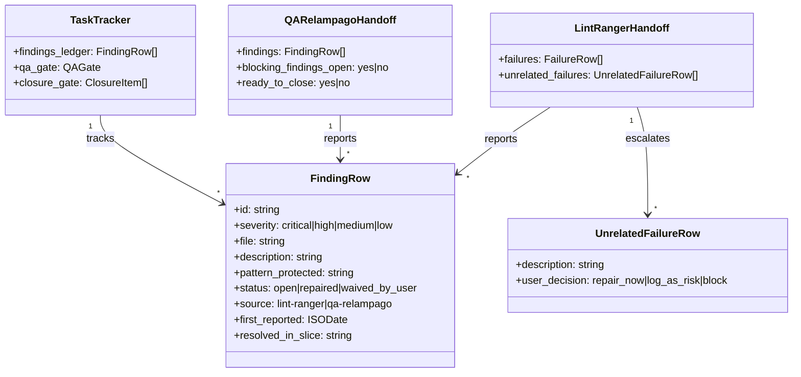
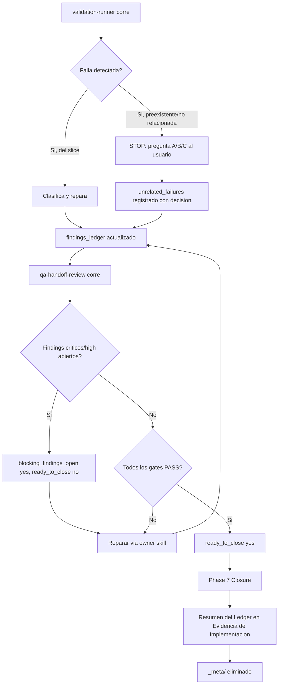

# PRD: Hardening del Loop de Cierre de `implement-prd`

**Ticket**: Workflow hardening — cierre production-ready verificable de `implement-prd`
**Autor**: GitHub Copilot
**Fecha**: 2026-08-20
**Estado**: En revisión

---

## 1. Contexto y Objetivo

`implement-prd` ya declara un "Production-Ready Closure Gate" con 7 compuertas (acceptance criteria, regresión, standards, tests, cobertura, edge cases, QA) y un QA adversarial (`qa-handoff-review`) con re-entrada `partial → repair → re-QA`. En el papel, el loop obliga a corregir todo antes de cerrar.

Una auditoría read-only del loop completo (`implement-prd/SKILL.md`, sus `reference/*.md`, `qa-handoff-review/SKILL.md`, `validation-runner/SKILL.md`) encontró seis huecos concretos donde el contrato depende de autoreporte sin verificación cruzada, permitiendo que un hallazgo real sobreviva al cierre sin que ningún gate lo note:

1. **Sin ledger de hallazgos persistente**: `qa-relampago` devuelve `findings[N]` en su handoff, pero `task_tracker.toon` solo registra agregados `PASS/FAIL` y `open_risks`. `qa-handoff-review` corre con `context: fork`, así que una segunda pasada de QA no tiene memoria de los hallazgos de la primera pasada — pueden evaporarse entre iteraciones sin que nada lo detecte.
2. **`ready_to_close` no bloquea por severidad**: el schema de `qa-relampago` no tiene ninguna regla que impida `ready_to_close: yes` cuando existe un finding `critical`/`high` abierto; el gate depende solo de los estados agregados por dominio (`ac_evidence`, `validation_status`, etc.).
3. **Comando de validación inexistente**: `validation-runner` declara `bin/validate-slice` como el wrapper determinístico preferido, pero ese script no existe en el repo canónico ni en el overlay instalable.
4. **Sin piso de severidad para waivers**: `waived_by_user` puede cerrar cualquier gap — incluida cobertura, edge cases, o un finding crítico de tenancy/auth/migración destructiva — con solo una razón genérica.
5. **Hallazgos no relacionados con la PRD se descartan en silencio**: `validation-runner` clasifica una falla como "Pre-existing unrelated failure" y solo repara lo asignado al slice; no hay ninguna obligación de registrar ni de consultar al usuario qué hacer con ese hallazgo detectado pero fuera de alcance.
6. **La evidencia se borra al cierre**: `<prd-directory>/_meta/` (tracker + execution lock, ambos ignorados por Git) se elimina en el Phase 7 de cierre. Solo sobrevive la narrativa de `## 10. Evidencia de Implementacion`, sin traza auditable de cuántos hallazgos hubo, cuáles se repararon y cuáles se waivearon.

Un séptimo hallazgo de la auditoría (Must-Read paths como `quality-gate.instructions.md`/`ARCHITECTURE.md` no garantizados por el overlay) se descarta explícitamente de este PRD: el principio 19 y la lista de Stop Conditions de `implement-prd` ya tratan una ruta configurada faltante como *hard stop* nombrando la ruta exacta, no como omisión silenciosa. No hay gap de contrato ahí — ver Sección 6.

> **Alcance estricto**: este PRD modifica únicamente los skills de la fase de implementación (`implement-prd`, `qa-handoff-review`, `validation-runner`) y sus `reference/*.md`, más el test de contrato correspondiente. **No** modifica `create-prd`, `implementation-slicing`, `prd-readiness-review`, `codebase-discovery`, el router, ni el registry de skills más allá del hash que `sync-skill-registry.mjs --write` recalcula automáticamente.

### Estado Actual

| Capa | Componente | Archivo | Estado actual |
| --- | --- | --- | --- |
| Orquestación | Closure Contract | `.agents/skills/02-implement/implement-prd/SKILL.md` | Define 11 ítems de cierre; el ítem 10 pide "residual risks or waivers" en prosa, sin exigir un resumen estructurado de hallazgos ni distinguir severidad |
| Tracker | Plantilla de tracker | `.agents/skills/02-implement/implement-prd/reference/task-tracker-template.md` | Tiene `qa_gate` (agregados) y `open_risks` (lista libre), pero no tiene una sección de ledger de hallazgos individuales con estado |
| Flujo | Fases 6-7 | `.agents/skills/02-implement/implement-prd/reference/orchestration-flow.md` | Fase 6 (QA) y Fase 7 (Cierre) no mencionan un ledger de hallazgos ni su persistencia antes de borrar `_meta/` |
| Schema | Handoffs TOON | `.agents/skills/02-implement/implement-prd/reference/handoff-schemas.md` | `qa-relampago` tiene `findings[N]` pero ningún campo agregado de bloqueo por severidad; `lint-ranger` no tiene campo para hallazgos no relacionados con el slice |
| QA | Revisor adversarial | `.agents/skills/02-implement/qa-handoff-review/SKILL.md` | Decision And Re-entry no condiciona `ready_to_close` a la severidad de los findings; no hay piso de waiver |
| Validación | Runner de validación | `.agents/skills/02-implement/validation-runner/SKILL.md` | Command Policy asume `bin/validate-slice` sin comprobar su existencia; clasifica fallas "pre-existing unrelated" sin pedir decisión al usuario |
| Reglas de paro | Stop conditions | `.agents/skills/02-implement/implement-prd/reference/validation-and-stop-conditions.md` | No incluye un stop condition específico para hallazgos no relacionados con el slice, ni un piso de severidad para waivers |
| Espejo instalable | Overlay | `templates/repo-overlay-fhh-ia-ecosystem-full/.agents/skills/02-implement/**` | Copia exacta de los archivos canónicos anteriores; el test `package canonical files match the installable overlay` exige que ambos permanezcan idénticos |
| Regresión | Test de contrato | `test/workflow-contract.test.mjs` | Ya verifica cadenas literales del closure contract, QA handoff y edge-case gate (líneas 109-192); no cubre el ledger de hallazgos ni el piso de severidad |

---

## 2. Requerimientos Funcionales

### 2.1 Ledger de hallazgos persistente (resuelve hallazgo 1)

**Decisión confirmada**: se agrega una sección `findings_ledger` al `task_tracker.toon`, poblada por `validation-runner` y `qa-handoff-review` en cada handoff, nunca sobrescrita — solo se agregan filas nuevas o se actualiza el `status` de una fila existente por `id`.

**Condición de aplicación**: cualquier PRD en modo distinto de `small/local` que use `validation-runner` o `qa-handoff-review`.
**Campos afectados**: `task-tracker-template.md` (nueva sección), `handoff-schemas.md` (ambos schemas referencian ids del ledger), `orchestration-flow.md` (Fase 6 exige leer el ledger antes de la re-entrada de QA).
**Salida obligatoria**: cada finding tiene `id`, `severity`, `file`, `description`, `pattern_protected`, `status` (`open|repaired|waived_by_user`), `source` (`lint-ranger|qa-relampago`), `first_reported`, `resolved_in_slice`.

### 2.2 `ready_to_close` bloqueado por severidad (resuelve hallazgo 2)

**Decisión confirmada**: el schema de `qa-relampago` agrega un campo agregado `blocking_findings_open: yes | no`. Es `yes` si cualquier fila de `findings[]` (o del `findings_ledger` heredado) tiene severidad `critical` o `high` y `status` distinto de `repaired`/`waived_by_user`. `ready_to_close: yes` requiere `blocking_findings_open: no`.

**Campos afectados**: `handoff-schemas.md`, `qa-handoff-review/SKILL.md` (Decision And Re-entry).

### 2.3 `bin/validate-slice` condicional (resuelve hallazgo 3)

**Decisión confirmada**: `validation-runner` solo prefiere `bin/validate-slice` cuando el script existe en el repo objetivo; su ausencia no es una falla y el runner cae directo a los comandos `make`/`bun` ya documentados.

**Campos afectados**: `validation-runner/SKILL.md` (Command Policy).

### 2.4 Piso de severidad para waivers (resuelve hallazgo 4)

**Decisión confirmada**: `waived_by_user` sigue siendo válido para cerrar cualquier gate (el usuario retiene la decisión final), pero para un finding `critical`/`high`, o para un gap de tenancy/autorización/migración destructiva, el waiver debe citar textualmente el riesgo concreto aceptado por el usuario — no alcanza una razón genérica ("proceed", "ok", "waived"). Un waiver sin el riesgo citado se trata como `evidence_state: missing`, no como `waived_by_user` válido.

**Campos afectados**: `validation-and-stop-conditions.md` (Production-Ready Closure Gate), `qa-handoff-review/SKILL.md` (Permitted Exceptions).

### 2.5 Hallazgos no relacionados requieren decisión del usuario (resuelve hallazgo 5, con ajuste del usuario)

**Decisión confirmada** (ajustada según feedback del usuario sobre la propuesta original de "solo registrar como follow-up"): cuando `validation-runner` clasifica una falla como "Pre-existing unrelated failure", no decide unilateralmente ignorarla ni repararla. Se agrega como nuevo Stop Condition: el runner detiene y presenta al usuario exactamente tres opciones — (A) reparar ahora dentro del alcance de este PRD, (B) registrar como riesgo residual explícito en `## 10. Evidencia de Implementacion` y continuar, (C) bloquear el cierre hasta que se resuelva en otro flujo. El runner no elige por sí mismo ni continúa hasta recibir la decisión.

**Campos afectados**: `validation-runner/SKILL.md` (Procedure, Stop And Ask When), `validation-and-stop-conditions.md` (Stop Conditions), `handoff-schemas.md` (`lint-ranger` agrega `unrelated_failures[N]` con el estado de la decisión).

### 2.6 Evidencia persistida antes de borrar `_meta/` (resuelve hallazgo 6)

**Decisión confirmada**: el ítem 10 del Mandatory Closure Contract se expande para exigir explícitamente un subapartado "Resumen del Ledger de Hallazgos" dentro de `## 10. Evidencia de Implementacion`, listando cada finding del `findings_ledger` con su `id`, `severity`, `status` final y resolución (reparado en qué slice, o razón exacta de waiver). Esta persistencia ocurre antes del ítem 11 (borrado de `_meta/`), que ya está secuenciado después.

**Campos afectados**: `implement-prd/SKILL.md` (Mandatory Closure Contract ítem 10), `orchestration-flow.md` (Fase 7 Closure).

### 2.7 Hallazgo descartado del alcance (referencia, no cambia código)

El hallazgo original 4 de la auditoría (rutas Must-Read no garantizadas por el overlay) no requiere cambio: el principio 19 y el Stop Condition existente ("A configured quality-gate or required domain-instruction path is missing; report the exact path and stop until it is created or corrected") ya cubren el caso como hard stop explícito. Se documenta aquí solo para que quede trazado por qué no genera un AC.

### 2.8 Criterios de Aceptación

| ID | Given | When | Then | Evidence expected |
| --- | --- | --- | --- | --- |
| AC-1 | Un PRD en modo `controlled-implementation` o superior corre `validation-runner` o `qa-handoff-review` | El delegate devuelve hallazgos | El orquestador agrega cada finding a `findings_ledger` en `task_tracker.toon` con un id estable, sin sobrescribir filas previas | Diff de `task-tracker-template.md` + `handoff-schemas.md` |
| AC-2 | `qa-handoff-review` corre una segunda vez (re-entrada) sobre un PRD con hallazgos previos abiertos | Evalúa `ready_to_close` | Lee `findings_ledger` heredado y confirma que cada finding previo está `repaired` o `waived_by_user` antes de declarar `yes` | Diff de `orchestration-flow.md` Fase 6 |
| AC-3 | `qa-relampago` encuentra un finding `critical` o `high` sin reparar ni waivear | Calcula el resultado final | `blocking_findings_open: yes` y `ready_to_close: yes` queda prohibido por el schema | Diff de `handoff-schemas.md` + `qa-handoff-review/SKILL.md` |
| AC-4 | `validation-runner` arranca en un repo que no tiene `bin/validate-slice` | Elige el comando de validación | Cae directo a los comandos `make`/`bun` documentados sin reportar la ausencia como falla | Diff de `validation-runner/SKILL.md` |
| AC-5 | Un finding `critical`/`high`, o un gap de tenancy/auth/migración destructiva, se quiere cerrar con `waived_by_user` | El usuario da una razón genérica ("ok", "proceed") | El waiver no es válido; el gate queda `evidence_state: missing` hasta que el usuario cite el riesgo concreto aceptado | Diff de `validation-and-stop-conditions.md` + `qa-handoff-review/SKILL.md` |
| AC-6 | `validation-runner` clasifica una falla como "Pre-existing unrelated failure" | Termina su análisis | Detiene y presenta las 3 opciones (reparar/registrar riesgo/bloquear) al usuario en vez de decidir solo | Diff de `validation-runner/SKILL.md` + `validation-and-stop-conditions.md` |
| AC-7 | `implement-prd` llega al Phase 7 (Closure) con un `findings_ledger` no vacío | Completa `## 10. Evidencia de Implementacion` | El subapartado "Resumen del Ledger de Hallazgos" lista cada finding con id/severity/status/resolución, antes de que `_meta/` se elimine | Diff de `implement-prd/SKILL.md` ítem 10 + `orchestration-flow.md` Fase 7 |
| AC-8 | Un maintainer humano audita por qué el hallazgo 4 de la auditoría original no tiene AC | Lee este PRD | Encuentra la Sección 2.7 explicando que el principio 19 ya cubre el caso como hard stop | Sección 2.7 de este PRD |
| AC-9 | `test/workflow-contract.test.mjs` corre en CI | Verifica el contrato endurecido | Existen assertions nuevas sobre `findings_ledger`, `blocking_findings_open`, el piso de waiver, el stop condition de hallazgos no relacionados, y el subapartado de evidencia | `node --test test/workflow-contract.test.mjs` |
| AC-10 | El overlay instalable se compara contra el canónico | Corre `bun run check:workflow` | Los archivos de `templates/repo-overlay-fhh-ia-ecosystem-full/.agents/skills/02-implement/**` son idénticos a los canónicos tras este cambio | `bun run check:workflow` |

### 2.9 Casos de Uso

| ID | Actor | Precondiciones | Flujo principal | Resultado observable (falsable) | AC vinculado |
| --- | --- | --- | --- | --- | --- |
| UC-1 | `validation-runner` (Lint Ranger) | Corre validación sobre un slice y encuentra un finding no crítico | Reporta el finding en su handoff | El orquestador lo agrega a `findings_ledger` con `status: open` y `source: lint-ranger` | AC-1 |
| UC-2 | `qa-handoff-review` (QA Relampago) | Segunda pasada de QA sobre un PRD con 2 findings previos, 1 reparado y 1 abierto | Evalúa cierre | Reporta el finding abierto como no resuelto y no declara `ready_to_close: yes` | AC-2, AC-3 |
| UC-3 | `qa-handoff-review` (QA Relampago) | Encuentra un finding `high` de contrato roto | Calcula el resultado | `blocking_findings_open: yes`; `ready_to_close: no` aunque el resto de gates sea `PASS` | AC-3 |
| UC-4 | `validation-runner` (Lint Ranger) | Repo objetivo sin `bin/validate-slice` | Elige comando de validación para un slice backend | Ejecuta `make test-fast` directamente sin reportar el script faltante como bloqueo | AC-4 |
| UC-5 | Orquestador `implement-prd` | Usuario quiere cerrar un finding `critical` de tenancy con `waived_by_user: "ok"` | Evalúa el waiver | Rechaza el waiver por falta de riesgo citado; pide al usuario nombrar el riesgo concreto aceptado | AC-5 |
| UC-6 | `validation-runner` (Lint Ranger) | Detecta una falla de un test preexistente no relacionado con el slice actual | Clasifica la falla | Se detiene y presenta A/B/C al usuario en vez de continuar solo | AC-6 |
| UC-7 | Orquestador `implement-prd` | Cierre del PRD con 3 findings en el ledger (2 reparados, 1 waived) | Completa la Sección 10 | El subapartado "Resumen del Ledger de Hallazgos" lista los 3 con su resolución final antes de borrar `_meta/` | AC-7 |
| UC-8 | Maintainer humano | Lee la Sección 2.7 de este PRD | Busca por qué el hallazgo 4 no generó cambios | Encuentra la referencia exacta al principio 19 y al stop condition existente | AC-8 |
| UC-9 | CI / maintainer | Corre la suite de tests del repo | Verifica el contrato endurecido | `node --test test/workflow-contract.test.mjs` pasa incluyendo las nuevas assertions | AC-9 |
| UC-10 | CI / maintainer | Corre `bun run check:workflow` tras el cambio | Verifica paridad canónico/overlay | El chequeo pasa sin `overlay/content-drift` | AC-10 |

### 2.10 Estrategia de Tests

| Nivel | Objetivo | Caso de uso vinculado | Cobertura esperada | Comando o mecanismo de validación |
| --- | --- | --- | --- | --- |
| Contrato/Regresión | Confirmar que las cadenas literales existentes en `test/workflow-contract.test.mjs` (closure contract, QA handoff, edge-case gate) siguen presentes | UC-2, UC-3, UC-7 | 0 regresiones en assertions existentes | `node --test test/workflow-contract.test.mjs` |
| Contrato/Nuevo | Verificar el ledger de hallazgos, el bloqueo por severidad, el piso de waiver, el stop condition de hallazgos no relacionados, y el subapartado de evidencia | UC-1, UC-2, UC-3, UC-5, UC-6, UC-7 | Assertions nuevas agregadas a `test/workflow-contract.test.mjs` | `node --test test/workflow-contract.test.mjs` |
| Workflow | Confirmar que el registry de skills y la paridad overlay/canónico no se rompen | UC-4, UC-10 | Sin fallos nuevos | `bun run check:workflow` |
| Docs | Confirmar que la documentación del repo sigue íntegra | UC-8 | Sin fallos nuevos | `bun run check:docs` |

### 2.11 Matriz de Edge Cases

| Categoría | Descripción | Caso de uso vinculado | Validación | Estado |
| --- | --- | --- | --- | --- |
| Datos vacíos | `findings_ledger` vacío (ningún finding reportado en todo el PRD) | UC-7 | Test de contrato: el subapartado de evidencia declara "sin hallazgos" en vez de omitir la sección | Pending |
| Límites | Múltiples findings del mismo `severity` en distintas fuentes (`lint-ranger` y `qa-relampago`) para el mismo archivo | UC-1, UC-2 | Test de contrato: cada finding conserva un `id` distinto y su `source` propio, sin deduplicación silenciosa | Pending |
| Errores | `validation-runner` no puede determinar con certeza si una falla es preexistente o inducida por el slice | UC-6 | Test de contrato: la regla exige tratarla como "unrelated" solo con evidencia razonable, y de lo contrario tratarla como falla del slice (no aplica el stop condition de la sección 2.5) | Pending |
| Permisos/tenancy | Un finding `critical` de tenancy se intenta cerrar con un waiver genérico | UC-5 | Test de contrato: el piso de severidad exige el riesgo citado explícitamente para tenancy/auth/migración destructiva | Pending |
| Concurrencia/orden | Dos slices delegados en paralelo devuelven findings al mismo tiempo | UC-1 | Test de contrato: la regla de actualización del ledger exige ids estables y prohíbe sobrescribir filas existentes, evitando condiciones de carrera al fusionar | Pending |
| Rollout/rollback | Un PRD histórico (creado antes de este cambio) no tiene `findings_ledger` en su tracker | UC-7 | No aplica retrofit: este PRD no exige `findings_ledger` retroactivo en trackers ya cerrados; solo aplica a PRDs con tracker activo después de este cambio | No aplica |

---

## 3. Modelo de Artefactos y Flujo

No hay migración de datos ni de base de datos. El cambio es de contrato de workflow (skills Markdown) más una nueva sección de estado efímero (`findings_ledger`) dentro de un archivo ya ignorado por Git (`task_tracker.toon`).

### 3.1 Artefactos Principales

| Artefacto | Tipo | Propósito | Propietario |
| --- | --- | --- | --- |
| `.agents/skills/02-implement/implement-prd/SKILL.md` | Skill canónica | Closure Contract ítem 10 expandido con Resumen del Ledger de Hallazgos | Implementation workflows |
| `.agents/skills/02-implement/implement-prd/reference/task-tracker-template.md` | Referencia | Nueva sección `findings_ledger` | Implementation workflows |
| `.agents/skills/02-implement/implement-prd/reference/orchestration-flow.md` | Referencia | Fase 6 (consulta de ledger antes de re-QA) y Fase 7 (persistencia antes de borrar `_meta/`) | Implementation workflows |
| `.agents/skills/02-implement/implement-prd/reference/validation-and-stop-conditions.md` | Referencia | Piso de waiver + nuevo stop condition de hallazgos no relacionados | Implementation workflows |
| `.agents/skills/02-implement/implement-prd/reference/handoff-schemas.md` | Referencia | Campo `blocking_findings_open` en `qa-relampago`; campo `unrelated_failures[N]` en `lint-ranger` | Implementation workflows |
| `.agents/skills/02-implement/qa-handoff-review/SKILL.md` | Skill delegate | Regla de bloqueo por severidad + piso de waiver en Permitted Exceptions | Implementation workflows |
| `.agents/skills/02-implement/validation-runner/SKILL.md` | Skill delegate | `bin/validate-slice` condicional + nuevo stop de hallazgo no relacionado | Implementation workflows |
| `templates/repo-overlay-fhh-ia-ecosystem-full/.agents/skills/02-implement/**` | Espejo instalable | Copia exacta de los 6 archivos anteriores | Implementation workflows |
| `test/workflow-contract.test.mjs` | Test de contrato | Nuevas assertions sobre las cadenas literales agregadas | Implementation workflows |

### 3.2 Diagrama de Clases

### 3.3 Diagrama de Flujo

### 3.4 Reglas Arquitectónicas

1. El `findings_ledger` es estado efímero (vive en `task_tracker.toon`, ignorado por Git); su contenido durable se traslada a `## 10. Evidencia de Implementacion` antes del borrado, nunca al revés.
2. Un finding nunca se sobrescribe: solo se agrega o se actualiza su `status` por `id`.
3. El bloqueo por severidad es determinista sobre el schema (`blocking_findings_open`), no una interpretación libre del agente.
4. El piso de waiver no impide que el usuario decida — solo exige que la decisión sea explícita y nombrada, nunca implícita.
5. El nuevo stop condition de hallazgos no relacionados es una pausa obligatoria, no una heurística de cuándo preguntar.

---

## 4. Plan de Implementación por Fases

### Fase 1 — Ledger de hallazgos y bloqueo por severidad

**Objetivo**: introducir `findings_ledger`, propagarlo por los schemas de handoff, y hacer que `ready_to_close` dependa de él determinísticamente.

**Slices ejecutables**:

| ID | Outcome | Depends on | Scope / likely files | Acceptance criteria | Use cases | Tests | Edge cases | Validation | Evidence |
| --- | --- | --- | --- | --- | --- | --- | --- | --- | --- |
| P1-S1 | `task-tracker-template.md` agrega la sección `findings_ledger` con reglas de actualización (no sobrescribir, ids estables) | none | `.agents/skills/02-implement/implement-prd/reference/task-tracker-template.md` | AC-1 | UC-1 | Contrato/Nuevo | Datos vacíos, Límites, Concurrencia/orden | `node --test test/workflow-contract.test.mjs` | Diff + test en verde |
| P1-S2 | `handoff-schemas.md` agrega `blocking_findings_open` al schema `qa-relampago` y `unrelated_failures[N]` al schema `lint-ranger` | P1-S1 | `.../reference/handoff-schemas.md` | AC-3, AC-6 | UC-3, UC-6 | Contrato/Nuevo | — | `node --test test/workflow-contract.test.mjs` | Diff + test en verde |
| P1-S3 | `qa-handoff-review/SKILL.md` agrega la regla de bloqueo por severidad en Decision And Re-entry | P1-S2 | `.agents/skills/02-implement/qa-handoff-review/SKILL.md` | AC-2, AC-3 | UC-2, UC-3 | Contrato/Nuevo | — | `node --test test/workflow-contract.test.mjs` | Diff + test en verde |
| P1-S4 | `orchestration-flow.md` Fase 6 exige leer `findings_ledger` heredado antes de una re-entrada de QA | P1-S3 | `.../reference/orchestration-flow.md` | AC-2 | UC-2 | Contrato/Nuevo | — | `node --test test/workflow-contract.test.mjs` | Diff + test en verde |

**Definition of Done**: `findings_ledger` existe, es consumido por ambos schemas, y `ready_to_close` no puede ser `yes` con un finding crítico/alto abierto.

### Fase 2 — Validación pragmática y piso de waiver

**Objetivo**: corregir `bin/validate-slice`, agregar el piso de severidad para waivers, y el stop condition de hallazgos no relacionados.

**Slices ejecutables**:

| ID | Outcome | Depends on | Scope / likely files | Acceptance criteria | Use cases | Tests | Edge cases | Validation | Evidence |
| --- | --- | --- | --- | --- | --- | --- | --- | --- | --- |
| P2-S1 | `validation-runner/SKILL.md` Command Policy vuelve `bin/validate-slice` condicional a su existencia en el repo objetivo | P1-S4 | `.agents/skills/02-implement/validation-runner/SKILL.md` | AC-4 | UC-4 | Contrato/Nuevo | — | `node --test test/workflow-contract.test.mjs` | Diff + test en verde |
| P2-S2 | `validation-runner/SKILL.md` agrega el nuevo Stop condition A/B/C para hallazgos preexistentes/no relacionados | P2-S1 | mismo archivo | AC-6 | UC-6 | Contrato/Nuevo | Errores | `node --test test/workflow-contract.test.mjs` | Diff + test en verde |
| P2-S3 | `validation-and-stop-conditions.md` agrega el piso de severidad para waivers y el mismo stop condition de hallazgos no relacionados a nivel orquestador | P2-S2 | `.../reference/validation-and-stop-conditions.md` | AC-5, AC-6 | UC-5, UC-6 | Contrato/Nuevo | Permisos/tenancy | `node --test test/workflow-contract.test.mjs` | Diff + test en verde |
| P2-S4 | `qa-handoff-review/SKILL.md` Permitted Exceptions agrega el piso de severidad para waivers (findings críticos/altos y tenancy/auth/migración) | P2-S3 | `.agents/skills/02-implement/qa-handoff-review/SKILL.md` | AC-5 | UC-5 | Contrato/Nuevo | Permisos/tenancy | `node --test test/workflow-contract.test.mjs` | Diff + test en verde |

**Definition of Done**: el runner no reporta `bin/validate-slice` faltante como fallo; un hallazgo no relacionado siempre pausa y pregunta; un waiver crítico/alto exige el riesgo citado.

### Fase 3 — Evidencia persistida al cierre y espejo overlay

**Objetivo**: expandir el Closure Contract para exigir el resumen del ledger antes de borrar `_meta/`, espejar todo en el overlay, y cerrar la trazabilidad de tests.

**Slices ejecutables**:

| ID | Outcome | Depends on | Scope / likely files | Acceptance criteria | Use cases | Tests | Edge cases | Validation | Evidence |
| --- | --- | --- | --- | --- | --- | --- | --- | --- | --- |
| P3-S1 | `implement-prd/SKILL.md` ítem 10 del Mandatory Closure Contract exige el subapartado "Resumen del Ledger de Hallazgos" | P2-S4 | `.agents/skills/02-implement/implement-prd/SKILL.md` | AC-7 | UC-7 | Contrato/Nuevo | Datos vacíos | `node --test test/workflow-contract.test.mjs` | Diff + test en verde |
| P3-S2 | `orchestration-flow.md` Fase 7 referencia explícitamente la persistencia del resumen antes del borrado de `_meta/` | P3-S1 | `.../reference/orchestration-flow.md` | AC-7 | UC-7 | Contrato/Nuevo | Rollout/rollback | `node --test test/workflow-contract.test.mjs` | Diff + test en verde |
| P3-S3 | Espejo exacto de los 6 archivos canónicos modificados en `templates/repo-overlay-fhh-ia-ecosystem-full/.agents/skills/02-implement/**` | P3-S2 | `templates/repo-overlay-fhh-ia-ecosystem-full/.agents/skills/02-implement/**` | AC-10 | UC-10 | Workflow | — | `bun run check:workflow` | Sin `overlay/content-drift` |
| P3-S4 | `node scripts/sync-skill-registry.mjs --write` recalcula hashes; `test/workflow-contract.test.mjs` agrega las assertions nuevas de AC-1 a AC-7 | P3-S3 | `.agents/skills/registry.cache.json`, overlay equivalente, `test/workflow-contract.test.mjs` | AC-9, AC-10 | UC-9, UC-10 | Contrato/Nuevo, Workflow | — | `node --test test/workflow-contract.test.mjs`, `bun run check:workflow` | Ambos en verde |

**Definition of Done**: cierre persiste el resumen de hallazgos antes de limpiar `_meta/`; overlay y canónico son idénticos; toda la suite de tests pasa.

---

## 5. Decisiones Tomadas

| # | Pregunta | Respuesta | Impacto en diseño |
| --- | --- | --- | --- |
| 1 | ¿Qué severidad bloquea `ready_to_close`? | `critical` y `high`; `medium`/`low` pueden cerrar con residual risk nombrado | AC-3; P1-S2, P1-S3 |
| 2 | ¿Qué hacer con hallazgos no relacionados con el slice/PRD actual? | No decidir en automático; detener y presentar A) reparar ahora, B) registrar como riesgo residual, C) bloquear — decisión del usuario (ajuste explícito pedido por el usuario sobre la propuesta original de "solo registrar") | AC-6; P2-S2, P2-S3 |
| 3 | ¿El waiver del usuario puede cerrar cualquier gap? | Sí, pero para `critical`/`high` o tenancy/auth/migración destructiva exige el riesgo citado explícitamente, no una razón genérica | AC-5; P2-S3, P2-S4 |
| 4 | ¿Se corrige el hallazgo de Must-Read paths no garantizados por el overlay? | No; ya está cubierto por el principio 19 y el stop condition existente | Sección 2.7, AC-8 |
| 5 | ¿`bin/validate-slice` se implementa en este PRD? | No; solo se corrige el texto para que su ausencia no bloquee el flujo. Implementarlo queda fuera de alcance | AC-4; P2-S1 |
| 6 | ¿Se retrofitea `findings_ledger` en trackers de PRDs ya cerrados? | No; solo aplica a PRDs con tracker activo después de este cambio | Edge case Rollout/rollback |

---

## 6. Preguntas Abiertas

_(Vacío = PRD listo para implementar)_

---

## 7. Riesgos y Mitigaciones

| Riesgo | Probabilidad | Impacto | Mitigación |
| --- | --- | --- | --- |
| El piso de severidad para waivers se percibe como fricción excesiva por el usuario | Media | Bajo | El usuario retiene control total; solo se exige nombrar el riesgo, no se prohíbe el waiver |
| El nuevo stop condition de hallazgos no relacionados interrumpe flujos autónomos (`autonomous-safe`) | Media | Medio | Es consistente con el resto de Stop Conditions, que ya aplican incluso en modo autónomo; se documenta explícitamente en `validation-and-stop-conditions.md` |
| `findings_ledger` crece de forma descontrolada en PRDs largos con muchas iteraciones | Baja | Bajo | El estado es efímero (ignorado por Git) y se resume/condensa al persistir en la Sección 10 al cierre |
| Divergencia entre canónico y overlay tras el cambio | Baja | Alto | `bun run check:workflow` con `checkOverlayDrift: true` detecta cualquier divergencia antes de cerrar (P3-S3, P3-S4) |

---

## 8. Definition of Done Global

- [x] `findings_ledger` existe en `task-tracker-template.md` con reglas de no-sobrescritura
- [x] `blocking_findings_open` bloquea `ready_to_close: yes` en el schema de `qa-relampago`
- [x] `unrelated_failures[N]` existe en el schema de `lint-ranger`
- [x] `bin/validate-slice` es condicional a su existencia real en el repo objetivo
- [x] El piso de severidad para waivers exige el riesgo citado para `critical`/`high` y tenancy/auth/migración destructiva
- [x] El nuevo stop condition de hallazgos no relacionados presenta A/B/C al usuario en vez de decidir en automático
- [x] El ítem 10 del Closure Contract exige el "Resumen del Ledger de Hallazgos" antes del borrado de `_meta/`
- [x] `templates/repo-overlay-fhh-ia-ecosystem-full/.agents/skills/02-implement/**` es idéntico al canónico
- [x] `node --test test/workflow-contract.test.mjs` en verde con las assertions nuevas
- [x] `bun run check:workflow` en verde sin `overlay/content-drift`
- [x] Todo AC tiene al menos un caso de uso vinculado y viceversa
- [x] La Matriz de Edge Cases cubre las seis categorías obligatorias (o declara `No aplica` con justificación)

---

## 9. Matriz de Trazabilidad

| Acceptance criterion | Caso de uso | Phase / slice | Test evidence | Edge case(s) | Validation evidence | Status |
| --- | --- | --- | --- | --- | --- | --- |
| AC-1 | UC-1 | P1-S1 | `test/workflow-contract.test.mjs` | Datos vacíos, Límites, Concurrencia/orden | `node --test test/workflow-contract.test.mjs` | Verified |
| AC-2 | UC-2 | P1-S3, P1-S4 | `test/workflow-contract.test.mjs` | — | `node --test test/workflow-contract.test.mjs` | Verified |
| AC-3 | UC-3 | P1-S2, P1-S3 | `test/workflow-contract.test.mjs` | — | `node --test test/workflow-contract.test.mjs` | Verified |
| AC-4 | UC-4 | P2-S1 | `test/workflow-contract.test.mjs` | — | `node --test test/workflow-contract.test.mjs` | Verified |
| AC-5 | UC-5 | P2-S3, P2-S4 | `test/workflow-contract.test.mjs` | Permisos/tenancy | `node --test test/workflow-contract.test.mjs` | Verified |
| AC-6 | UC-6 | P1-S2, P2-S2, P2-S3 | `test/workflow-contract.test.mjs` | Errores | `node --test test/workflow-contract.test.mjs` | Verified |
| AC-7 | UC-7 | P3-S1, P3-S2 | `test/workflow-contract.test.mjs` | Datos vacíos, Rollout/rollback | `node --test test/workflow-contract.test.mjs` | Verified |
| AC-8 | UC-8 | Sección 2.7 | Revisión manual | — | Revisión manual de este PRD | Verified |
| AC-9 | UC-9 | P3-S4 | `test/workflow-contract.test.mjs` | — | `node --test test/workflow-contract.test.mjs` | Verified |
| AC-10 | UC-10 | P3-S3, P3-S4 | `bun run check:workflow` | — | `bun run check:workflow` | Verified |

---

## 10. Evidencia de Implementacion

**Cambios entregados**:

- `.agents/skills/02-implement/validation-runner/SKILL.md`: `bin/validate-slice` es condicional a su existencia real; nuevo Stop condition A/B/C para fallas "pre-existing unrelated"; `unrelated_failures[N]` en el handoff.
- `.agents/skills/02-implement/qa-handoff-review/SKILL.md`: `### Severity-Blocking Gate` (bloquea `ready_to_close: yes` con `blocking_findings_open: yes`); `### Waiver Floor` (waiver crítico/alto o tenancy/auth/migración exige riesgo citado).
- `.agents/skills/02-implement/implement-prd/SKILL.md`: Closure Contract ítem 8 exige `blocking_findings_open: no`; ítem 10 exige el subapartado "Resumen del Ledger de Hallazgos" antes del borrado de `_meta/`.
- `.agents/skills/02-implement/implement-prd/reference/task-tracker-template.md`: nuevas secciones `findings_ledger` y `unrelated_failures`; `qa_gate` agrega `blocking_findings_open`; nuevas Update Rules de no-sobrescritura.
- `.agents/skills/02-implement/implement-prd/reference/orchestration-flow.md`: Fase 6 exige leer `findings_ledger` en cada re-entrada de QA; Fase 7 exige persistir el resumen del ledger antes de eliminar `_meta/`.
- `.agents/skills/02-implement/implement-prd/reference/validation-and-stop-conditions.md`: Findings gate + Waiver Floor en el Production-Ready Closure Gate; 2 nuevos Stop Conditions (hallazgo no relacionado, waiver sin riesgo citado).
- `.agents/skills/02-implement/implement-prd/reference/handoff-schemas.md`: `blocking_findings_open` en el schema `qa-relampago`; `unrelated_failures[N]` en el schema `lint-ranger`; 3 nuevas General Rules.
- Espejo exacto de los 7 archivos anteriores en `templates/repo-overlay-fhh-ia-ecosystem-full/.agents/skills/02-implement/**`.
- `test/workflow-contract.test.mjs`: nuevo test `implement-prd closure loop keeps a persistent findings ledger and blocks on open critical/high findings` con 15 assertions sobre las cadenas literales agregadas.
- `package.json`: versión bumpeada `0.7.28-runtime-native-agents` → `0.7.29-closure-loop-hardening` (requerido por `validate-release-readiness.mjs` al cambiar `templates/**`).

**Estado de criterios de aceptación**: AC-1 a AC-10 completos, ver Sección 9 (Matriz de Trazabilidad).

**Validaciones ejecutadas**:

- `node --test test/workflow-contract.test.mjs` → 136/136 pass (incluye el nuevo test de este PRD).
- `bun run check:workflow` → registry sincronizado, adapters sincronizados (74 archivos), 6 template packs válidos.
- `bun run check` → scaffold válido.
- `bun run check:docs` → documentación íntegra.
- `bun run check:release` → release readiness pasa (tras el bump de versión).

**Resultado QA**: revisión inline (modo `controlled-implementation`, cambio confinado a contratos de workflow sin código de aplicación); todos los gates de cierre verificados con evidencia de comando, sin fresh-context QA delegado por tratarse de Markdown de skills con validación de contrato determinística.

**Referencia de cambio**: working tree de la rama `main` en `xampo848/fhh-ia-ecosystem-workflow-kit`, commit pendiente de creación de PR (ver Sección 10 para el hash final una vez commiteado).

### Resumen del Ledger de Hallazgos

El `findings_ledger` de este PRD está vacío: no hubo ejecución de `validation-runner` ni `qa-handoff-review` como delegates independientes (modo `controlled-implementation`, escritura inline con revisión directa del autor). El único hallazgo detectado durante la validación —`validateReleaseReadiness passes for bundled release prep` fallando por falta de bump de versión— fue clasificado como **causado por este mismo slice** (edición de `templates/**`), no como "pre-existing unrelated failure"; por lo tanto no activó el Stop Condition de la Sección 2.5 y se reparó directamente (ver "Cambios entregados").

**Riesgos residuales**: ninguno. Los 4 riesgos de la Sección 7 (fricción del waiver floor, interrupción de `autonomous-safe`, crecimiento del ledger, drift overlay/canónico) son riesgos de diseño a futuro, no defectos de esta implementación; `bun run check:workflow` confirma 0 drift actual.

**Fecha de cierre**: 2026-08-20.

