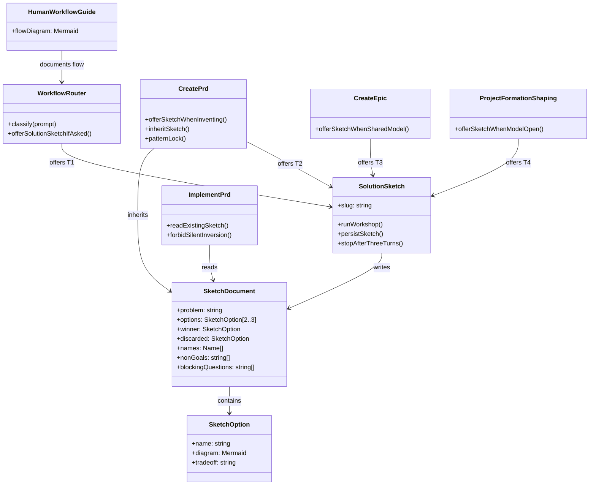
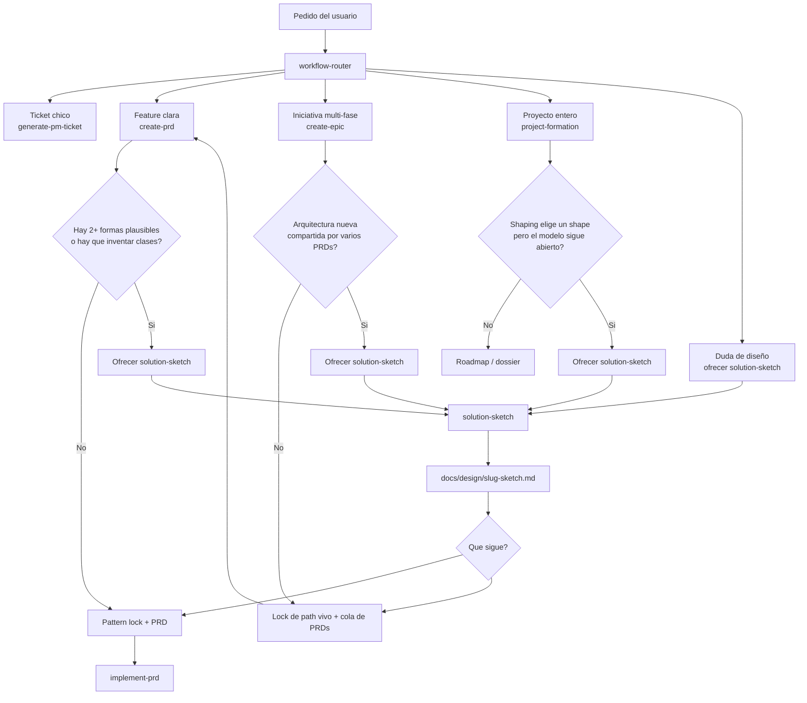

# PRD: Skill opcional `solution-sketch` y guia de flujo

**Ticket**: Workflow — taller de diseño opcional antes de PRD/epica, con diagrama visible en docs humanas
**Autor**: GitHub Copilot
**Fecha**: 2026-08-24
**Estado**: Cerrada

---

## 1. Contexto y Objetivo

`create-prd` y `create-epic` ya diseñan, pero tarde y rigido. El `classDiagram` del PRD es un contrato final; el pattern lock pregunta "que patron local reuso", no "que solucion gana". Formation shaping compara bets de producto, no clases ni relaciones. Resultado: dev e IA escriben el spec sin un tablero compartido de alternativas.

Este PRD agrega `solution-sketch`: un desvio corto y opcional *antes* de redactar PRD/cola de PRDs. Produce un artefacto commiteable con 2-3 opciones, diagramas simples, una ganadora y la descartada. Tambien publica el diagrama de flujo en docs humanas del workflow para que se vea en el repo sin abrir skills.

> **Alcance estricto**: skill nueva `solution-sketch`, ganchos de oferta en router/`create-prd`/`create-epic`/`project-formation` shaping, lectura heredada en `implement-prd` y `create-prd`, guia humana en `docs/workflow/`, registro/overlay/legal/tests de contrato. **No** convierte el sketch en fase obligatoria de `create-prd` o `create-epic`. **No** toca `generate-pm-ticket` (sigue directo). **No** agrega persistencia de producto, flags, tenancy ni UI.

### Contexto de Epica Padre _(si aplica)_

**parent_epic**: No aplica

**Path vivo heredado**: No aplica
**Secuencia de corte heredada**: No aplica
**Este PRD respeta el corte**: No aplica

### Contrato entre Fases _(si aplica)_

**Ledger leido**: No aplica
**PRD anterior en la cola**: No aplica

### Estado Actual

| Capa | Componente | Archivo | Estado actual |
| --- | --- | --- | --- |
| Router | Clasificacion y menu | `.agents/skills/00-router/workflow-router/SKILL.md` | Menu de 4 rutas de producto; no hay clase ni hard trigger de diseño |
| PRD | Orquestador 5 fases | `.agents/skills/01-product/create-prd/SKILL.md` | Pattern lock + classDiagram final; no hay taller previo |
| PRD | Pattern lock | `.agents/skills/01-product/create-prd/reference/pattern-locking.md` | Reusa patron local o declara `none`; no ofrece sketch |
| Epica | Discovery + corte | `.agents/skills/01-product/create-epic/SKILL.md` | Lock de path vivo antes de la cola; no hay sketch de modelo compartido |
| Formation | Shaping | `.agents/skills/01-product/project-formation/shaping/SKILL.md` | 3 opciones de bet; prohibe brainstorm eterno; no dibuja clases |
| Implementacion | Startup | `.agents/skills/02-implement/implement-prd/SKILL.md` | Lee `_meta` Calibration/Pattern Lock/Self-Audit; no lee sketches |
| Postura | Challenge | `.agents/skills/01-product/shared/critical-stance.md` | Aplica a create-prd/epic/formation/ticket; no nombra solution-sketch |
| Registry | Inventario | `.agents/skills/registry.md` + `scripts/sync-skill-registry.mjs` | `directRoutingKeys` no incluye solution-sketch |
| Docs humanas | Mapa | `docs/workflow/README.md` | Estructura decisions/runbooks; no hay diagrama de flujo product skills |
| Overlay | Espejo instalable | `templates/repo-overlay-fhh-ia-ecosystem-full/` | Debe copiar skills y docs de workflow tocadas |
| Legal | Inventario overlay | `docs/legal/overlay-authorship.json` | fileCount 123; hay que renovarlo al agregar archivos |
| Tests | Contrato | `test/workflow-contract.test.mjs`, `test/turn-routing-contract.test.mjs` | Assertions literales de create-prd/epic/router |

---

## 2. Requerimientos Funcionales

### 2.1 Skill hermana `solution-sketch` (no fase nueva)

> **Decision confirmada**: `solution-sketch` es un workflow skill propio, Explicit-only, user-invocable, cost hint `lean`. No es una Phase extra de `create-prd` ni un step extra de la epica. Meterlo ahi lo mata (se saltea o se finge).

**Condicion de aplicacion**: el usuario lo pide, o un gancho de oferta lo autoriza.
**Salida**: `docs/design/<slug>-sketch.md` commiteable + plantilla en el skill.
**Campos NO afectados**: compact path de create-prd, generate-pm-ticket, AC/edge-case/slices del PRD.

### 2.2 Artefacto commiteable, no `_meta/`

> **Decision confirmada**: el sketch vive en `docs/design/<slug>-sketch.md`. `_meta/` se ignora y `implement-prd` lo borra al cierre; un diseño ahi no sobrevive.

Plantilla minima (1-2 paginas, lenguaje de pizarron):

1. Problema en 3 lineas
2. 2-3 opciones, cada una con un Mermaid (cajas + flechas; `classDiagram` solo si hace falta)
3. Opcion ganadora + opcion descartada + por que (`critical-stance`)
4. Nombres que si existen: clases, dueños, relaciones
5. Que no se crea ahora
6. Preguntas que todavia bloquean el PRD

No es un segundo PRD: sin AC, sin matriz de edge cases, sin slices.

Si el archivo ya existe para el mismo slug, reusar. No rehacer el taller.

### 2.3 Guia humana visible en el repo

> **Decision confirmada**: el diagrama de flujo se publica en docs humanas del workflow, no solo en el PRD.

Archivos:

- `docs/workflow/decisions/2026-08-24-solution-sketch-flow.md` — decision durable: que es, cuando aparece, cuando no, diagrama Mermaid canonico.
- `docs/workflow/README.md` — enlace a esa decision y el mismo diagrama (o un embed/link corto) para que se vea al abrir el mapa.

El overlay debe espejar ambos para que un repo instalado vea la guia.

### 2.4 Cuatro triggers de oferta, nunca auto-start

El skill **no arranca solo**. Solo se ofrece. Si el usuario dice que no, se anota `sketch: skipped` y el flujo padre sigue.

| ID | Donde | Trigger |
| --- | --- | --- |
| T1 | Router | El usuario pide diseño/clases/alternativas/brainstorm de solucion *antes* de un spec |
| T2 | `create-prd` Phase 3 / pattern-locking | El lock tendria que **inventar** clases/relaciones en vez de reusar un ancla local, o el classDiagram serian placeholders |
| T3 | `create-epic` antes del corte/cola | Arquitectura o modelo **compartido por varios PRDs hijos** |
| T4 | `project-formation` shaping exit | El shape ya esta elegido y el modelo/clases siguen abiertos |

No aparece en: ticket/`generate-pm-ticket`, compact PRD, patron local obvio, sketch existente para el slug, usuario eligiendo *que* construir (no *como*), pedido de codigo (`implement-prd`).

Tope: 3 turnos. Sin decision, cortar y volver al flujo padre.

### 2.5 Herencia dura

Un PRD hijo o `implement-prd` no puede invertir un sketch locked sin un desafio `critical-stance` explicito (misma regla que `INV-CUT`). El pattern lock, si hay sketch, debe nombrarlo como ancla: "reusar este sketch + este patron local". El `classDiagram` del PRD sigue siendo obligatorio y usa los nombres del sketch, no placeholders.

`implement-prd` startup lee `docs/design/<slug>-sketch.md` cuando existe (path declarado en el PRD o slug derivado del directorio del PRD).

### 2.6 Registry, overlay, legal, tests

- Fila en `.agents/skills/registry.md` (Workflow, Explicit-only, lean, key `solution-sketch`).
- Agregar `solution-sketch` a `directRoutingKeys` en `scripts/sync-skill-registry.mjs`.
- Correr `node scripts/sync-skill-registry.mjs --write`.
- Espejar skill + docs + skills tocados en `templates/repo-overlay-fhh-ia-ecosystem-full/`.
- Renovar `docs/legal/overlay-authorship.json` (`lastVerified`, `fileCount`, `pathContentSha256`).
- Assertions nuevas en tests de contrato; no romper las literales existentes.

### 2.7 Criterios de Aceptacion

| ID | Given | When | Then | Evidence expected |
| --- | --- | --- | --- | --- |
| AC-1 | El kit no tiene skill de diseño previo al spec | Se implementa este PRD | Existe `.agents/skills/01-product/solution-sketch/SKILL.md` con protocolo de 3 turnos, plantilla, stop conditions y `user-invocable: true` | Diff del skill + frontmatter |
| AC-2 | Un usuario o gancho autoriza el sketch | El skill termina | Existe `docs/design/<slug>-sketch.md` con las 6 secciones y una opcion ganadora + descartada | Plantilla en skill + test de contrato sobre secciones |
| AC-3 | Un maintainer abre docs de workflow | Busca el flujo product | `docs/workflow/README.md` enlaza la decision y muestra el diagrama Mermaid; existe `docs/workflow/decisions/2026-08-24-solution-sketch-flow.md` | Diff de ambos archivos |
| AC-4 | El usuario pide "dibujemos las clases" / "brainstorm de la solucion" | El router clasifica | Ofrece `solution-sketch` y no auto-carga `create-prd` | Diff router + `test/turn-routing-contract.test.mjs` |
| AC-5 | `create-prd` llega a pattern lock y tendria que inventar clases | Evalua el gancho | Ofrece sketch, se detiene, y no lockea placeholders | Diff `pattern-locking.md` + `create-prd/SKILL.md` |
| AC-6 | Compact PRD o patron local obvio | Evalua el gancho | No menciona `solution-sketch` | Diff del skill + test negativo documentado |
| AC-7 | Una epica introduce modelo compartido por varios PRDs | Antes del corte/cola | Ofrece un unico sketch de epica | Diff `create-epic/SKILL.md` |
| AC-8 | Shaping eligio un shape y el modelo sigue abierto | Sale de shaping | Ofrece sketch; no convierte formation en brainstorm eterno | Diff `project-formation/shaping/SKILL.md` |
| AC-9 | Existe un sketch locked para el slug | `create-prd` o `implement-prd` arranca | Lo lee; no puede invertirlo sin desafio explicito | Diff create-prd, implement-prd, critical-stance |
| AC-10 | El usuario rechaza la oferta | El flujo padre continua | Queda `sketch: skipped` en el artefacto padre (`_meta` Pattern Lock, epica, o stage log) | Diff de los ganchos |
| AC-11 | Se registra la skill | Sync de registry | Aparece en `registry.md`, index compacto y overlay; `directRoutingKeys` la incluye | `bun run check:workflow` |
| AC-12 | Overlay vs canonico | `bun run check:workflow` y `bun run check:legal` | Sin drift; `overlay-authorship.json` renovado | Esos comandos en verde |
| AC-13 | Tests de contrato existentes | CI corre la suite | Las assertions literales de create-prd/epic/router siguen pasando; hay assertions nuevas de solution-sketch | `node --test test/workflow-contract.test.mjs test/turn-routing-contract.test.mjs` |

### 2.8 Casos de Uso

| ID | Actor | Precondiciones | Flujo principal | Resultado observable (falsable) | AC vinculado |
| --- | --- | --- | --- | --- | --- |
| UC-1 | Usuario | Quiere diseñar approvals antes del PRD | Pide brainstorm/clases | El router ofrece `solution-sketch` y espera autorizacion | AC-4 |
| UC-2 | Agente `solution-sketch` | Usuario autorizo el taller | Dibuja 2-3 opciones, desafia, lockea | Existe `docs/design/<slug>-sketch.md` con ganadora y descartada | AC-1, AC-2 |
| UC-3 | Agente `create-prd` | Pattern lock no tiene ancla local | Ofrece sketch y para | No escribe Pattern Lock con placeholders | AC-5 |
| UC-4 | Agente `create-prd` | Compact path / ancla local obvia | Sigue Phase 3 | El chat no ofrece solution-sketch | AC-6 |
| UC-5 | Agente `create-epic` | Modelo compartido entre fases | Ofrece un sketch antes de la cola | La cola no se escribe hasta skip o sketch locked | AC-7 |
| UC-6 | Agente formation shaping | Shape elegido, modelo abierto | Ofrece sketch al salir | Formation no avanza a roadmap fingiendo el modelo | AC-8 |
| UC-7 | Usuario | Recibe oferta y dice no | Flujo padre retoma | Artefacto padre tiene `sketch: skipped` | AC-10 |
| UC-8 | Agente `implement-prd` | PRD declara o existe sketch | Startup | Lee el sketch y no inventa clases distintas | AC-9 |
| UC-9 | Maintainer | Abre `docs/workflow/README.md` | Busca el flujo | Ve el diagrama y el link a la decision | AC-3 |
| UC-10 | CI / maintainer | Corre checks | Valida contrato, overlay, legal, registry | Comandos en verde con assertions nuevas | AC-11, AC-12, AC-13 |

### 2.9 Estrategia de Tests

| Nivel | Objetivo | Caso de uso vinculado | Cobertura esperada | Comando o mecanismo de validacion |
| --- | --- | --- | --- | --- |
| Contrato | Skill, plantilla, 4 triggers, skip, no-auto-start, herencia | UC-2, UC-3, UC-4, UC-5, UC-6, UC-7, UC-8 | Cadenas literales nuevas en `test/workflow-contract.test.mjs` | `node --test test/workflow-contract.test.mjs` |
| Contrato router | Oferta T1 y menu/autorizacion intactos | UC-1 | Assertions en `test/turn-routing-contract.test.mjs` | `node --test test/turn-routing-contract.test.mjs` |
| Workflow | Registry + overlay + index | UC-10 | Sin drift | `bun run check:workflow` |
| Legal | Inventario overlay renovado | UC-10 | `check:legal` verde | `bun run check:legal` |
| Docs | Guia humana presente | UC-9 | Archivos existen y README enlaza | Diff + lectura del README |
| Regresion | Gates existentes de create-prd/epic | UC-4 | 0 fallos en assertions viejas | mismos tests de contrato |

### 2.10 Matriz de Edge Cases

| Categoria | Descripcion | Caso de uso vinculado | Validacion | Estado |
| --- | --- | --- | --- | --- |
| Datos vacios | No hay sketch y el usuario nunca lo pidio | UC-4 | Contrato: compact/patron local no menciona la skill | Verified |
| Limites | Tercer turno del sketch sin decision | UC-2 | Skill: stop y volver al padre; no cuarto turno | Verified |
| Errores | Slug choca con un sketch existente | UC-2 | Skill: reusar, no overwrite sin preguntar | Verified |
| Permisos/tenancy | No aplica: sin datos de usuario, auth ni tenancy | — | No aplica — solo contratos Markdown de workflow | No aplica |
| Concurrencia/orden | Oferta durante create-prd y el usuario pide implementar | UC-3, UC-8 | Router precedence: no codear; o sketch o spec primero | Verified |
| Rollout/rollback | PRDs/epicas historicas sin sketch | UC-8 | No retrofit; ausencia de sketch no bloquea implement-prd | Verified |

---

## 3. Modelo de Datos

### 3.1 Migracion Requerida

No hay migracion de base de datos. El unico artefacto nuevo de producto-workflow es Markdown en `docs/design/` y una decision en `docs/workflow/decisions/`.

### 3.2 Diagrama de Clases

### 3.3 Diagrama de Flujo

Este diagrama es el mismo que debe publicarse en `docs/workflow/README.md` y en la decision.

---

## 4. Plan de Implementacion por Fases

### Fase 1 - Skill, plantilla y guia humana

**Objetivo**: el taller existe y el diagrama se ve en docs de workflow.

**Slices ejecutables**:

| ID | Outcome | Depends on | Scope / likely files | Acceptance criteria | Use cases | Tests | Edge cases | Validation | Evidence |
| --- | --- | --- | --- | --- | --- | --- | --- | --- | --- |
| P1-S1 | Skill `solution-sketch` con protocolo, 3-turn cap, plantilla y stop conditions | none | `.agents/skills/01-product/solution-sketch/SKILL.md`, `references/sketch-template.md` | AC-1, AC-2 | UC-2 | Contrato sobre secciones y stop | Limites, errores | `rg -n "three turns\|docs/design\|sketch-template" .agents/skills/01-product/solution-sketch` | Archivos existen |
| P1-S2 | Guia humana con el diagrama de flujo | P1-S1 | `docs/workflow/decisions/2026-08-24-solution-sketch-flow.md`, `docs/workflow/README.md` | AC-3 | UC-9 | Lectura + contrato de heading/diagrama | Datos vacios N/A | `rg -n "solution-sketch" docs/workflow/README.md docs/workflow/decisions` | Diagrama visible en README |

**Slice stop conditions**:

- La plantilla empieza a copiar secciones de PRD (AC, slices, edge cases)

**Definition of Done**:

- Every slice is `VERIFIED`
- Un humano puede abrir `docs/workflow/README.md` y ver el flujo
- El skill no es un segundo create-prd

### Fase 2 - Ganchos de oferta e herencia

**Objetivo**: el sketch aparece solo en T1-T4 y se hereda.

**Slices ejecutables**:

| ID | Outcome | Depends on | Scope / likely files | Acceptance criteria | Use cases | Tests | Edge cases | Validation | Evidence |
| --- | --- | --- | --- | --- | --- | --- | --- | --- | --- |
| P2-S1 | Router ofrece T1 sin auto-start | P1-S1 | `.agents/skills/00-router/workflow-router/SKILL.md` | AC-4 | UC-1 | `test/turn-routing-contract.test.mjs` | Concurrencia/orden | `node --test test/turn-routing-contract.test.mjs` | Assertions nuevas + menu de 4 intacto |
| P2-S2 | create-prd/pattern-lock ofrece T2 y respeta compact/skip/herencia | P1-S1 | `create-prd/SKILL.md`, `reference/pattern-locking.md`, `PRD_TEMPLATE.md` si hace falta un campo de sketch path | AC-5, AC-6, AC-9, AC-10 | UC-3, UC-4, UC-7 | `test/workflow-contract.test.mjs` | Datos vacios, rollout | `node --test test/workflow-contract.test.mjs` | No se mencionan placeholders; compact no ofrece |
| P2-S3 | create-epic ofrece T3 una vez antes de corte/cola | P1-S1 | `create-epic/SKILL.md` | AC-7, AC-10 | UC-5, UC-7 | Contrato | Rollout historico | mismo test | Un solo offer por epica |
| P2-S4 | Formation shaping ofrece T4 al salir si el modelo esta abierto | P1-S1 | `project-formation/shaping/SKILL.md`, `shared/critical-stance.md` | AC-8, AC-10 | UC-6, UC-7 | Contrato | Limites (no brainstorm eterno) | mismo test | Exit gate sigue exigiendo un shape |
| P2-S5 | implement-prd lee sketch existente y prohibe inversion silenciosa | P2-S2 | `implement-prd/SKILL.md` | AC-9 | UC-8 | Contrato | Rollout: ausencia no bloquea | mismo test | Startup lista el path |

**Slice stop conditions**:

- Un gancho auto-ejecuta el skill
- El menu del router supera 4 opciones de producto o pierde el texto literal testeado

**Definition of Done**:

- T1-T4 son ofertas
- Compact/ticket no cambian
- Herencia queda escrita en create-prd e implement-prd

### Fase 3 - Registry, overlay, legal y tests

**Objetivo**: el kit instalable y CI conocen la skill.

**Slices ejecutables**:

| ID | Outcome | Depends on | Scope / likely files | Acceptance criteria | Use cases | Tests | Edge cases | Validation | Evidence |
| --- | --- | --- | --- | --- | --- | --- | --- | --- | --- |
| P3-S1 | Registry + directRoutingKeys + sync | P1-S1, P2-S1 | `registry.md`, `scripts/sync-skill-registry.mjs`, artifacts derivados | AC-11 | UC-10 | `test/skill-registry-sync.test.mjs` | — | `node scripts/sync-skill-registry.mjs --write` luego `bun run check:workflow` | Index lista `solution-sketch` |
| P3-S2 | Overlay byte-copy de skills/docs tocados | P3-S1, P1-S2, P2-* | `templates/repo-overlay-fhh-ia-ecosystem-full/**` | AC-12 | UC-10 | `check:workflow` | — | `bun run check:workflow` | Sin `overlay/content-drift` |
| P3-S3 | Renovar overlay-authorship | P3-S2 | `docs/legal/overlay-authorship.json` | AC-12 | UC-10 | `check:legal` | — | `bun run check:legal` | fileCount/hash nuevos |
| P3-S4 | Assertions de contrato nuevas | P2-*, P3-S1 | `test/workflow-contract.test.mjs`, `test/turn-routing-contract.test.mjs` | AC-13 | UC-10 | esos archivos | Regresion | `node --test test/workflow-contract.test.mjs test/turn-routing-contract.test.mjs test/skill-registry-sync.test.mjs` | Verde |

**Slice stop conditions**:

- `check:legal` falla por inventario no renovado
- Una assertion historica se reescribe en vez de agregar

**Definition of Done**:

- `bun run check:workflow`, `bun run check:legal` y los tests de contrato pasan
- Overlay y canonico coinciden en archivos tocados

### Fase Futura - _(fuera de alcance de este PRD)_

> Sera abordada en PRD separado.

- Propagar offer hooks a `generate-pm-ticket` (explícitamente no)
- Skill matcher / implement-prd usando sketches como pattern skill
- Visualizar sketches en una galeria
- Retrofit de PRDs historicos

---

## 5. Decisiones Tomadas

| # | Pregunta | Respuesta | Impacto en diseno |
| --- | --- | --- | --- |
| 1 | Fase de PRD/epica o skill hermana? | Skill hermana `solution-sketch` | Ganchos de oferta, no Phase 6 |
| 2 | Donde vive el diagrama humano? | `docs/workflow/README.md` + decision 2026-08-24 | Visible en el mapa instalable |
| 3 | Donde vive el sketch de una feature? | `docs/design/<slug>-sketch.md` | Commiteable; no `_meta/` |
| 4 | Auto-start? | No. Solo oferta | Ausente por defecto |
| 5 | Compact/ticket? | Nunca | Cero ceremonia extra en lo comun |
| 6 | Feature flag? | No | Contrato determinista |
| 7 | Puede el PRD invertir el sketch? | No, sin desafio explicito | Igual que INV-CUT |
| 8 | Seguir a implement-prd? | Si, autorizado en el mismo turno | Este PRD queda Aprobado |

---

## 6. Preguntas Abiertas

_(Vacio = PRD listo para implementar)_

---

## 7. Riesgos y Mitigaciones

| Riesgo | Probabilidad | Impacto | Mitigacion |
| --- | --- | --- | --- |
| El offer se vuelve ruido en cada PRD | Media | Alto | Triggers estrechos; compact/patron local no mencionan la skill |
| El router rompe el menu de 4 opciones | Media | Alto | T1 es hard trigger aparte; no quinta opcion permanente en el menu de producto |
| Overlay/legal se olvidan | Alta | Alto | Slice P3 dedicado; `check:legal` + `check:workflow` en DoD |
| El sketch se convierte en segundo PRD | Media | Medio | Plantilla sin AC/slices; stop si aparecen |
| Inversion silenciosa en implement-prd | Media | Alto | Startup lee el path; contrato de no-inversion |
| Brainstorm eterno | Media | Medio | Cap de 3 turnos + corte |

---

## 8. Definition of Done Global

- [x] Todas las fases completadas
- [x] `node --test test/workflow-contract.test.mjs test/turn-routing-contract.test.mjs test/skill-registry-sync.test.mjs` en verde
- [x] `bun run check:workflow` en verde
- [x] `bun run check:legal` en verde
- [x] Diagrama visible en `docs/workflow/README.md`
- [x] Skill registrada y espejada en overlay
- [x] Todo AC tiene al menos un caso de uso vinculado y todo caso de uso tiene al menos un AC vinculado
- [x] Todo caso de uso tiene al menos un test en la Estrategia de Tests
- [x] La Matriz de Edge Cases cubre las seis categorias obligatorias (o declara `No aplica` con justificacion)

---

## 9. Matriz de Trazabilidad

| Acceptance criterion | Caso de uso | Phase / slice | Test evidence | Edge case(s) | Validation evidence | Status |
| --- | --- | --- | --- | --- | --- | --- |
| AC-1 | UC-2 | P1-S1 | skill frontmatter + protocolo | Limites | rg skill path | COMPLETE |
| AC-2 | UC-2 | P1-S1 | plantilla 6 secciones | Errores (slug existente) | contrato | COMPLETE |
| AC-3 | UC-9 | P1-S2 | README + decision | — | rg docs/workflow | COMPLETE |
| AC-4 | UC-1 | P2-S1 | turn-routing-contract | Concurrencia | node --test | COMPLETE |
| AC-5 | UC-3 | P2-S2 | workflow-contract | — | node --test | COMPLETE |
| AC-6 | UC-4 | P2-S2 | workflow-contract negativo | Datos vacios | node --test | COMPLETE |
| AC-7 | UC-5 | P2-S3 | workflow-contract | — | node --test | COMPLETE |
| AC-8 | UC-6 | P2-S4 | workflow-contract | Limites | node --test | COMPLETE |
| AC-9 | UC-8 | P2-S2, P2-S5 | workflow-contract | Rollout | node --test | COMPLETE |
| AC-10 | UC-7 | P2-S2..S4 | workflow-contract `sketch: skipped` | — | node --test | COMPLETE |
| AC-11 | UC-10 | P3-S1 | skill-registry-sync | — | check:workflow | COMPLETE |
| AC-12 | UC-10 | P3-S2, P3-S3 | check:workflow + check:legal | — | esos comandos | COMPLETE |
| AC-13 | UC-10 | P3-S4 | tests de contrato | Regresion | node --test | COMPLETE |

---

## 10. Evidencia de Implementacion

Esta seccion es el registro durable de cierre. `implement-prd` la completa antes de eliminar los artefactos temporales de `_meta/`; no registrar prompts, trackers, handoffs ni estado interno de agentes.

**Estado**: Cerrada

| Campo | Evidencia durable |
| --- | --- |
| Cambios entregados | Skill hermana `solution-sketch` (protocolo 3 turnos + plantilla de 6 secciones). Guia humana con diagrama Mermaid en `docs/workflow/README.md` y `docs/workflow/decisions/2026-08-24-solution-sketch-flow.md`. Ganchos offer-only T1-T4 en router, create-prd/pattern-lock, create-epic y formation shaping. Herencia en create-prd e implement-prd (startup 3.5; no invertir sin critical-stance). Registry + overlay + legal renovados. Tests de contrato nuevos sin reescribir literales historicas. Reparacion post-colision: se restauro el texto roto de Contrato Visual en `create-prd/SKILL.md` (secciones requeridas, quality bar, anti-patterns) sin revertir el UI lock paralelo. |
| Criterios de aceptacion | AC-1 COMPLETE: `.agents/skills/01-product/solution-sketch/SKILL.md` (`user-invocable: true`, 3 turns, stop). AC-2 COMPLETE: `references/sketch-template.md` con 6 secciones + winner/discarded. AC-3 COMPLETE: README + decision 2026-08-24. AC-4 COMPLETE: hard trigger T1; menu de 4 opciones intacto. AC-5 COMPLETE: offer en pattern lock al inventar clases. AC-6 COMPLETE: compact `do not mention solution-sketch`; ticket no lo nombra. AC-7 COMPLETE: offer unico antes de corte/cola. AC-8 COMPLETE: offer al salir de shaping si el modelo sigue abierto. AC-9 COMPLETE: create-prd hereda sketch; implement-prd 3.5 lee `docs/design/<slug>-sketch.md`. AC-10 COMPLETE: `sketch: skipped` en decline. AC-11 COMPLETE: registry/index/`directRoutingKeys`. AC-12 COMPLETE: overlay byte-copy + `overlay-authorship.json` (`fileCount` 127, hash `895b9cc50cf6f9d19093797a2b925e62f811c2fdcd1b18a4af4c62348bf3ad64`). AC-13 COMPLETE: tests nuevos + literales historicas verdes, incluido Contrato Visual. |
| Validaciones ejecutadas | `node --test test/workflow-contract.test.mjs test/turn-routing-contract.test.mjs test/skill-registry-sync.test.mjs` — PASS (32/32). `bun run check:workflow` — PASS. `bun run check:legal` — PASS. |
| Calidad y QA | Quality-gate path `.github/instructions/quality-gate.instructions.md` no existe en este kit; no aplica. QA inline: `ready_to_close: yes`, `blocking_findings_open: no`. Contrato Visual paralelo intacto (`require a locked Contrato Visual before any coding slice`). |
| Referencia de cambio | Working tree local 2026-08-24; skill nueva + hooks + overlay + tests + PRD de cierre. Sin commit/PR todavia. |
| Riesgos o waivers | Ninguno aceptado. Residual no bloqueante: si otra sesion vuelve a editar los mismos SKILL.md, re-espejar overlay y renovar legal. Ausencia de sketch no bloquea PRDs historicos. |
| Fecha de cierre | 2026-08-24 |

### Resumen del Ledger de Hallazgos

El ledger quedo vacio. No hubo findings `critical`/`high` abiertos. La colision con Contrato Visual se reparo en el mismo cierre (texto garbled de `create-prd`) antes de declarar `ready_to_close: yes`.
