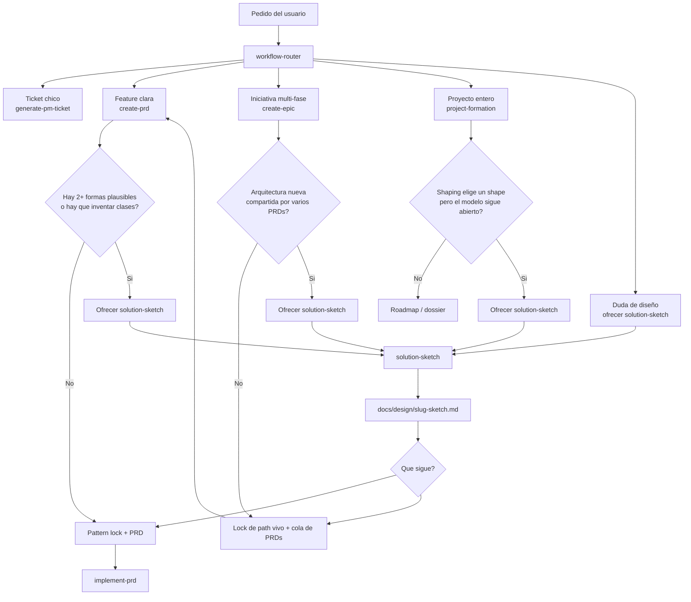

# Workflow Docs Map

This folder is reserved for documents that support the installed AI workflow.

## Structure

- `decisions/`: durable decisions about workflow rules, routing, and architecture.
- `runbooks/`: procedural documents for recurring operations.
- `handoffs/`: implementation summaries and ownership transfers.
- `standards/`: backend/frontend standards and setup-migration guidance.
- `migration/`: one-time adoption artifacts for recovering and reordering legacy docs.

## Ordering rules

1. Keep one concern per document.
2. Prefer append-only history for decisions; supersede by adding a newer file.
3. Link each runbook to the commands/files it touches.
4. For handoffs, include scope, validation evidence, and next steps.

## Product skill flow

Optional `solution-sketch` sits beside ticket / PRD / epic / formation. It is offer-only. See [decisions/2026-08-24-solution-sketch-flow.md](decisions/2026-08-24-solution-sketch-flow.md).

Visible UI also needs a **Contrato Visual (UI lock)** inside `create-prd` / `generate-pm-ticket` before `implement-prd` starts. See [decisions/2026-08-24-ui-visual-contract.md](decisions/2026-08-24-ui-visual-contract.md).

## Recommended first documents

- `decisions/2026-01-01-workflow-adoption-baseline.md`
- `decisions/2026-08-24-solution-sketch-flow.md`
- `runbooks/update-skill-registry.md`
- `runbooks/router-skill-enforcement-manual-checklist.md`
- `runbooks/runtime-native-readiness-checklist.md`
- `handoffs/template-installation.md`
- `standards/setup-and-migration.md`
- `standards/project-instructions-template.md`
