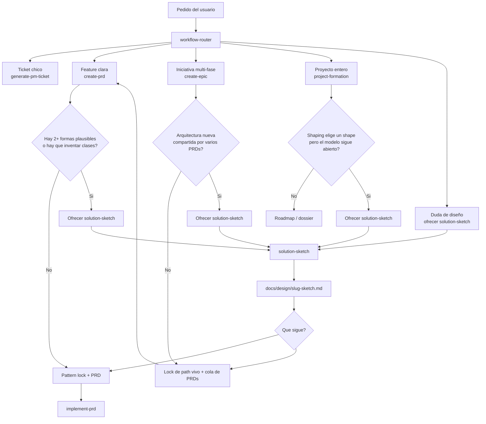

# Decision: optional `solution-sketch` before PRD or epic

**Date**: 2026-08-24
**Status**: Accepted
**Skill**: `solution-sketch`

## Decision

Design comparison happens in a sister workflow skill, not as a new phase of `create-prd` or `create-epic`.

The sketch is optional, offer-only, and commitable at `docs/design/<slug>-sketch.md`. The human map of when it appears lives here and in [../README.md](../README.md).

## Why

`create-prd` locks a local pattern and then treats the class diagram as a final contract. `create-epic` locks live path and cut, not classes. Formation shaping compares product bets. None of those is a short whiteboard of 2-3 solution shapes.

Putting the workshop inside a long skill would get skipped or faked. Putting the artifact in `_meta/` would delete it at `implement-prd` closure.

## When it appears

Offer `solution-sketch`. Never auto-start it.

| Trigger | Where | Condition |
| --- | --- | --- |
| T1 | `workflow-router` | User asks for design, classes, alternatives, or solution brainstorm *before* a spec |
| T2 | `create-prd` pattern lock | Lock would invent classes or relationships instead of reusing a local anchor |
| T3 | `create-epic` | Shared model across several child PRDs, before cut/queue |
| T4 | `project-formation` shaping exit | Shape is chosen and the model is still open |

## When it does not appear

- `generate-pm-ticket`
- compact `create-prd`
- obvious local pattern
- a sketch already exists for the slug
- the user is choosing *what* to build, not *how*
- the user wants production code (`implement-prd`)

If the user declines: record `sketch: skipped` and resume the parent workflow.

## Inheritance

A locked sketch is an anchor. `create-prd` and `implement-prd` must read it and must not invert it without an explicit `critical-stance` challenge, same bar as `INV-CUT`. Missing sketch does not block historical PRDs.

## Canonical flow

