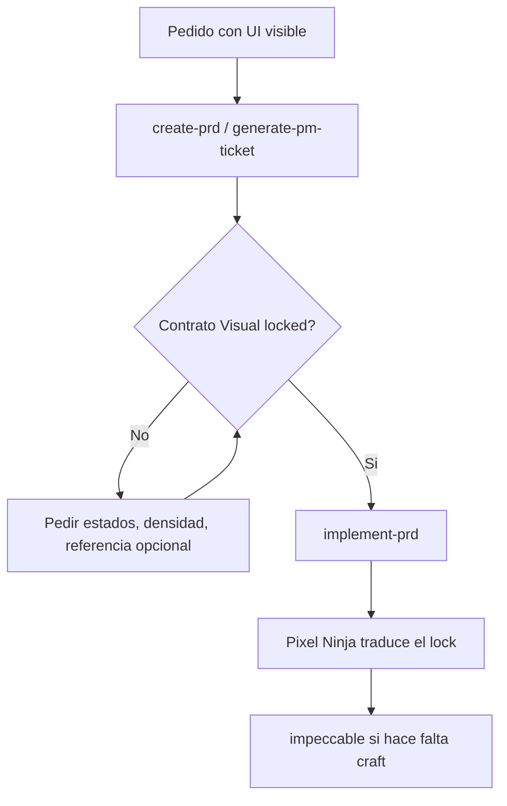

# Decision: visual contract before visible-UI implementation

**Date**: 2026-08-24
**Status**: Accepted
**Skills**: `create-prd`, `generate-pm-ticket`, `implement-prd`, `frontend-phase-implementer`

## Decision

Visible UI is a contract, not a Pixel Ninja invention.

When a PRD or ticket changes a user-facing screen, lock a **Contrato Visual** before coding. A mockup, screenshot, Figma file, or photo is optional evidence. High-fidelity mockups are never a universal gate.

## Why

`create-prd` already blocks unlocked behavior, data, and API contracts. Implementation still invented layout, density, and states, then used `frontend-design` / `impeccable` after JSX existed. That produced functional-but-generic screens and expensive visual iteration.

`solution-sketch` locks classes. It does not lock screens. A new workflow skill would add ceremony without closing the existing PRD gate.

## What the lock contains

Required:

- surface: new vs existing
- density / composition
- primary action
- required UI states
- one-sentence visual thesis
- Design System primitive or sibling screen to reuse
- `UI lock: locked` or `not-applicable` with a one-line reason

Optional evidence, in this order:

1. existing sibling screen in the repo
2. Figma or digital mockup
3. photo of paper / whiteboard
4. competitor screenshot

Do not lock hex colors, new typefaces, or animation unless product already decided them.

## Where it binds

| Workflow | Rule |
| --- | --- |
| `create-prd` | Phase 2 treats an unlocked screen as blocking ambiguity when `visible_ui: yes`. Phase 5 cannot declare ready without the lock. |
| `generate-pm-ticket` | Compact visual contract, or `not-applicable`. |
| `prd-readiness-review` | Missing lock on visible UI is `STOP`. |
| `implement-prd` / Pixel Ninja | Do not start a visible-UI coding slice until the lock exists. Do not invent the screen. |
| `frontend-design` | Translates or sharpens the lock before code. Does not invent the screen after JSX. |
| `impeccable` | Craft / QA after the lock exists. |

Historical PRDs without a UI lock remain valid only when they also lack a new visible surface.

## Canonical flow

