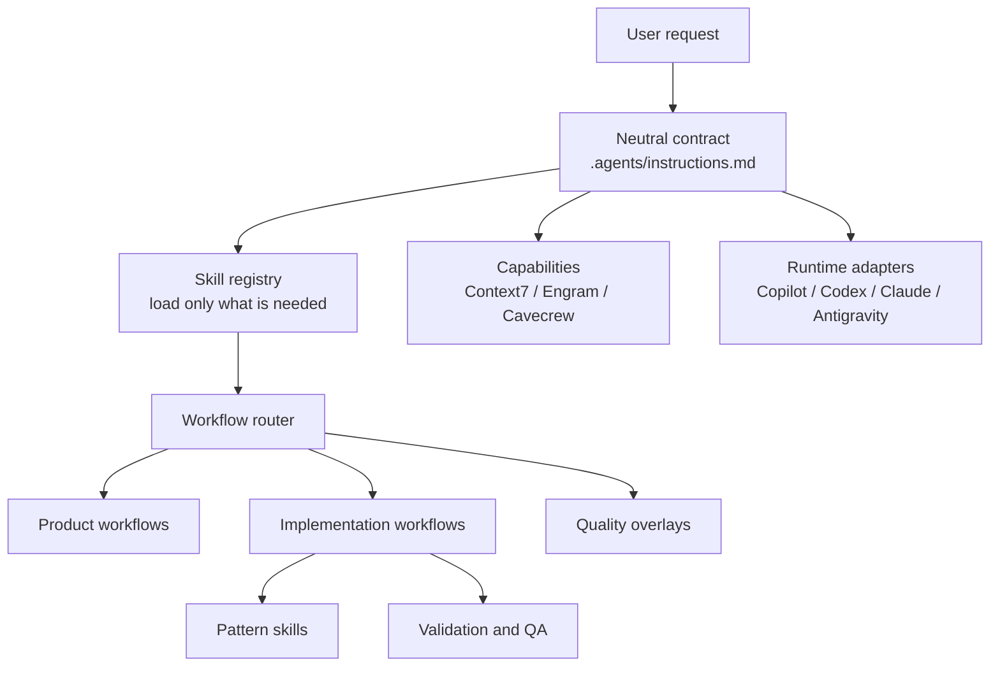
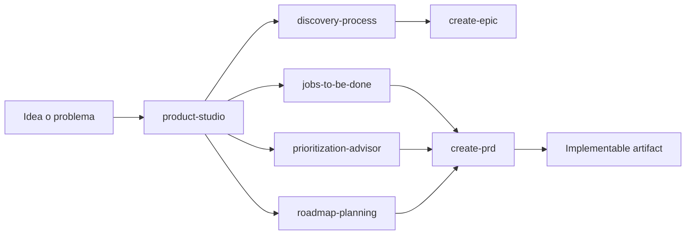

# FHH IA Ecosystem

  

    
AI Workflow System

    <h2 class="hero-title">No instala solo archivos. Instala una forma correcta de desarrollar software con agentes IA.</h2>
    

      Skills, routing, memoria, validaciones, ownership y guardrails para convertir peticiones libres en ejecucion de ingenieria con estructura.
    

  

  

    

      
workflow

      
router

      
skills

      
memory

      
validation

    

  

---
layout: section
---

# La tesis

## El valor fuerte no es la instalacion. Es el sistema de trabajo con IA.

---

# El problema que corrige

  

    
Sin workflow

    <h3>Prompting caotico</h3>
    
Cada pedido arranca distinto. No hay intake, no hay decision de flujo, no hay criterio de escala.

  

  

    
Sin ownership

    <h3>Coding directo</h3>
    
El agente salta a editar sin PRD, sin slicing, sin contratos y sin protecciones de validacion.

  

  

    
Sin memoria

    <h3>Calidad inconsistente</h3>
    
Se pierde contexto entre sesiones, se repiten errores y cada repo vuelve a inventar su forma de trabajar.

  

  El workflow convierte lenguaje natural en proceso operativo repetible.

---

# Que se instala realmente

  

    
No es el centro

    <h3>Toolkit de adopcion</h3>
    
CLI, TUI, update, doctor y export existen para distribuir el sistema de forma segura entre repos y runtimes.

  

  

    
Lo importante

    <h3>Workflow operativo con IA</h3>
    <ul class="clean-list">
      <li>Contrato neutral de instrucciones</li>
      <li>Registro de skills con carga just-in-time</li>
      <li>Workflows de producto, implementacion y calidad</li>
      <li>Pattern skills reutilizables por dominio</li>
      <li>Capacidades opcionales como memoria y docs lookup</li>
    </ul>
  

---

# Arquitectura del sistema

El repo instala wrappers finos; la logica vive en la capa neutral.

---

# Contrato neutral y source of truth

  

    
01

    

      <h3>.agents/instructions.md</h3>
      
Define jerarquia, reglas de carga, boundaries y el contrato base para cualquier runtime.

    

  

  

    
02

    

      <h3>.agents/skills/registry.md</h3>
      
Explica que skill existe, cuando cargarla, cuanto pesa y si es workflow, pattern, overlay o helper.

    

  

  

    
03

    

      <h3>SKILL.md</h3>
      
Es la instruccion ejecutable para el agente. No documentacion humana, sino procedimiento operativo.

    

  

---

# El router: donde empieza la disciplina

  

    
workflow-router

    <h3>Promesa del router</h3>
    <ul class="clean-list compact">
      <li>Clasifica la peticion</li>
      <li>Elige el flujo mas pequeno que da resultado serio</li>
      <li>Recomienda postura de costo: lean, balanced o premium</li>
      <li>Explica la ruta en una frase clara</li>
      <li>Deja traza visible de decision</li>
    </ul>
  

  

    
Guardrail critico

    <h3>No se codea directamente</h3>
    
Si la solicitud es de desarrollo, el router no deja que el agente salte a editar sin pasar por el flujo correcto.

    
Development request -> safe predecessor or implement-prd.

  

---

# Rutas principales del workflow

  

    
Producto

    <h3>Decidir que construir</h3>
    
product-studio, create-epic, create-prd, generate-pm-ticket.

  

  

    
Implementacion

    <h3>Construir con control</h3>
    
implement-prd y su orquestacion por fases, slices y ownership.

  

  

    
Calidad

    <h3>Validar y cerrar</h3>
    
contract-verifier, validation-runner, QA handoff, document-development.

  

  El sistema no trata todo pedido igual. Decide el workflow correcto antes de producir trabajo.

---

# Flujo de producto con IA

La IA no solo responde: facilita discovery, estrategia, priorizacion y definicion ejecutable.

---

# Flujo de implementacion con IA

  
Phase 0 Readiness review

  
Phase 1 Codebase discovery

  
Phase 2 Implementation slicing

  
Phase 3 Owned implementation slices

  
Phase 4 Contract verification

  
Phase 5 Focused validation

  
Phase 6 Fresh-context QA

  
Phase 7 Closure with evidence

`implement-prd` actua como orquestador; no concentra todo el trabajo en una sola conversacion ciega.

---

# Delegacion con ownership real

  

    
Modelo operativo

    <h3>Un writer por slice</h3>
    <ul class="clean-list compact">
      <li>Cada slice define owner skill y archivos permitidos</li>
      <li>Se esperan handoffs terminales con evidencia</li>
      <li>No se pisa trabajo de otro writer</li>
      <li>La paralelizacion solo existe con ownership disjunto</li>
    </ul>
  

  

    
Delegates

    <h3>Subagentes especializados</h3>
    
Capitana Alcance, Sherlock Estructura, Arquitecta Fases, Turbo Backend, Pixel Ninja, Guardia Contrato, QA Relampago.

    
Cada uno entra por skill, no por improvisacion.

  

---

# Pattern skills: conocimiento reusable

  
api-contract-producer

  
tenant-safe-data-access

  
feature-flag-implementation

  
external-data-source-integration

  
importer-implementation

  
form-validation

  
frontend-test-pattern

  
Por que importa

  <h3>El agente no resuelve cada problema desde cero</h3>
  
Cuando una slice necesita conocimiento repetible, el workflow carga la skill exacta justo a tiempo. Eso reduce variabilidad y sube la consistencia tecnica entre features, repos y sesiones.

---

# Calidad integrada, no postiza

  

    
Contracts

    <h3>contract-verifier</h3>
    
Protege payloads, serializers, controllers y consumidores frontend.

  

  

    
Validation

    <h3>validation-runner</h3>
    
Fuerza el comando mas chico capaz de falsar el cambio antes de seguir.

  

  

    
QA

    <h3>qa-handoff-review</h3>
    
Aporta sesgo fresco y findings defendibles antes del cierre.

  

---

# Memoria y capacidades opcionales

  

    
Durabilidad

    <h3>Engram</h3>
    
Guarda decisiones, descubrimientos y resuenes de sesion para que el aprendizaje no se pierda.

  

  

    
Contexto vivo

    <h3>Context7 y helpers</h3>
    
Docs actualizadas, cavecrew para tareas comprimidas, overlays de frontend craft como impeccable y frontend-design.

  

Estas capacidades no reemplazan el workflow. Lo potencian sin cambiar su contrato central.

---

# Lo que habilita en la practica

  

    
Menos

    
coding impulsivo

  

  

    
Mas

    
rutas correctas por tipo de trabajo

  

  

    
Mejor

    
calidad reproducible entre agentes

  

  

    
Menor

    
costo por rework y ambiguedad

  

  

    
Mayor

    
trazabilidad de decisiones

  

  

    
Mas

    
portabilidad entre runtimes y repos

  

---

# Donde entra el kit

  

    <h3 class="subtle-title">Rol secundario pero necesario</h3>
    
El kit existe para instalar, actualizar, exportar y validar este sistema sin romper repos ni duplicar logica entre adapters.

  

  

    <ul class="clean-list compact">
      <li>dry-run first</li>
      <li>apply explicito</li>
      <li>backups antes de overwrite</li>
      <li>doctor para validar superficie instalada</li>
      <li>adapters finos por runtime</li>
    </ul>
  

---
layout: end
---

# Idea central

## No es un paquete para usar IA. No es un prompt bonito. Es un workflow para hacer ingenieria correcta con agentes IA.

Primera version del deck. Siguiente paso: profundizar demos, casos de uso y slides ejecutivas.
